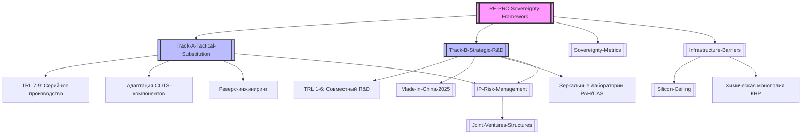

# Стратегический фреймворк технологического суверенитета РФ-КНР в диапазоне TRL 1-9

> [!abstract] **Вводный обзор фреймворка**
> Настоящий документ определяет архитектуру научно-производственного партнерства между Российской Федерацией и Китайской Народной Республикой. В основе фреймворка лежит разделение на два ключевых контура: **стратегический (TRL 1-6)** — совместное создание прорывных технологий и новых физических принципов, и **тактический (TRL 7-9)** — оперативное импортозамещение западных решений китайскими аналогами, адаптация COTS-компонентов и локализация производства.
> 
> Фреймворк направлен на преодоление технологической изоляции и формирование устойчивого к санкционному давлению замкнутого цикла разработки и производства.

---

## 1. Двухуровневая модель: TRL 1-6 vs. TRL 7-9

Для минимизации рисков технологического отставания и эффективного распределения ресурсов модель разделена на два параллельных трека, разграниченных по уровням готовности технологий ([[Уровни готовности технологий (TRL)]]).

```
                                 [ ТЕХНОЛОГИЧЕСКИЙ ЗАДЕЛ ]
                                             │
                    ┌────────────────────────┴────────────────────────┐
                    ▼                                                 ▼
       [ ТРЕК А: ТАКТИЧЕСКИЙ ]                          [ ТРЕК Б: СТРАТЕГИЧЕСКИЙ ]
     (Импортозамещение / TRL 4-9)                       (Опережающее развитие / TRL 1-6)
                    │                                                 │
   ┌────────────────┴────────────────┐               ┌────────────────┴────────────────┐
   ▼                                 ▼               ▼                                 ▼
[Реверс-инжиниринг]         [Адаптация COTS]  [Новые физ. принципы]       [Сквозные технологии]
(Замена западной ЭКБ)       (Китайские чипы)  (Кванты, фотоника)          (Новые материалы)
```

### Трек А: Тактическое замещение и локализация (TRL 4–9)
Цель — быстрая ликвидация «горящих» дефицитов в критических отраслях (авиастроение, станкостроение, микроэлектроника, ТЭК) путем копирования, адаптации китайских аналогов и их вывода на уровень коммерческой эксплуатации.

*   **Фокус TRL:** 
    *   **TRL 4-5:** Лабораторная интеграция и валидация сопряжения российских операционных систем (Astra Linux, ALT Linux) с китайскими процессорами (Loongson на архитектуре LoongArch, Kunpeng на архитектуре ARM).
    *   **TRL 6:** Демонстрация прототипа системы в релевантной среде (сертификация блоков бортового оборудования, прохождение климатических и вибрационных испытаний).
    *   **TRL 7-9:** Опытно-промышленная эксплуатация, квалификационные испытания на полигонах, запуск в серийное производство и локализация на территории РФ с получением статуса продукции отечественного происхождения (ПП РФ № 719).
*   **Механизмы:**
    *   **[[Реверс-инжиниринг]]**: Быстрое 3D-сканирование, послойное снятие топологии интегральных схем (ИС), анализ металлургических сплавов и защитных покрытий.
    *   **Адаптация COTS (Commercial Off-The-Shelf)**: Использование китайской гражданской и промышленной компонентной базы для нужд российского машиностроения с проведением дополнительных испытаний на надежность (скрининг, термоциклирование, испытания на электромагнитную совместимость).

### Трек Б: Совместный R&D и опережающее развитие (TRL 1–6)
Цель — создание принципиально новых технологических платформ, где у стран Запада нет абсолютного доминирования, с целью выхода на рынки Глобального Юга к 2030–2035 гг.

```
[TRL 1: Идея/Теория] ──> [TRL 2: Модель/EDA] ──> [TRL 3: MPW-Шаблон] ──> [TRL 4: Лаб.Макет] ──> [TRL 5: SiP-Упаковка] ──> [TRL 6: Прототип]
```

*   **Глубокая декомпозиция TRL 1-6 в совместных проектах:**
    *   **TRL 1 (Фундаментальные исследования):** Совместные теоретические работы РАН и CAS (Chinese Academy of Sciences) в области квантовых вычислений, двумерных материалов (графеновые гетероструктуры) и нейроморфных архитектур.
    *   **TRL 2 (Формулирование концепции):** Математическое моделирование физических процессов в специализированном ПО. Переход от западных САПР (Synopsys, Cadence) к совместным или китайским аналогам (например, Empyrean) для проектирования топологии ИС.
    *   **TRL 3 (Экспериментальное подтверждение):** Изготовление первых тестовых структур (Test Vehicles) на мультипроектных пластинах (MPW - Multi-Project Wafer) на китайских фабриках для верификации физических принципов работы (например, GaN/SiC силовых транзисторов или оптических модуляторов).
    *   **TRL 4 (Лабораторный макет):** Сборка и тестирование дискретных компонентов на автоматизированных измерительных стендах в зеркальных лабораториях РФ и КНР.
    *   **TRL 5 (Компонентная интеграция):** Упаковка кристаллов в корпуса (технологии SiP - System-in-Package, Flip-Chip) на мощностях китайских OSAT-провайдеров (JCET, TFME) и их валидация в условиях, приближенных к реальным.
    *   **TRL 6 (Системный прототип):** Интеграция разработанных компонентов в функциональные модули (например, приемопередающие модули АФАР, оптические сопроцессоры) и их испытания на совместных стендах-демонстраторах.
*   **Механизмы:**
    *   **[[Сквозные технологии]]**: Синтез российских фундаментальных математических моделей, алгоритмов помехоустойчивого кодирования и физических школ с китайскими возможностями быстрого прототипирования, материаловедческой базой и масштабным производством.

---

## 2. Граф связей разделов реестра знаний

Ниже представлена структура связей между ключевыми узлами базы знаний технологического суверенитета в Obsidian.



---

## 3. Сравнительный анализ треков развития

| Параметр | Трек А: Тактическое замещение (TRL 4-9) | Трек Б: Опережающее развитие (TRL 1-6) |
| :--- | :--- | :--- |
| **Горизонт планирования** | 1–3 года | 5–10 лет |
| **Доминирующий TRL** | TRL 7–9 (внедрение и локализация) | TRL 1–6 (исследования и прототипы) |
| **Основной источник IP** | Существующие патенты (западные/китайские) | Совместно создаваемая [[Интеллектуальная собственность (IP)]] |
| **Финансовый профиль** | Высокий CAPEX на закупку оборудования и лицензий | Высокий OPEX на R&D и содержание научных коллективов |
| **Ключевой риск** | «Застревание» на этапе копирования устаревших технологий | Риск недостижения заявленных физических параметров |
| **Интеграция** | Встраивание китайских COTS-решений в РФ | Сопряжение с программой [[Made in China 2025]] |
| **Стандартизация** | Адаптация под ГОСТ/ЕСКД | Разработка новых стандартов (ISO/IEC, GB/T) |

---

## 4. Критические точки зависимости и барьеры

> [!warning] **Кремниевый потолок (The Silicon Ceiling)**
> РФ не обладает собственными фабриками для коммерческого производства микросхем по топологическим нормам менее 65 нм. Проектируемые в РФ чипы (TRL 1-4) вынужденно отправляются на фабрики КНР (SMIC, Hua Hong) для производства (TRL 5-6). 
> **Уязвимость:** SMIC критически зависит от американского и европейского оборудования (ASML, Applied Materials, Lam Research). Под угрозой вторичных санкций китайские фабрики могут блокировать российские заказы, даже если они разработаны на базе открытой архитектуры RISC-V.

### Физико-инфраструктурные барьеры:
1. **Химическая монополия КНР:** КНР контролирует до 80% мирового рынка редкоземельных элементов (РЗЭ) и прекурсоров для химии полупроводников (сверхчистый кремний, галлий, германий). Любые экспортные ограничения КНР автоматически парализуют совместные проекты TRL 4-6.
2. **Симметричная уязвимость (Сырьевой рычаг РФ):** РФ является ключевым поставщиком сверхчистых газов для литографии (неон, криптон, ксенон) и синтетического сапфира для подложек. Это создает основу для паритетных переговоров: доступ к китайским фабрикам в обмен на российское сырье высокой степени очистки.
3. **Стандарты и метрология:** Различие между российскими ГОСТ/ЕСКД и китайскими национальными стандартами GB (Guobiao) увеличивает время сертификации прототипов (TRL 6) в 1.5–2 раза. Отсутствие взаимного признания результатов испытаний испытательных центров (ИЦ) требует повторного прохождения тестов.

---

## 5. Метрики технологической независимости

Для мониторинга состояния суверенитета в рамках альянса РФ-КНР вводятся следующие математически верифицируемые метрики:

### 1. Индекс локализации спецификации (BOM Localization Index - BLI)
Показывает долю стоимости компонентов, произведенных внутри суверенного контура (РФ + КНР), исключая влияние третьих стран.

$$BLI = \frac{\sum C_{\text{subst}}}{\sum C_{\text{total}}} \times 100\%$$

Где:
*   $C_{\text{subst}}$ — стоимость компонентов, сырья и ПО, произведенных в РФ или КНР (без использования западных лицензий).
*   $C_{\text{total}}$ — общая стоимость изделия (Bill of Materials - BOM).
*   *Целевое значение для TRL 6-9:* $> 95\%$ (полное исключение компонентов из стран НАТО).

### 2. Коэффициент суверенного IP (Sovereign IP Ratio - SIPR)
Определяет степень контроля над интеллектуальной собственностью в совместных проектах TRL 1-6.

$$SIPR = \frac{N_{\text{RU}} + (0.5 \times N_{\text{Joint}})}{N_{\text{Total}}}$$

Где:
*   $N_{\text{RU}}$ — количество патентов, принадлежащих исключительно резидентам РФ.
*   $N_{\text{Joint}}$ — количество совместных патентов с распределением прав 50/50.
*   $N_{\text{Total}}$ — общее количество патентов, защищающих технологию.
*   *Критический порог:* $SIPR < 0.4$ указывает на угрозу потери технологического контроля над проектом в пользу китайской стороны.

### 3. Индекс асимметрии технологической зависимости (Technology Asymmetry Index - TAI)
Оценивает баланс вклада сторон в совместный R&D.

$$TAI = \ln \left( \frac{I_{\text{RU\_Algorithms}} + I_{\text{RU\_Materials}}}{I_{\text{CN\_Fab}} + I_{\text{CN\_Equipment}}} \right)$$

Где $I$ — экспертная оценка вклада в ключевые компоненты технологии. Значение близкое к $0$ указывает на паритетный альянс; сильное отклонение в отрицательную сторону указывает на риск превращения РФ в технологического протектората КНР.

---

## 6. Интерактивные кейсы для самопроверки

### Кейс 1: Риск "Пылесоса IP" (IP Vacuuming)
> [!question] **Сценарий**
> Российский НИИ разработал уникальный математический алгоритм и физический принцип работы оптического сопроцессора (TRL 3). Китайский партнер предлагает создать [[Совместные предприятия (JV)]] в Шэньчжэне для быстрого прототипирования (TRL 4-6) и обещает полностью профинансировать проект. 
> 
> **Какую стратегию защиты IP должна выбрать российская сторона?**
> 
> *Доступные варианты:*
> *   **A.** Передать исходный код и математические модели партнеру для ускорения разработки на китайских суперкомпьютерах.
> *   **B.** Использовать модель "Черного ящика" (Black Box) и зафиксировать Dual-Key IP Ownership.
> *   **C.** Отказаться от партнерства и пытаться реализовать TRL 4-6 самостоятельно без финансирования.

> [!success] **Решение (Разбор кейса 1)**
> **Правильный ответ: B.**
> *Обоснование:* 
> 1. Применение **модели "Черного ящика"** позволяет передавать алгоритмы исключительно в виде скомпилированного объектного кода (микропрограмм) или зашифрованных IP-блоков (Hard IP) без раскрытия исходных математических моделей и исходного кода.
> 2. Соглашение **Dual-Key IP Ownership** юридически разграничит рынки сбыта: РФ и СНГ остаются за российской стороной, КНР и ЮВА — за китайской, а глобальные роялти делятся 50/50. Это предотвратит несанкционированное патентование технологии в юрисдикции КНР.

---

### Кейс 2: Преодоление "Кремниевого потолка"
> [!question] **Сценарий**
> Российский дизайн-центр разработал архитектуру специализированной ИС (ASIC) для промышленного контроллера (TRL 4). При попытке разместить заказ на фабрике SMIC (КНР) для выпуска опытной партии (TRL 6) получен отказ из-за риска вторичных санкций США.
> 
> **Какое управленческое решение минимизирует риски срыва проекта?**

> [!success] **Решение (Разбор кейса 2)**
> **Рекомендуемый комплекс мер:**
> 1. **Ретаргетинг на зрелый техпроцесс:** Перепроектировать ИС под топологические нормы 90/65 нм, доступные на отечественных фабриках (Микрон) или менее загруженных фабриках КНР второго эшелона, не использующих американское оборудование последнего поколения.
> 2. **Использование COTS-альтернатив:** Временно заменить специализированную ASIC на коммерчески доступные китайские ПЛИС (FPGA) общего назначения (например, Gowin), прошедшие процедуру дополнительного скрининга и термоциклирования (Трек А).
> 3. **Проведение транзакции через "технического" посредника:** Использование СП в нейтральной юрисдикции для размещения заказа на SMIC без прямой аффилиации с РФ.

---

### Кейс 3: Конфликт стандартов при переходе TRL 5 -> TRL 6
> [!question] **Сценарий**
> Совместно разработанный силовой модуль для электромобилей успешно прошел лабораторные испытания в РФ (TRL 5) по стандартам ГОСТ. При попытке интеграции в китайскую платформу (TRL 6) выяснилось, что параметры электромагнитной совместимости не соответствуют китайскому стандарту GB/T 18384.
> 
> **Каков оптимальный алгоритм действий инженерной группы?**

> [!success] **Решение (Разбор кейса 3)**
> **Рекомендуемый алгоритм:**
> 1. **Гармонизация требований:** Провести кросс-картирование стандартов ГОСТ и GB/T на этапе TRL 2-3.
> 2. **Виртуальное прототипирование:** Использовать цифровой двойник (Digital Twin) модуля для симуляции испытаний по стандарту GB/T в среде MATLAB/Simulink.
> 3. **Модификация фильтра помех:** Оперативно изменить топологию печатной платы (ввод дополнительных синфазных дросселей и Y-конденсаторов) без изменения архитектуры самого силового чипа, что позволит пройти сертификацию в КНР без перезапуска дорогостоящего цикла производства кристаллов.

---
**Связанные файлы:**
* [[Track-A-Tactical-Substitution]] — Подробный регламент тактического замещения.
* [[Track-B-Strategic-R&D]] — Стратегическая дорожная карта совместных разработок.
* [[IP-Risk-Management]] — Юридические шаблоны и кейсы защиты интеллектуальной собственности.