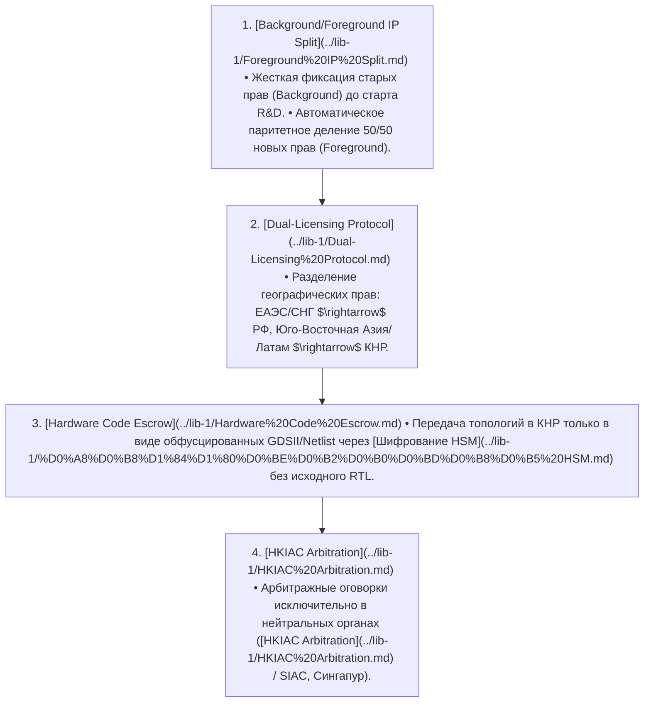


**Стратегическое резюме**
В условиях тотальных санкционных ограничений линейное импортозамещение приводит к застреванию в «догоняющей ловушке» и форсирует технологическую деградацию. Настоящая **Двухтрековая стратегия** определяет архитектуру научно-технологического паритета и взаимодействия РФ и КНР на ключевых фазах [TRL 1–6](../lib-1/TRL%201%E2%80%936.md) (от фундаментальных физико-математических исследований до лабораторных испытаний прототипов) с предсказуемым мостом в промышленное масштабирование [TRL 7–9](../lib-1/TRL%207%E2%80%939.md). 

Стратегия основана на концепции **«Двойного перехода»**: преодолении роли простого потребителя зарубежных компонентных баз (OEM/ODM) через паритетное владение фундаментальным **Foreground/Background IP**, совладение средствами производства (EDA/Foundry) и совместный контроль над технологическими стеками следующего поколения.


---

## 1. Карта мета-связей: Трансляционный мост R&D (TRL 1–6) $\rightarrow$ Промышленность (TRL 7–9)

Стратегия соединяет фундаментальный задел российской математической и физической школы с производственными и полигонными мощностями КНР. Это создает замкнутый трансляционный контур, исключающий разрыв на этапе «Долины смерти» (TRL 3–5).

  ФУНДАМЕНТАЛЬНЫЙ КОНТУР (РФ)               ЛАБОРАТОРНЫЙ МОСТ (JRC)               ПРОМЫШЛЕННЫЙ КОНТУР (КНР/РФ)
### [ TRL 1 - TRL 2 ]                       [ TRL 3 - TRL 5 ]                      [ TRL 6 - TRL 9 ]

| [Математика и Алгоритмы](../lib-1/%D0%9C%D0%B0%D1%82%D0%B5%D0%BC%D0%B0%D1%82%D0%B8%D0%BA%D0%B0%20%D0%B8%20%D0%90%D0%BB%D0%B3%D0%BE%D1%80%D0%B8%D1%82%D0%BC%D1%8B.md) |  | [RTL-проектирование](../lib-1/RTL-%D0%BF%D1%80%D0%BE%D0%B5%D0%BA%D1%82%D0%B8%D1%80%D0%BE%D0%B2%D0%B0%D0%BD%D0%B8%D0%B5.md) |  | [Пилотные FAB-линии](../lib-1/%D0%9F%D0%B8%D0%BB%D0%BE%D1%82%D0%BD%D1%8B%D0%B5%20FAB-%D0%BB%D0%B8%D0%BD%D0%B8%D0%B8.md) |
| --- | --- | --- | --- | --- |
| • [Материаловедение](../lib-1/%D0%9C%D0%B0%D1%82%D0%B5%D1%80%D0%B8%D0%B0%D0%BB%D0%BE%D0%B2%D0%B5%D0%B4%D0%B5%D0%BD%D0%B8%D0%B5.md) |  | • [OpenLane EDA](../lib-1/OpenLane%20EDA.md) |  | • [Chiplet-сборка](../lib-1/Chiplet-%D1%81%D0%B1%D0%BE%D1%80%D0%BA%D0%B0.md) |

               │                                       │                                       │
### ▼                                       ▼                                       ▼

| [Фундаментальный R&D](../lib-1/%D0%A4%D1%83%D0%BD%D0%B4%D0%B0%D0%BC%D0%B5%D0%BD%D1%82%D0%B0%D0%BB%D1%8C%D0%BD%D1%8B%D0%B9%20R%26D.md) • [Полигоны Сколково](../lib-1/%D0%9F%D0%BE%D0%BB%D0%B8%D0%B3%D0%BE%D0%BD%D1%8B%20%D0%A1%D0%BA%D0%BE%D0%BB%D0%BA%D0%BE%D0%B2%D0%BE.md) |  | [Прототип в лаборатории](../lib-1/%D0%9F%D1%80%D0%BE%D1%82%D0%BE%D1%82%D0%B8%D0%BF%20%D0%B2%20%D0%BB%D0%B0%D0%B1%D0%BE%D1%80%D0%B0%D1%82%D0%BE%D1%80%D0%B8%D0%B8.md) • [Чиплеты RISC-V+](../lib-1/%D0%A7%D0%B8%D0%BF%D0%BB%D0%B5%D1%82%D1%8B%20RISC-V%2B.md) |  | [Серийный продукт](../lib-1/%D0%A1%D0%B5%D1%80%D0%B8%D0%B9%D0%BD%D1%8B%D0%B9%20%D0%BF%D1%80%D0%BE%D0%B4%D1%83%D0%BA%D1%82.md) • [Серверы / Телеком](../lib-1/%D0%A2%D0%B5%D0%BB%D0%B5%D0%BA%D0%BE%D0%BC.md) |
| --- | --- | --- | --- | --- |

### Детальная матрица уровня готовности технологий (TRL 1–6)


**Системный трансляционный стек**
Переход между уровнями TRL регламентируется метриками воспроизводимости, жестким разделением IP и криптографической защитой передаваемых моделей.


> **TRL 1: Фундаментальные принципы**

                                                  │
### ▼

> **TRL 2: Формулирование концепции**

                                                  │
### ▼

> **TRL 3: Аналитическое и экспериментальное подтверждение**

                                                  │
### ▼

> **TRL 4: Лабораторный прототип / RTL-синтез**

                                                  │
### ▼

> **TRL 5: Валидация компонентов в рабочей среде (Shuttle run)**

                                                  │
### ▼

> **TRL 6: Валидация прототипа в релевантной среде (Препромышленный барьер)**

---

## 2. Модель «Двойного перехода» (Dual Transition Model)

Модель защищает суверенитет РФ от риска превращения в подчиненный рынок потребления устаревающих технологических стеков КНР.

                                 МОДЕЛЬ ДВОЙНОГО ПЕРЕХОДА
                                 
### ФАЗА 0: Зависимость          ФАЗА 1: Тактический трек        ФАЗА 2: Стратегический трек

| (OEM/ODM из КНР) |  | и локализация (TRL 4-6) |  | критическим IP (TRL 1-6) |
| --- | --- | --- | --- | --- |

      [Покупатель-Продавец]           [Адаптор / Интегратор]          [Совладелец / Соразработчик]


**Предупреждение о технологической провинциализации**
Закрепление в Фазе 1 (простая отверточная сборка, адаптация готовых китайских микроконтроллеров и ПО) блокирует собственную школу проектирования. При изменении политики экспортного контроля [CNIPA](../lib-1/CNIPA.md) или введении вторичных санкций страна теряет доступ к модернизации. Стратегический суверенитет формируется **исключительно в Фазе 2**.


### Двухуровневый механизм перехода

#### Переход I: От «Покупателя» к «Интегратору» (Тактический Трек / TRL 4–6)
* **Механика:** Экспресс-замещение критической инфраструктуры (3G/4G/5G [O-RAN](../lib-1/O-RAN.md), базовые [MCU](../lib-1/MCU.md), промышленные контроллеры, СУБД) за счет зрелых FAB-процессов КНР (28–90 нм).
* **Инструментарий:** [Black-Box Reverse Engineering](../lib-1/Black-Box%20Reverse%20Engineering.md), адаптация китайских открытых IP-ядер, портом системного ПО под отечественные ОС (Astra Linux, ALT Linux).

#### Переход II: От «Интегратора» к «Совладельцу IP» (Стратегический Трек / TRL 1–5)
* **Механика:** Интеграция российских математических алгоритмов, методов компиляции и физико-химических патентов в производственные процессы КНР в обмен на паритетные права на конечные чипы и оборудование.
* **Институциональный барьер:** Внедрение четырехуровневого протокола правовой и технической защиты:

### ПРОТОКОЛЫ ЗАЩИТЫ IP

| № | Структура / Компонент |
| --- | --- |
| 1 | 1. [Background/Foreground IP Split](../lib-1/Foreground%20IP%20Split.md) • Жесткая фиксация старых прав (Background) до старта R&D. • Автоматическое паритетное деление 50/50 новых прав (Foreground). |
| 2 | 2. [Dual-Licensing Protocol](../lib-1/Dual-Licensing%20Protocol.md) • Разделение географических прав: ЕАЭС/СНГ $\rightarrow$ РФ, Юго-Восточная Азия/Латам $\rightarrow$ КНР. |
| 3 | 3. [Hardware Code Escrow](../lib-1/Hardware%20Code%20Escrow.md) • Передача топологий в КНР только в виде обфусцированных GDSII/Netlist через [Шифрование HSM](../lib-1/%D0%A8%D0%B8%D1%84%D1%80%D0%BE%D0%B2%D0%B0%D0%BD%D0%B8%D0%B5%20HSM.md) без исходного RTL. |
| 4 | 4. [HKIAC Arbitration](../lib-1/HKIAC%20Arbitration.md) • Арбитражные оговорки исключительно в нейтральных органах ([HKIAC Arbitration](../lib-1/HKIAC%20Arbitration.md) / SIAC, Сингапур). |

---

## 3. Сравнительный анализ: Трек 1 vs Трек 2


**Стратегическая балансировка**
Финансовые и кадровые ресурсы распределяются в пропорции **30/70**: 30% на оперативную адаптацию (Трек 1) и 70% на глубокую научно-инженерную кооперацию TRL 1–6 (Трек 2).


| Параметрический вектор :--- **Фокусные уровни TRL** **Ключевые технологии** **Роль РФ** **Роль КНР** **Правовой статус IP** **Критический риск** **Временной горизонт** | [Трек 1: Импортозамещение](../lib-1/%D0%A2%D1%80%D0%B5%D0%BA%201%3A%20%D0%98%D0%BC%D0%BF%D0%BE%D1%80%D1%82%D0%BE%D0%B7%D0%B0%D0%BC%D0%B5%D1%89%D0%B5%D0%BD%D0%B8%D0%B5.md) (Тактический) :--- **TRL 4 $\rightarrow$ TRL 6** Зрелый кремний (28–90 нм), [MCU](../lib-1/MCU.md), СУБД, [O-RAN 4G/5G](../lib-1/5G.md), готовые FPGA. Заказчик, системный интегратор, адаптер ПО, эксплуатант. Поставщик OEM/ODM, контрактная фабрика ([SMIC](../lib-1/SMIC.md), [Hua Hong](../lib-1/Hua%20Hong.md)). Покупка коммерческих лицензий / Роялти / Open-Source. Отставание от технологического мейнстрима на 10–15 лет, ценовая зависимость. **1–3 года** (Стабилизация рынка и критических отраслей) | [Трек 2: Опережающее развитие](../lib-1/%D0%A2%D1%80%D0%B5%D0%BA%202%3A%20%D0%9E%D0%BF%D0%B5%D1%80%D0%B5%D0%B6%D0%B0%D1%8E%D1%89%D0%B5%D0%B5%20%D1%80%D0%B0%D0%B7%D0%B2%D0%B8%D1%82%D0%B8%D0%B5.md) (Стратегический) :--- **TRL 1 $\rightarrow$ TRL 5** [Фотонные вычислители](../lib-1/%D0%A4%D0%BE%D1%82%D0%BE%D0%BD%D0%BD%D1%8B%D0%B5%20%D0%B2%D1%8B%D1%87%D0%B8%D1%81%D0%BB%D0%B8%D1%82%D0%B5%D0%BB%D0%B8.md), WBG-полупроводники ($GaN/SiC$), [RISC-V+](../lib-1/RISC-V%2B.md), [Квантовая криптография](../lib-1/%D0%9A%D0%B2%D0%B0%D0%BD%D1%82%D0%BE%D0%B2%D0%B0%D1%8F%20%D0%BA%D1%80%D0%B8%D0%BF%D1%82%D0%BE%D0%B3%D1%80%D0%B0%D1%84%D0%B8%D1%8F.md), [3D Chiplet-архитектура](../lib-1/3D%20Chiplet-%D0%B0%D1%80%D1%85%D0%B8%D1%82%D0%B5%D0%BA%D1%82%D1%83%D1%80%D0%B0.md). Источник фундаментальных идей, математических алгоритмов, архитектур и $TCAD$-моделей. Партнер по прототипированию, поставщик тестового и специализированного спецоборудования. Совладение **Foreground IP (50/50)** с международной регистрацией по системе PCT. Утечка фундаментального IP на этапе передачи спецификаций (TRL 3 $\rightarrow$ TRL 4). **5–10 лет** (Формирование собственного стандарта и глобальная конкурентоспособность) |
| --- | --- | --- |

---

## 4. Технические барьеры и архитектурные решения

При реализации совместных R&D проектов уровня TRL 1–6 возникают технологические и программно-аппаратные разрывы.

                    АРХИТЕКТУРНЫЕ РЕШЕНИЯ БАРЬЕРОВ
                    
### БАРЬЕР                                        РЕШЕНИЕ

| (Synopsys / Cadence) |  | + ИИ-оптимизаторы |
| --- | --- | --- |
| (Ограничения SMIC) |  | и [Бескремниевая фотоника](../lib-1/%D0%91%D0%B5%D1%81%D0%BA%D1%80%D0%B5%D0%BC%D0%BD%D0%B8%D0%B5%D0%B2%D0%B0%D1%8F%20%D1%84%D0%BE%D1%82%D0%BE%D0%BD%D0%B8%D0%BA%D0%B0.md) |
| (Экосистема NVIDIA) |  | для [Huawei Ascend](../lib-1/Huawei%20Ascend.md) |

### 1. Зависимость от проприетарного САПР/EDA ПО
* **Проблема:** Санкционные блокировки доступа к пакетам Synopsys и Cadence делают невозможным проектирование топологий ниже 28 нм в стандартном цикле.
* **Решение:** Развертывание совместной гибридной платформы на базе [OpenLane EDA](../lib-1/OpenLane%20EDA.md) и OpenROAD. Внедрение математических оптимизаторов [ИСП РАН](../lib-1/%D0%98%D0%A1%D0%9F%20%D0%A0%D0%90%D0%9D.md) и [МФТИ](../lib-1/%D0%9C%D0%A4%D0%A2%D0%98.md) для ИИ-управляемой авторазводки кристаллов, экстракции паразитных параметров и формальной верификации RTL.

### 2. Санкционный барьер фотолитографии (Отсутствие EUV)
### * **Проблема:** Невозможность прямой печати монолитных кристаллов по нормам $<7$ нм на фабриках [SMIC](../lib-1/SMIC.md) из-за бана на поставки ASML EUV-степперов.

| * **Решение:** Переход на [чиплетную архитектуру](../lib-1/3D%20Chiplet-%D0%B0%D1%80%D1%85%D0%B8%D1%82%D0%B5%D0%BA%D1%82%D1%83%D1%80%D0%B0.md) и гетерогенную интеграцию. Объединение нескольких кристаллов, выполненных по доступным нормам (14–28 нм), на кремниевом интерпозере (Silicon Interposer) с использованием гибридного микроконтактного разваривания (Cu-Cu bonding). Параллельное развитие направления [Бескремниевая фотоника](../lib-1/%D0%91%D0%B5%D1%81%D0%BA%D1%80%D0%B5%D0%BC%D0%BD%D0%B8%D0%B5%D0%B2%D0%B0%D1%8F%20%D1%84%D0%BE%D1%82%D0%BE%D0%BD%D0%B8%D0%BA%D0%B0.md) для связи кристаллов. |
| --- | --- |

### 3. Программный барьер ИИ-ускорителей (Доминирование CUDA)
* **Проблема:** Массовый софтверный стек вычислений глубоко завязан на экосистему NVIDIA CUDA, что блокирует эффективное использование китайских ускорителей ([Huawei Ascend](../lib-1/Huawei%20Ascend.md), Biren, Iluvatar).
* **Решение:** Разработка и внедрение двухстороннего компиляторного транслятора на базе **[MLIR/LLVM Транслятор](../lib-1/LLVM%20%D0%A2%D1%80%D0%B0%D0%BD%D1%81%D0%BB%D1%8F%D1%82%D0%BE%D1%80.md)**. Проект переводит промежуточное представление (IR) графов PyTorch/TensorFlow напрямую в ISA целевых китайских и российских NPU/TPU-ускорителей.

---

## 5. Дорожная карта реализации стратегии (2025–2030)


**Временная шкала TRL-перехода**
Каждая фаза завершается аудитом готовности IP и подписыванием протоколов приема-передачи результатов интеллектуальной деятельности.


[2025] Фаза 1: Институционализация и фундаментальный базис (TRL 1–2)
 ├── Регистрация международных совместных исследовательских центров ([Hub-and-Spoke JRC](../lib-1/Hub-and-Spoke%20JRC.md))
 ├── Депонирование [Background IP](../lib-1/Foreground%20IP%20Split.md) в доверенном цифровом реестре
 ├── Гармонизация стандартов интеллектуальной собственности между [Роспатент](../lib-1/%D0%A0%D0%BE%D1%81%D0%BF%D0%B0%D1%82%D0%B5%D0%BD%D1%82.md) и [CNIPA](../lib-1/CNIPA.md)
 └── Формулирование ISA спецификации расширения [RISC-V+](../lib-1/RISC-V%2B.md)

[2026–2027] Фаза 2: Прикладное моделирование и RTL (TRL 3–4)
 ├── Синтез опытными лабораториями WBG-материалов ($GaN$-on-$SiC$, $Ga_2O_3$)
 ├── Запуск полностью открытого стека [OpenLane EDA](../lib-1/OpenLane%20EDA.md) с ИИ-модулями разводки
 ├── Разработка топологий чиплетов вычислителей и тензорных блоков
 └── Организация защищенных каналов передачи Netlist через [Шифрование HSM](../lib-1/%D0%A8%D0%B8%D1%84%D1%80%D0%BE%D0%B2%D0%B0%D0%BD%D0%B8%D0%B5%20HSM.md)

[2028] Фаза 3: MPW-прототипирование и корпусация (TRL 5)
 ├── Запуск опытных шаттлов ([MPW-запуски SMIC](../lib-1/MPW-%D0%B7%D0%B0%D0%BF%D1%83%D1%81%D0%BA%D0%B8%20SMIC.md)) по нормам 14–28 нм
 ├── Тестирование гибридной корпусации 2.5D/3D на мощностях партнеров
 └── Лабораторные испытания кристаллов в термо- и радиационно-нагруженных средах

[2029–2030] Фаза 4: Валидация систем и подготовка к серии (TRL 6 $\rightarrow$ TRL 7)
 ├── Системная интеграция чиплетных комплектов в телеком-оборудование и серверы
 ├── Сертификация софтверного стека [MLIR/LLVM Транслятор](../lib-1/LLVM%20%D0%A2%D1%80%D0%B0%D0%BD%D1%81%D0%BB%D1%8F%D1%82%D0%BE%D1%80.md) для промышленных ОС
 └── Передача комплекта КД (конструкторской документации) для развертывания серийного выпуска

---

## 6. Интерактивные кейсы для самопроверки

### Кейс 1: Защита фундаментального IP при передаче на фабрику (TRL 3 $\rightarrow$ TRL 4)


**Условие кейса 1**
Российский университет разработал математический алгоритм аппаратно-ускоренной оптимизации графов для обработки нейросетей, реализованный в виде топологии RTL-блока ([TRL 3](../lib-1/TRL%203.md)). Для изготовления тестового кристалла ([TRL 4](../lib-1/TRL%204.md)) требуется передать данные китайскому дизайн-центру в Шэньчжэне. Китайская сторона настаивает на получении незашифрованного исходного кода на Verilog/SystemVerilog для «оптимизации под их технологический процесс».

**Как сформировать процесс передачи без утраты контроля над IP?**



**Сделать выбор / Посмотреть решение**
**Некорректный подход:** Передача исходного Verilog-кода. Это создает риск регистрации китайским партнером самостоятельного патента в [CNIPA](../lib-1/CNIPA.md) на модифицированный блок, что закроет российскому разработчику доступ к внешним рынкам.

**Корректный подход (Двухтрековая стратегия):**
1. Зафиксировать RTL-код и математическую модель как **Background IP** в Роспатенте и международной базе WIPO/PCT.
2. Провести синтез RTL в Netlist (сеточный список) на собственной территории с использованием [OpenLane EDA](../lib-1/OpenLane%20EDA.md).
3. Применить протокол **[Hardware Code Escrow](../lib-1/Hardware%20Code%20Escrow.md)**: передать китайской стороне зашифрованный файл топологии (GDSII/OASIS) через аппаратный модуль безопасности ([Шифрование HSM](../lib-1/%D0%A8%D0%B8%D1%84%D1%80%D0%BE%D0%B2%D0%B0%D0%BD%D0%B8%D0%B5%20HSM.md)).
4. Оформить создание **Foreground IP** на совместную чиплетную сборку по схеме 50/50 с закреплением за РФ эксклюзивных прав на территорию ЕАЭС по [Dual-Licensing Protocol](../lib-1/Dual-Licensing%20Protocol.md).


---

### Кейс 2: Миграция ИИ-платформы с инфраструктуры NVIDIA на китайские NPU


**Условие кейса 2**
Российский разработчик систем автопилотирования подготовил программно-аппаратный комплекс, работающий на ускорителях NVIDIA Jetson (TRL 5). Из-за санкций прямые поставки прекращены. Принято решение перевести комплекс на китайские чипы [Huawei Ascend](../lib-1/Huawei%20Ascend.md). Вся кодовая база системы (более 500 000 строк) написана с использованием функций CUDA API. Прямое переписывание кода под фреймворк CANN требует 24 месяцев работы всей команды, что срывает сроки проекта.

**Какое архитектурное решение позволит совершить переход в сжатые сроки?**



**Сделать выбор / Посмотреть решение**
**Некорректный подход:** Попытка полной ручной переработки кодовой базы под CANN или построение параллельного импорта карт NVIDIA (сопряжено с рисками отсутствия гарантии, завышенной цены и внезапных блокировок).

**Корректный подход:**
Внедрить промежуточную компиляционную прослойку на базе **[MLIR/LLVM Транслятор](../lib-1/LLVM%20%D0%A2%D1%80%D0%B0%D0%BD%D1%81%D0%BB%D1%8F%D1%82%D0%BE%D1%80.md)**.

Пошаговый процесс:
1. Извлечь вычислительные графы моделей из PyTorch/CUDA в единое промежуточное представление MLIR (Dialect).
2. Использовать специализированный бэкенд транслятора для автоматической генерации оптимизированного кода под ISA процессоров Ascend (CANN Low-Level IR).
3. Валидировать точность вычислений (FP16/INT8) на HIL-стенде. Это сокращает срок миграции с 24 до 3–4 месяцев и сохраняет независимость высокоуровневого кода от аппаратной платформы.


---

## 7. Взаимосвязанные заметки (WikiLinks Index)

### Уровни готовности технологий (TRL)
* [TRL 1-3 Fundamental Physics](../lib-1/TRL%201-3%20Fundamental%20Physics.md) — Фундаментальные R&D, квантовые эффекты и материаловедение.
* [TRL 4-5 Lab Prototypes](../lib-1/TRL%204-5%20Lab%20Prototypes.md) — Лабораторное прототипирование, RTL-синтез и MPW-запуски.
* [TRL 6 Lab Validation](../lib-1/TRL%206%20Lab%20Validation.md) — Валидация инженерных образцов в релевантных условиях.
* [TRL 7-9 Industrial Scaling](../lib-1/TRL%207-9%20Industrial%20Scaling.md) — Промышленное серийное производство и коммерциализация.

### Институциональные и правовые механизмы
* [Hub-and-Spoke JRC](../lib-1/Hub-and-Spoke%20JRC.md) — Организация совместных исследовательских центров РФ-КНР.
* [Background/Foreground IP Split](../lib-1/Foreground%20IP%20Split.md) — Разделение предшествующих и вновь создаваемых прав IP.
* [Dual-Licensing Protocol](../lib-1/Dual-Licensing%20Protocol.md) — Разделение глобальных рынков сбыта по региональному признаку.
* [Hardware Code Escrow](../lib-1/Hardware%20Code%20Escrow.md) — Безопасное депонирование и передача прошивок и топологий.
* [HKIAC Arbitration](../lib-1/HKIAC%20Arbitration.md) — Арбитражные механизмы разрешения споров в нейтральных юрисдикциях.
* [CNIPA](../lib-1/CNIPA.md) — Национальное управление интеллектуальной собственности КНР.

### Микроэлектроника и EDA
* [OpenLane EDA](../lib-1/OpenLane%20EDA.md) — Открытый стек автоматизации проектирования микросхем.
* [MPW-запуски SMIC](../lib-1/MPW-%D0%B7%D0%B0%D0%BF%D1%83%D1%81%D0%BA%D0%B8%20SMIC.md) — Технология Multi-Project Wafer для снижения стоимости прототипирования.
* [3D Chiplet-архитектура](../lib-1/3D%20Chiplet-%D0%B0%D1%80%D1%85%D0%B8%D1%82%D0%B5%D0%BA%D1%82%D1%83%D1%80%D0%B0.md) — Гетерогенная интеграция и упаковка кристаллов.
* [Бескремниевая фотоника](../lib-1/%D0%91%D0%B5%D1%81%D0%BA%D1%80%D0%B5%D0%BC%D0%BD%D0%B8%D0%B5%D0%B2%D0%B0%D1%8F%20%D1%84%D0%BE%D1%82%D0%BE%D0%BD%D0%B8%D0%BA%D0%B0.md) — Оптические межкристальные соединения и интегральные фотонные схемы.
* [SMIC](../lib-1/SMIC.md) — Крупнейший foundry-производитель полупроводников в КНР.
* [Hua Hong](../lib-1/Hua%20Hong.md) — Контрактный производитель полупроводников, специализирующийся на зрелых узлах и WBG.

### Вычислительные архитектуры и ПО
* [RISC-V+](../lib-1/RISC-V%2B.md) — Открытая процессоростроительная архитектура с расширениями.
* [MCU](../lib-1/MCU.md) — Микроконтроллерные юниты для систем автоматизации и промышленности.
* [O-RAN 4G/5G](../lib-1/5G.md) — Открытая архитектура сетей радиодоступа.
* [Huawei Ascend](../lib-1/Huawei%20Ascend.md) — Платформа аппаратно-программных ускорителей ИИ.
* [MLIR/LLVM Транслятор](../lib-1/LLVM%20%D0%A2%D1%80%D0%B0%D0%BD%D1%81%D0%BB%D1%8F%D1%82%D0%BE%D1%80.md) — Промежуточное представление и инфраструктрура компиляторов для конвертации CUDA-кода.
* [Шифрование HSM](../lib-1/%D0%A8%D0%B8%D1%84%D1%80%D0%BE%D0%B2%D0%B0%D0%BD%D0%B8%D0%B5%20HSM.md) — Аппаратные модули безопасности для защиты каналов передачи IP.
* [ИСП РАН](../lib-1/%D0%98%D0%A1%D0%9F%20%D0%A0%D0%90%D0%9D.md) — Институт системного программирования РАН.
* [МФТИ](../lib-1/%D0%9C%D0%A4%D0%A2%D0%98.md) — Московский физико-технический институт.