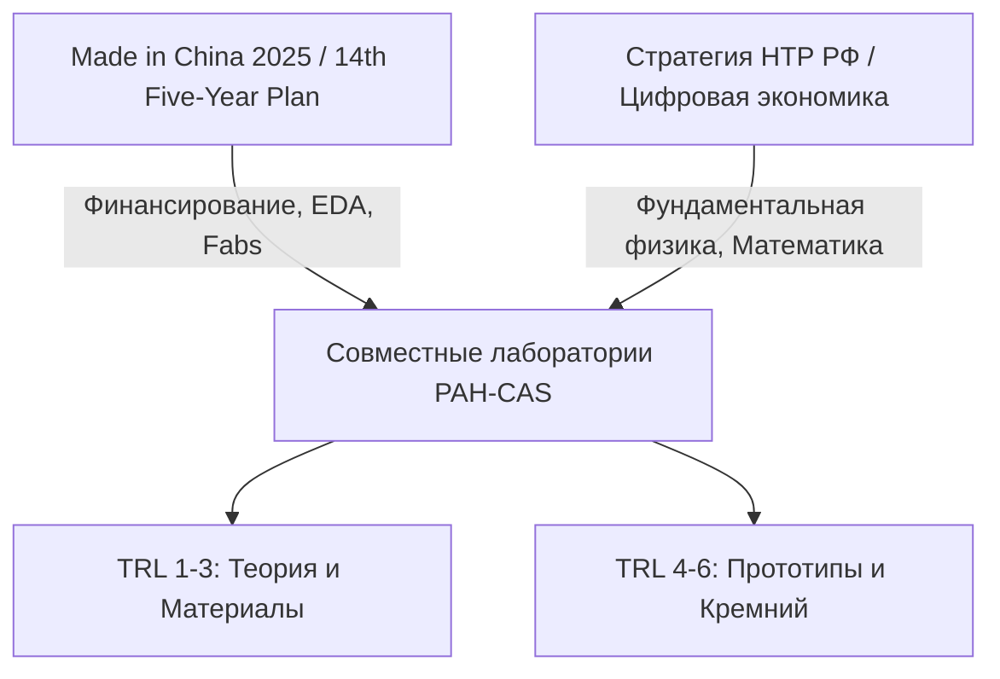
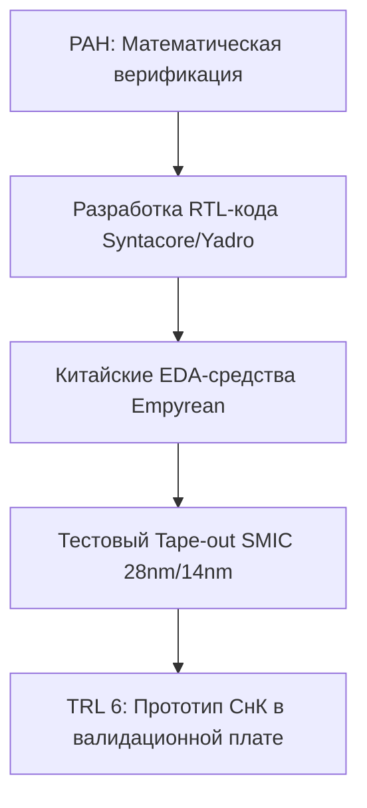

# Анализ совместных инициатив РФ и КНР: Квантовые технологии и RISC-V (TRL 1-6)


**Краткое содержание**
Совместные фундаментальные и прикладные исследования между Российской академией наук (**РАН**) и Китайской академией наук (**CAS**) в области квантовых технологий и открытой архитектуры **RISC-V** представляют собой стратегический альянс с высокой степенью асимметрии. 

Для РФ это критический канал преодоления технологической изоляции, обхода санкционных ограничений и доступа к передовым полупроводниковым фабрикам (Foundries). Для КНР — это инструмент абсорбции фундаментальной физико-математической школы РАН для достижения целей государственной программы **«Made in China 2025»** (в части импортозамещения полупроводников и лидерства в квантовых вычислениях). Анализ охватывает уровни готовности технологий **TRL 1–6** (от фундаментальных принципов до демонстрации прототипов в реальных условиях).


---

## 1. Стратегическое соответствие и государственные программы

Сотрудничество между РФ и КНР опирается на глубокую взаимодополняемость национальных стратегий. В то время как Китай обладает развитой промышленной базой, финансовыми ресурсами и возможностями масштабирования, Россия предоставляет глубокую экспертизу в области фундаментальной физики, материаловедения и прикладной математики.

### КНР: «Made in China 2025» и 14-й Пятилетний план
Китай рассматривает квантовые технологии и суверенную схемотехнику как критические направления национальной безопасности. В рамках инициативы **«Made in China 2025»** и 14-го пятилетнего плана КНР ставит цель достичь 70% самообеспеченности в полупроводниковом секторе.
* **Квантовое направление:** Курируется Национальной лабораторией квантовой информатики в Хэфэе (USTC) под руководством академика Цзянь-Вэй Паня.
* **RISC-V:** Рассматривается как единственный способ обойти санкции США в отношении архитектур x86 и ARM. Китай доминирует в консорциуме *RISC-V International* (через такие компании, как Alibaba T-Head, ICT CAS).

### РФ: Технологический суверенитет
Для РФ **Квантовые вычисления** (дорожная карта Росатома) и квантовые коммуникации (дорожная карта РЖД), а также переход на **RISC-V** (разработки Yadro/KNS Group, Syntacore, Миландр) — это вопросы выживания критической информационной инфраструктуры (КИИ) в условиях санкций.

### Синергия CAS — РАН
* **РАН** обладает сильной школой теоретической физики, квантовой оптики, материаловедения (выращивание монокристаллов, гетероструктур) и математических методов верификации.
* **CAS** обладает неограниченным финансовым ресурсом, доступом к современному технологическому оборудованию (cleanrooms класса ISO 3/4), развитой экосистемой **EDA-инструментов** и возможностями быстрого прототипирования (Tape-out) на мощностях **SMIC**.

---

## 2. Глубокий технический анализ по направлениям (TRL 1–6)

### Направление А: Квантовые технологии

#### 1. Квантовые вычисления (Quantum Computing)

##### **Сверхпроводниковые кубиты** (TRL 3 $\rightarrow$ TRL 5)
* **Технический барьер:** Декогеренция, вызванная шумами двухуровневых систем (TLS) в диэлектриках, точность одно- и двухкубитных гейтов ($>99.9\%$), масштабирование криогенных систем.
* **Сотрудничество:** РАН (Лаборатория сверхпроводящих метаматериалов НИТУ МИСИС/ИФТТ РАН) предоставляет теоретические модели топологической защиты кубитов (например, флуксониумные кубиты с высокой anharmonicity) и методы подавления фазового шума. CAS (Институт физики твердого тела) обеспечивает прецизионную литографию субмикронных джозефсоновских переходов (Al/AlOx/Al) на 200-мм кремниевых пластинах.
* **TRL 5 Достижение:** Создание совместного прототипа 20-50 кубитного процессора на базе чипа, изготовленного в КНР, с управляющей СВЧ-электроникой, разработанной в РФ на базе отечественных ПЛИС и ЦАП/АЦП.

##### Нейтральные атомы и ионы (TRL 2 $\rightarrow$ TRL 4)
* **Технический барьер:** Лазерное охлаждение до микрокельвиновых температур, стабильность оптических пинцетов на базе пространственных модуляторов света (SLM), время жизни кубита в ловушке.
* **Сотрудничество:** ИФП СО РАН (Новосибирск) обладает мировым приоритетом в области интерферометрии холодных атомов и лазерного охлаждения изотопов рубидия ($^{87}\text{Rb}$) и иттербия ($^{171}\text{Yb}$). CAS (Институт физики и математики Уханя) предоставляет прецизионные лазерные системы с ультраузкой шириной линии ($<1$ Гц) и многоканальные ПЛИС-контроллеры для динамического управления ловушками.
* **TRL 4 Достижение:** Демонстрация когерентного контроля массива из 100 нейтральных атомов в двумерной оптической решетке с точностью однокубитных операций $>99.5\%$.

---

#### 2. Квантовые сенсоры (Quantum Sensing)

##### **NV-центры** в алмазе (TRL 4 $\rightarrow$ TRL 6)
* **Применение:** Высокочувствительные магнитометры для навигации в GPS-denied средах (подводные лодки, БПЛА), медицинская диагностика.
* **Сотрудничество:** ИФВД РАН (Троицк) — синтез сверхчистых алмазов методом HPHT с контролируемой концентрацией азотных вакансий и изотопным обогащением по углероду-12 ($^{12}\text{C} > 99.99\%$), что минимизирует спиновый шум. CAS (Институт полупроводников) — интеграция алмазных микрокристаллов с **кремниевой фотоникой** (waveguides, кольцевые резонаторы) и КМОП-схемами считывания на одном чипе.
* **TRL 6 Достижение:** Демонстрация прототипа твердотельного гироскопа/магнитометра в условиях реальных вибрационных и температурных испытаний на подвижном стенде.

---

#### 3. **Квантовое распределение ключей** (QKD)

##### Волоконные и атмосферные системы (TRL 5 $\rightarrow$ TRL 6)
* **Технический барьер:** Скорость генерации секретного ключа на больших расстояниях ($>100$ км), интеграция с существующими DWDM-сетями без подавления квантового канала шумами рассеяния Рамана.
* **Сотрудничество:** Университет ИТМО / ИФЗ РАН — разработка протоколов QKD на боковых частотах (subcarrier wave QKD), устойчивых к фазовым шумам в волокне. CAS (USTC) — предоставление детекторов одиночных фотонов на основе сверхпроводящих нанопроволок (SNSPD) с квантовой эффективностью $>95\%$ при уровне темнового отсчета $<1$ Гц.
* **TRL 6 Достижение:** Межгосударственный сегмент квантовой сети (например, Москва — Пекин через спутник «Мо-Цзы» / Micius) с сопряжением российских и китайских криптографических шифраторов и демонстрацией непрерывной генерации ключей.

---

### Направление Б: Архитектура RISC-V как основа суверенной схемотехники

Переход от TRL 1 (теоретическая спецификация ISA) к TRL 6 (рабочий прототип СнК — Системы на Кристалле в составе вычислительного модуля).

#### 1. Разработка IP-ядер и кастомных расширений (TRL 3 $\rightarrow$ TRL 5)
* **Векторные расширения (RVV 1.0) и тензорные ускорители:** Необходимы для Edge AI и высокопроизводительных вычислений (HPC).
* **Безопасность (Security Extensions):** Разработка аппаратных анклавов (типа ARM TrustZone), устойчивых к атакам по сторонним каналам (Side-channel attacks, Spectre/Meltdown). РАН (ИСП РАН) обеспечивает методы **формальной верификации** RTL-кода (с использованием систем Coq/Kami) на отсутствие аппаратных закладок и логических ошибок. CAS (Institute of Software) интегрирует ядра в открытую программную экосистему (OpenEuler, RISC-V Software Ecosystem (RISE)).

#### 2. Физический дизайн и EDA (Electronic Design Automation)
* **Проблема:** Полная блокировка западного ПО (Synopsys, Cadence, Siemens EDA) для РФ и жесткие ограничения для КНР.
* **Решение:** Совместная доработка китайских коммерческих EDA-платформ (например, *Empyrean*) с использованием алгоритмов оптимизации топологии, разработанных в ИППИ РАН. Это включает в себя:
  * Алгоритмы автоматической трассировки сигналов с учетом паразитных эффектов (RC-extraction).
  * Средства статического временного анализа (STA) для техпроцессов класса FinFET (14-нм и ниже).

#### 3. Прототипирование и Tape-out (TRL 5 $\rightarrow$ TRL 6)
* Создание тестовых чипов (Test-chips) на базе RISC-V. РФ разрабатывает архитектуру (например, 64-битные многоядерные процессоры Syntacore), КНР обеспечивает физический синтез, верификацию правил проектирования (DRC/LVS) под конкретный технологический процесс (SMIC 28-нм или 14-нм) и непосредственно фабрикацию.

---

## 3. Экономическая динамика и структура совместных предприятий (JV)

Финансово-организационная модель сотрудничества характеризуется жестким прагматизмом со стороны КНР.

### Модели финансирования
1. **Зеркальные гранты (РНФ — NSFC):** Финансирование фундаментальных исследований (TRL 1-3). Бюджеты относительно невелики ($100k–$300k на проект в год), фокус на совместных публикациях в высокорейтинговых журналах.
2. **Целевые фонды развития (например, Российско-Китайский инвестиционный фонд):** Финансирование TRL 4-6. Здесь КНР требует создания совместных предприятий (JV) на своей территории (Шэньчжэнь, Шанхай, Сучжоу) для обеспечения трансфера технологий.

### Структура Joint Ventures (JV) и асимметрия сил
* **Типичная структура:** 51% (КНР) / 49% (РФ). Китайская сторона настаивает на мажоритарной доле, мотивируя это предоставлением капитальных затрат (CapEx) на производство, закупку оборудования и доступ к фабрикам.


**Экономический риск для РФ: «Ловушка локализации»**
Российские дизайн-хаусы передают RTL-описания процессоров RISC-V в JV для производства на SMIC. В результате интеллектуальная собственность (IP) де-факто переходит под юрисдикцию КНР, а российская сторона получает готовый кремний без гарантий непрерывности поставок в случае изменения политической конъюнктуры.


---

## 4. Риски интеллектуальной собственности (IP) и геополитическое трение

### Риски утечки IP (IP Leakage)
* **Китайская стратегия "Indigenous Innovation" (Zizhu Chuangxin):** Направлена на замещение импортных технологий собственными аналогами. Российские патенты в области квантовых сенсоров или топологии ИС часто перерегистрируются в КНР как «совместные разработки» с последующим вытеснением российских авторов из коммерческой эксплуатации.
* **RISC-V Специфика:** Поскольку RISC-V — открытая архитектура, основные риски лежат в области проприетарных микроархитектурных решений (Out-of-Order execution engines, когерентность кэшей L2/L3). Без жесткого контроля лицензионных соглашений (например, использование гибридных лицензий типа Apache 2.0 с закрытыми коммерческими модулями) российские разработки будут быстро скопированы китайскими конкурентами (такими как *T-Head* или *Nuclei System Technology*).

### Геополитическое трение и экспортный контроль
* **Вторичные санкции:** Крупные китайские технологические гиганты (Huawei, SMIC) крайне осторожно относятся к прямому сотрудничеству с российскими институтами, находящимися под санкциями OFAC (например, ФИАН, ИФТТ РАН). Это вынуждает проводить совместные исследования через «прослойки» — региональные академии наук КНР (например, Академия наук провинции Гуандун) или вновь создаваемые малые технологические компании.
* **Двойное назначение (Dual-Use):** Квантовые сенсоры и QKD напрямую подпадают под экспортный контроль КНР (Закон об экспортном контроле КНР от 2020 г.). Передача готовых изделий (TRL 6) из КНР в РФ может быть заблокирована Министерством коммерции КНР (MOFCOM) из опасения эскалации санкционного давления на китайских производителей.

---

## 5. Физические и инфраструктурные барьеры

Реализация проектов на уровнях TRL 4–6 упирается в жесткие физические и инфраструктурные ограничения.

### 1. Литографический барьер и доступ к чипмейкерам (Fabs)
* **Для RISC-V:** Российские безфабричные (fabless) компании не имеют доступа к TSMC (Тайвань). Единственный маршрут для передовой схемотехники (sub-28nm) — китайская SMIC. Однако SMIC работает на оборудовании DUV (ASML) американского/европейского происхождения и жестко соблюдает правила экспортного контроля США (EAR), чтобы не потерять доступ к запчастям. 
* **Для Квантовых чипов:** Требуется специализированная электронно-лучевая литография (E-beam lithography) высокого разрешения ($<10$ нм) для формирования джозефсоновских переходов. В РФ такие установки единичны и имеют проблемы с обслуживанием. В КНР (CAS) развернуты современные линейки, но доступ российских ученых к ним физически ограничен требованиями внутренней безопасности КНР.

### 2. Криогеника и сверхчистые материалы
* **Разбавление гелия (Dilution Refrigerators):** Квантовые компьютеры на сверхпроводниках работают при температурах $<20$ мК. Мировые лидеры (Bluefors, Oxford Instruments) полностью прекратили поставки и обслуживание в РФ. Китай (компании *Origin Quantum*, *Anhui Quantum*) активно разрабатывает собственные рефрижераторы растворения на базе циркуляции смеси $^3\text{He}/^4\text{He}$, но их надежность и хладопроизводительность на уровнях TRL 5-6 пока уступают западным аналогам. РФ критически зависит от поставок этих систем из КНР.
* **Изотопно-чистый Кремний-28 ($^{28}\text{Si}$):** Необходим для спиновых кубитов. Исторически основным производителем был Электрохимический завод (Росатом, Зеленогорск). Здесь у РФ есть преимущество (TRL 1-3), которое обменивается на китайские технологии микроэлектронного производства.

### 3. Корпусирование и 3D-интеграция (Advanced Packaging)
* Современные процессоры RISC-V и квантово-классические гибридные системы требуют передовых методов корпусирования (Chiplets, CoWoS — Chip-on-Wafer-on-Substrate). В РФ технологии корпусирования ограничены традиционными металлокерамическими корпусами (TRL 4). КНР обладает развитой индустрией OSAT (Outsourced Semiconductor Assembly and Test), такой как JCET, что делает их критическим звеном в цепочке TRL 6.

---

## Сводная таблица анализа TRL и барьеров

| Технологическое направление | Текущий TRL (РФ) | Текущий TRL (КНР) | Целевой TRL (Совместный) | Ключевой физический/инфраструктурный барьер | Риск утечки IP |
| :--- | :---: | :---: | :---: | :--- | :--- |
| **Сверхпроводниковые кубиты** | 3 | 5 | 5 | Отсутствие отечественных рефрижераторов растворения; литография субмикронных переходов. | Высокий (передача топологии чипов на фабрики КНР) |
| **Квантовые сенсоры (NV-алмазы)** | 4 | 4 | 6 | Интеграция алмазных структур с КМОП-чипами считывания; прецизионная сборка. | Средний (РФ удерживает ноу-хау синтеза алмазов) |
| **QKD (Спутник / Волокно)** | 5 | 6 | 6 | Санкционная доступность высокоскоростных лавинных фотодиодов и SNSPD. | Средний (протоколы открыты, критичен софт) |
| **RISC-V Процессоры (HPC)** | 4 | 5 | 6 | Блокировка доступа к фабрикам SMIC (sub-28nm) из-за санкций США. | Критический (поглощение российских RTL-дизайнов экосистемой КНР) |

---

## 6. Стратегические рекомендации

Для минимизации рисков и максимизации технологической отдачи от сотрудничества РАН и CAS необходимо внедрить следующие механизмы:

### 1. Модель «Черного ящика» (Black Box) в RISC-V проектировании
Российская сторона должна передавать китайским партнерам для Tape-out только верифицированные нетлисты (Netlists) или зашифрованные IP-блоки без раскрытия исходного RTL-кода архитектуры. Совместная разработка должна быть сфокусирована на открытых спецификациях и стандартах верификации, но не на физической реализации критических узлов.

### 2. Паритетный обмен «Материалы в обмен на Сервис»
Использовать монопольное/лидирующее положение РФ в производстве изотопов ($^{28}\text{Si}$), сверхчистых газов для литографии (неон, ксенон) и синтезе монокристаллов как рычаг для получения гарантированных квот на Tape-out чипов RISC-V на китайских фабриках вне рамок стандартного коммерческого заказа.

### 3. Создание «Зеркальных чистых комнат»
Вместо переноса всех прикладных исследований (TRL 4-6) в КНР, лоббировать создание совместных технологических площадок на территории РФ (например, в СЦФМ в Зеленограде или в Сколтехе) с установкой китайского технологического оборудования, не подпадающего под западные санкции. Это позволит сохранить физический контроль над технологическими процессами.

### 4. Юридический комплаенс двойного назначения
Разрабатывать архитектуру квантовых сенсоров и QKD-систем изначально в гражданских спецификациях (для телекома и медицины), чтобы обходить жесткие ограничения Закона об экспортном контроле КНР, делая возможным легальный трансфер технологий TRL 5-6 между CAS и РАН.

---

## 7. Интерактивные кейсы для самопроверки


**Кейс 1: Защита интеллектуальной собственности при Tape-out**
Российский дизайн-хаус планирует произвести тестовую партию (Tape-out) нового 64-битного процессора RISC-V с кастомными векторными ускорителями на фабрике SMIC через совместное предприятие в Шэньчжэне. Китайская сторона настаивает на передаче полной RTL-модели (на языке SystemVerilog) для проведения "оптимизации под техпроцесс 14-нм".

**Какое решение является наиболее безопасным с точки зрения сохранения IP?**

*А) Передать полный RTL-код, так как без этого невозможно провести физический синтез под конкретную библиотеку ячеек SMIC.*
*Б) Передать верифицированный нетлист (Netlist) после проведения логического синтеза на российской стороне с использованием PDK (Process Design Kit) SMIC, закрыв критические блоки (векторный ускоритель) в виде жестких IP-блоков (Hard Macros).*
*В) Отказаться от производства на SMIC и попытаться реализовать проект на отечественном оборудовании (микросхемы 90-нм).*



**Решение Кейса 1**
**Правильный ответ: Б.**
Передача нетлиста и Hard Macros (модель "Черного ящика") защищает исходную микроархитектуру от прямого копирования и анализа. Вариант А ведет к полной потере контроля над IP. Вариант В не позволяет достичь целевых характеристик процессора (HPC требует sub-28nm техпроцессов, которые в РФ отсутствуют).


---


**Кейс 2: Преодоление криогенного барьера**
Лаборатория РАН разрабатывает 50-кубитный квантовый процессор на сверхпроводниках (целевой TRL 5). Для его работы требуется температура $15$ мК. Поставка рефрижератора растворения Bluefors заблокирована. Китайский партнер предлагает поставить аналогичную систему от *Origin Quantum*, но требует взамен эксклюзивные права на использование разработанных в РФ алгоритмов калибровки кубитов.

**Какова оптимальная переговорная стратегия для РФ?**

*А) Согласиться на условия КНР, так как без криостата проект полностью остановится на уровне TRL 3.*
*Б) Предложить бартерную схему: алгоритмы калибровки предоставляются в виде скомпилированного ПО (бинарного кода) без исходников в обмен на поставку оборудования с долгосрочным сервисным контрактом.*
*В) Отказаться от китайского оборудования и начать разработку собственного рефрижератора растворения с нуля.*



**Решение Кейса 2**
**Правильный ответ: Б.**
Предоставление алгоритмов в виде закрытого ПО (компилированных библиотек) минимизирует риск утечки математического ноу-хау, при этом позволяя получить критически важное оборудование. Вариант А лишает РФ ключевого технологического преимущества. Вариант В задержит проект на 5-7 лет, что приведет к полной потере актуальности разработки.

