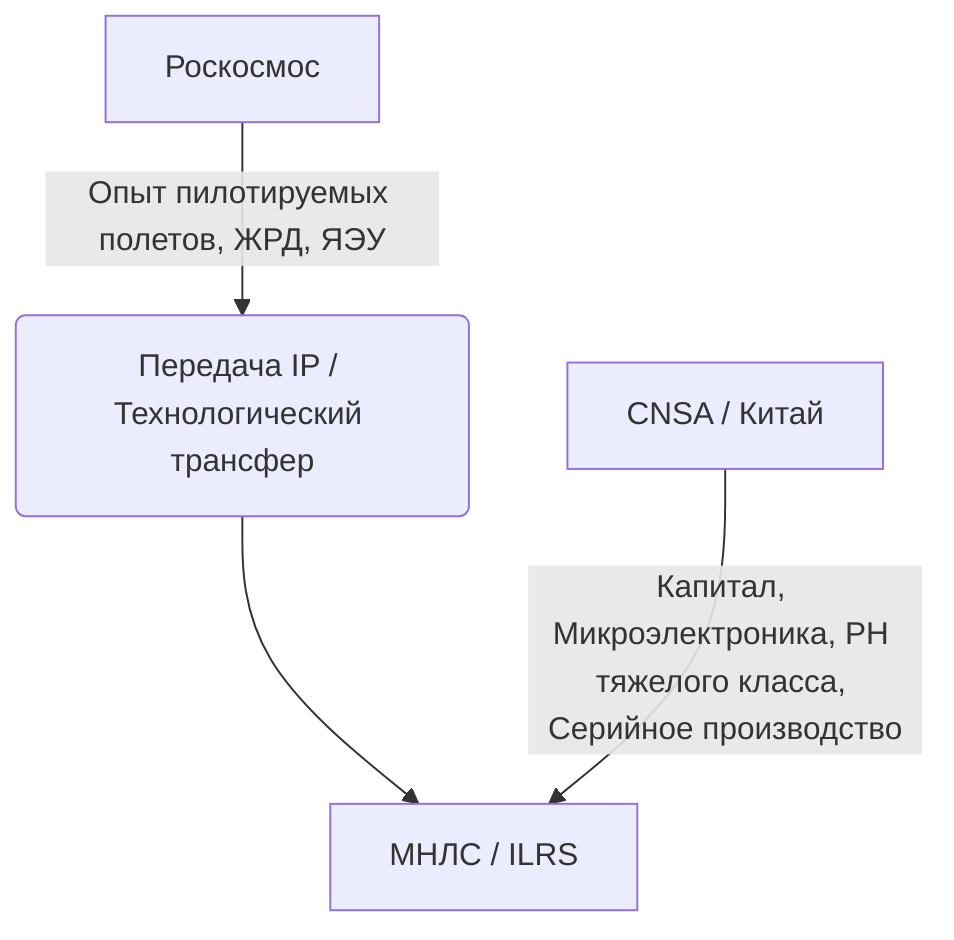

# Глубокий технический и экономический анализ: Космические технологии и дальний космос (TRL 1-6)

> [!abstract] Стратегический контекст
> Развитие технологий дальнего космоса, ядерной энергетики и многоспутниковых группировок Китая — это вершина пирамиды инициативы **[[Made_in_China_2025]]** и последующих 14-го и 15-го пятилетних планов. Переход от копирования советских/российских и западных технологий к абсолютному технологическому суверенитету в космосе опирается на импортозамещение критических компонентов (радиационно-стойкая ЭКБ, сверхвысокотемпературные сплавы), вертикальную интеграцию цепочек поставок и асимметричное международное партнерство.

---

## 1. Международная научная лунная станция ([[ILRS]])

Проект [[ILRS]] (совместная инициатива CNSA и Роскосмоса) позиционируется как прямой конкурент американской программе Artemis. Однако технический и экономический паритет внутри этого альянса глубоко асимметричен.



### 1.1. Анализ партнерства CNSA-Роскосмос и риски интеллектуальной собственности (IP)

Исторически Китай импортировал технологии жидкостных ракетных двигателей (ЖРД), включая технологии РД-120 и РД-170/180, а также систем жизнеобеспечения (СЖО). В рамках [[ILRS]] ключевые риски для РФ и выгоды для КНР распределяются следующим образом:

* **Асимметричный трансфер компетенций:** Китай испытывает острую потребность в российских компетенциях по долгосрочному планированию пилотируемых миссий, радиационной безопасности в глубоком космосе и замкнутым системам жизнеобеспечения (TRL 5-6 в РФ, TRL 4 в КНР). Взамен Китай предлагает финансирование и поставку радиационно-стойкой электронной компонентной базы (ЭКБ), где РФ находится в критической зависимости.
* **Риск «обратного инжиниринга» и абсорбции IP:** Китайские государственные корпорации (CASC, CASIC) используют практику создания совместных лабораторий. После достижения TRL 6 на совместных испытательных стендах, КНР быстро переходит к TRL 7-8 на собственных производственных мощностях, исключая партнера из цепочки создания стоимости (Value Chain).

### 1.2. Технический аудит ключевых подсистем [[ILRS]] (TRL 1-6)

| Субсистема [[ILRS]] | Текущий TRL (КНР) | Ключевые технические барьеры | Оценка IP-рисков для партнеров |
| :--- | :---: | :--- | :--- |
| **Сверхтяжелая РН ([[Long_March_9]])** | **TRL 3-4** | Переход от керосинового ЖРД YF-130 к метановому YF-215 тягой 200 тс. Сварка трением с перемешиванием (FSW) крупногабаритных обечаек из Al-Li сплавов (диаметр 10 м). | **Высокий.** Попытки заимствования технологий трибологических пар, турбонасосных агрегатов (ТНА) и систем наддува баков у РФ. |
| **Автоматические лунные станции ([[Chang_e_6\|Chang’e-6/7/8]])** | **TRL 6** | Точная посадка в затененные кратеры (прецизионная навигация LiDAR + ИИ-распознавание рельефа ALHAT). Криогенный забор реголита с сохранением летучих веществ ($H_2O$ лед). | **Низкий.** Китай здесь является технологическим лидером (успешный возврат грунта с обратной стороны Луны в миссии [[Chang_e_6]]). |
| **Ядерный источник энергии для лунной базы (1-100 кВт)** | **TRL 3-4** | Создание высокотемпературного литиевого или газоохлаждаемого реактора. Деградация термоэлектрических преобразователей на основе SiGe/BiTe. Отвод тепла в вакууме. | **Средний.** Активный интерес к российским наработкам по космической ядерной энергетике (проект [[TEM_Zeus\|«Зевс»]]). |
| **Замкнутая СЖО (Life Support System)** | **TRL 4-5** | Регенерация воды и кислорода с эффективностью $>98\%$ в условиях лунной гравитации ($1/6\text{ g}$). Фазовое разделение сред (газ-жидкость) без центробежных перегрузок. | **Высокий.** Потребность в российских технологиях фильтрации, электролиза воды и утилизации углекислого газа (реакция Сабатье). |

---

## 2. Ядерные космические буксиры и электроракетные двигатели (ЭРД)

Транспортировка тяжелых грузов к Луне и Марсу неэффективна на химических источниках энергии. КНР и РФ ведут параллельные, но технологически разные разработки в области космических ядерных энергоустановок (ЯЭУ) и мегаваттных ЭРД.

### 2.1. Сравнительный анализ концепций ЯЭУ: РФ ([[TEM_Zeus\|«Зевс»]]) vs. КНР (CAS MW-class)

```
Концепция РФ (ТЭМ "Зевс"):
[Реактор (Быстрые нейтроны)] ──► [Газоохлаждаемый контур (He-Xe)] ──► [Турбина / Генератор (Брайтон)] ──► [Капельный радиатор] ──► [ЭРД (ИД/ДХ)]

Концепция КНР (CAS):
[Реактор (Литиевый теплоноситель)] ──► [Термоэлектрический / Стирлинг преобразователь] ──► [Статический радиатор] ──► [Высокомощный ЭРД]
```

#### 1. Российский проект ТЭМ [[TEM_Zeus\|«Зевс»]] (TRL 4-5)
* **Технология:** Высокотемпературный газоохлаждаемый реактор на быстрых нейтронах. Теплоноситель — гелий-ксеноновая смесь (He-Xe, молярная масса $\sim72\text{ г/моль}$). Преобразование энергии — замкнутый машинный цикл Брайтона (газовая турбина на одном валу с генератором и компрессором). Температура на входе в турбину — до $1500\text{ K}$.
* **Преимущества:** Высокий термодинамический КПД преобразования ($\sim30\%$), отработанная теория газовых турбин, меньшая масса радиатора за счет высокой температуры сброса тепла.
* **Уязвимости:** Сложная динамика вращающихся частей (гироскопический момент) в невесомости, высокий износ газодинамических подшипников, проблема создания капельного радиатора-излучателя (TRL 3) для исключения проколов метеоритами.

#### 2. Китайский проект мегаваттного класса (CAS/Ухань) (TRL 3)
* **Технология:** Литиевый одноконтурный теплоноситель с высокотемпературными тепловыми трубами и термоэлектрическим преобразованием (или свободнопоршневым двигателем Стирлинга).
* **Преимущества:** Отсутствие движущихся частей в контуре охлаждения (в термоэлектрическом варианте), высокая надежность и радиационная стойкость статической схемы.
* **Уязвимости:** Высокая коррозионная агрессивность жидкого лития к конструкционным материалам при температурах $>1200\text{ K}$. Требуются молибденовые (TZM) и ниобиевые (Nb-1Zr) сплавы сверхвысокой чистоты, производство которых ограничено. Низкий КПД термоэлектриков ($\sim 6-8\%$) требует гигантской площади радиаторов.

### 2.2. Электроракетные двигатели (ЭРД) высокой мощности (TRL 4-6)

Для реализации ядерного буксира требуются ЭРД мощностью от 50 кВт до 100 кВт на один единичный модуль.

* **Двигатели Холла (HET):** Китай (Lanzhou Institute of Physics) разработал и испытал HET-3000 (мощность 50 кВт, тяга 3.2 Н, удельный импульс $I_{sp} \sim 3000\text{ s}$, TRL 5-6). Основной барьер — эрозия стенок разрядной камеры из борида лантана ($LaB_6$) или нитрида бора ($BN$). Переход на технологию **магнитного экранирования (Magnetic Shielding)** позволил снизить ионную бомбардировку стенок и поднять ресурс до 10 000 часов, но это требует прецизионного численного моделирования плазмы (PIC-MCC коды).
* **Ионные двигатели с сеткой (GIE):** Разработки КНР серии LIPS (LIPS-300, TRL 6) обладают высоким удельным импульсом ($I_{sp} > 4000\text{ s}$), но низкой тягой ($\sim 0.2\text{ Н}$). Применяются преимущественно для удержания геостационарных орбит. Основной барьер для мегаваттного класса — изготовление крупногабаритных перфорированных молибденовых или углерод-углеродных ионно-оптических сеток с минимальным зазором ($<1\text{ мм}$), исключающим тепловую деформацию.
* **Магнитоплазмодинамические двигатели (MPDT):** Находятся на стадии TRL 2-3. Основная проблема — колоссальный эрозионный износ катодов при токах в тысячи ампер из-за перехода из диффузного режима горения дуги в контрагированный (пятнистый).

### 2.3. Физические и инфраструктурные барьеры

> [!warning] Критические технологические ограничения
> 1. **Тепловой барьер (Thermal Management):** В вакууме сброс тепла возможен только излучением, описываемым законом Стефана-Больцмана:
>    $$Q = \epsilon \sigma A (T^4 - T_0^4)$$
>    Для мегаваттного реактора при КПД $20\%$ необходимо сбросить 4 МВт тепловой мощности. При температуре радиатора $400\text{ K}$ площадь излучения $A$ должна составлять более $3000\text{ м}^2$. Создание складных композитных радиаторов с графеновым покрытием высокой теплопроводности находится на уровне **TRL 3**.
> 2. **Радиационная стойкость управляющей электроники:** Поток быстрых нейтронов ($>10^{13}\text{ н/см}^2$) и гамма-излучения от собственного реактора требует физического разнесения приборного отсека и ЯЭУ на ферме длиной 30-50 метров, а также разработки радиационно-стойких полупроводников на основе карбида кремния (SiC) и нитрида галлия (GaN) (TRL 4-5 в КНР).
> 3. **Топливный барьер:** Необходимость использования урана высокой степени обогащения (HALEU, от $15\%$ до $19.75\%$ U-235). Производство HALEU в промышленных масштабах монополизировано РФ (АО «Техснабэкспорт»), что создает критическую зависимость КНР в случае отказа от развертывания собственных центрифужных мощностей под космические нужды.

---

## 3. Многоспутниковые низкоорбитальные группировки связи и ДЗЗ

Китай разворачивает масштабный ответ американскому Starlink в виде двух мега-группировок: **Guowang (GW)** ($\sim13\ 000$ аппаратов) и **G60 Qianfan (Thousand Sails)** ($\sim14\ 000$ аппаратов).

```
[Starlink (США)] ◄─── (Орбитально-частотное противостояние) ───► [Guowang / G60 (КНР)]
                                                                        │
                                      ┌─────────────────────────────────┴────────────────────────────────┐
                                      ▼                                                                  ▼
                        [Технологические узкие места]                                      [Инфраструктурные барьеры]
                        - Межспутниковая лазерная связь (ISL)                              - Дефицит пусковых мощностей
                        - Фазированные антенные решетки (AESA)                             - Отсутствие многоразовых РН
                        - Радиационно-стойкие ASIC-чипы                                    - Пропускная способность космодромов
```

### 3.1. Технологические узкие места (Bottlenecks) и TRL компонентов

1. **Межспутниковая лазерная связь (ISL - Inter-Satellite Laser Links):**
   * **Статус:** **TRL 5-6**. Китай продемонстрировал лазерную связь на спутниках Shijian. Однако массовое производство терминалов ISL весом $<5\text{ кг}$ и энергопотреблением $<50\text{ Вт}$ с точностью наведения в единицы микрорадиан на расстоянии до 5000 км остается сложной задачей. Переход от прямого детектирования (OOK) к когерентному (BPSK/QPSK) требует высокостабильных лазеров и быстрых процессоров DSP (Digital Signal Processing), где КНР испытывает дефицит литографических мощностей для выпуска специализированных чипов.
2. **Плоские фазированные антенные решетки (AESA) Ku/Ka/Q/V-диапазонов:**
   * **Статус:** **TRL 6**. Ключевой барьер — стоимость и энергоэффективность приемопередающих модулей (TRX) на базе SiGe BiCMOS или GaAs. Переход на кремний-германиевую технологию позволяет снизить стоимость, но КНР зависит от импортного софта для проектирования интегральных схем (EDA-средства, такие как Synopsys/Cadence, заблокированы санкциями США). Теплоотвод от плоской панели AESA мощностью $>500\text{ Вт}$ без жидкостного контура требует применения пиролитического графита.
3. **Радиационно-стойкие бортовые вычислители ([[Rad_Hard_ASIC\|Rad-Hard OBC]]):**
   * **Статус:** **TRL 5**. Использование коммерческих чипов (COTS) с мажоритарным резервированием (TMR - Triple Modular Redundancy) на уровне архитектуры и программного обеспечения. Это снижает стоимость, но увеличивает энергопотребление и вес ПО. Разработка собственных радиационно-стойких ASIC по технологии SOI (Silicon-on-Insulator) ограничена доступностью фабрик (SMIC отстает в коммерческом освоении специализированных Rad-Hard процессов).

### 3.2. Физические и инфраструктурные барьеры развертывания

* **Дефицит пусковых мощностей (The Launch Bottleneck):**
  Для вывода 27 000 спутников при среднем сроке службы аппарата в 5 лет требуется запускать не менее 3000-5000 спутников ежегодно. Текущий флот одноразовых ракет семейства Long March (CZ-2D, CZ-4B, CZ-5, CZ-8) физически не способен обеспечить такую частоту пусков. Стоимость вывода полезной нагрузки на одноразовых носителях КНР составляет около $\$3000\text{--}\$5000$ за кг, в то время как у SpaceX Falcon 9 она опустилась ниже $\$1500$ за кг.
* **Статус многоразовых носителей в КНР (TRL 4-5):**
  Ракеты-носители с вертикальной посадкой (VTVL), такие как [[Long_March_10]] (лунная), *Zhuque-3* (LandSpace, нержавеющая сталь, метановый двигатель TQ-12/15A), *Nebula-1* (Deep Blue Aerospace) и *Hyperbola-3* (i-Space), находятся на стадии огневых испытаний и прыжковых тестов на высоту от 100 м до 10 км (TRL 4-5). Ключевой барьер — глубокое дросселирование метановых ЖРД (снижение тяги до $30-40\%$ для совершения мягкой посадки при минимальной массе ракеты в конце полета) и разработка высокоресурсных уплотнений ТНА. Реальное коммерческое использование начнется не ранее 2026–2027 гг.
* **Пропускная способность космодромов:**
  Традиционные внутренние космодромы КНР (Цзюцюань, Сичан, Тайюань) перегружены и имеют жесткие ограничения по азимутам пуска из-за падения ступеней на сушу. Новый коммерческий космодром в Вэньчане (Хайнань) с двухпусковыми столами под жидкий кислород/керосин и жидкий кислород/метан только вводится в эксплуатацию, его логистическая емкость пока не превышает 20-30 пусков в год.

---

## 4. Сводная матрица рисков и экономическая жизнеспособность

### 4.1. Матрица рисков (Risk Matrix)

| Риск | Вероятность | Влияние | Стратегия смягчения (Mitigation) |
| :--- | :---: | :---: | :--- |
| **IP-утечки из РФ в КНР** (в рамках [[ILRS]]) | **Высокая** | **Высокое** | Жесткое разделение интерфейсов (Black Box approach). Передача готовых агрегатов (например, СЖО или ЯЭУ) без раскрытия конструкторской и технологической документации. |
| **Санкционная блокировка EDA-софта** для КНР | **Высокая** | **Среднее** | Форсированные инвестиции в национальные САПР (Empyrean). Использование открытой архитектуры RISC-V для космических процессоров вместо ARM/SPARC. |
| **Орбитальный коллапс (синдром Кесслера)** | **Средняя** | **Критическое** | Обязательное оснащение каждого спутника LEO-группировок резервными двигателями увода с орбиты (криогенный газ или ЭРД) с TRL 6. Внедрение автономного уклонения на базе ИИ. |
| **Дефицит Ксенона/Криптона** для ЭРД | **Средняя** | **Среднее** | Переход на альтернативные рабочие тела (Аргон, Йод). Разработка йодных ЭРД (TRL 4), требующих подогрева тракта подачи для исключения сублимации йода. |

### 4.2. Экономический анализ (CAPEX/OPEX)

```
[Инвестиции в LEO-группировки (GW / G60)] ──► CAPEX: ~$15-20 млрд. (Производство + Пуски)
                                                    │
                                                    ▼
                                        [Экономический тупик?]
                                        - Низкий ARPU на внутреннем рынке КНР
                                        - Геополитические ограничения экспорта услуг (США/ЕС закрыты)
                                        - Необходимость субсидирования государством (военный бюджет)
```

#### LEO-группировки
* **CAPEX:** Развертывание группировки из 13 000 спутников потребует около **$\$15\text{--}\$20\text{ млрд}$** (при себестоимости спутника $\$500\text{ тыс.}$ и стоимости пуска $\$30\text{ млн}$ на 50 спутников).
* **OPEX:** Ежегодное восполнение группировки ($20\%$ утилизации в год из-за деградации орбит и отказов) потребует **$\$3\text{--}\$4\text{ млрд}$** операционных расходов.
* **ROI:** Внутренний рынок КНР не способен сгенерировать достаточный ARPU (Average Revenue Per User) для окупаемости проекта из-за высокой плотности наземного 5G/6G покрытия. Экспорт услуг в страны «Один пояс, один путь» ограничен низкой платежеспособностью населения этих регионов. Проект жизнеспособен только при прямом государственном (военном) субсидировании как система двойного назначения (аналог Starshield).

#### Дальний космос и [[ILRS]]
Проекты глубокого космоса имеют **нулевую прямую коммерческую окупаемость** в горизонте до 2040 года. Основной экономический драйвер — спин-офф (Spin-off) технологии:
* Разработка новых сверхлегких композитов и технологий сварки FSW для [[Long_March_9]] находит применение в гражданской авиации (C919/C929) и ракетостроении средней дальности.
* Космические ЯЭУ стимулируют развитие наземных малых модульных реакторов (SMR) для удаленных регионов КНР.
* Высокоэффективные ЭРД стимулируют химическую промышленность сверхчистых газов и производство редкоземельных магнитов (NdFeB) высокой температурной стабильности.

---

## 5. Интерактивные кейсы для самопроверки

> [!question] Кейс 1: Дилемма трансфера ядерных технологий
> Вы являетесь ведущим техническим аудитором со стороны Роскосмоса в совместной рабочей группе по энергоустановке [[ILRS]]. Китайская сторона предлагает полностью профинансировать создание стенда для испытаний термоэмиссионных преобразователей в Ухане в обмен на передачу математических моделей деградации эмиттеров при температурах $>1600\text{ K}$, разработанных в РФ.
> 
> **Какое решение является наиболее взвешенным с точки зрения защиты IP и экономической выгоды?**
> 
> 1. Согласиться. Финансирование позволит завершить НИОКР по проекту [[TEM_Zeus\|«Зевс»]], а модели без физических образцов бесполезны.
> 2. Отказаться. Математические модели — это ядро технологии (IP), их передача позволит КНР создать собственный аналог без участия РФ.
> 3. Предложить компромисс: проведение расчетов на российских серверах в режиме «черного ящика» (SaaS) без передачи исходного кода моделей, с оплатой за каждый расчетный цикл со стороны КНР.

> [!info] Анализ решения Кейса 1
> **Правильный ответ: 3.** 
> Вариант 3 минимизирует риск прямой утечки IP (модели деградации эмиттеров — это TRL 4-5, критический актив РФ) и одновременно обеспечивает монетизацию компетенций для финансирования отечественной программы. Вариант 1 ведет к потере технологического лидерства. Вариант 2 ведет к остановке сотрудничества и поиску Китаем альтернативных путей (что задержит их, но не остановит).

---

> [!question] Кейс 2: Преодоление пускового барьера (The Launch Bottleneck)
> Перед руководством проекта G60 Qianfan стоит задача: обеспечить темп развертывания группировки в 1000 спутников в год к 2026 году. Собственная многоразовая ракета *Zhuque-3* находится на уровне TRL 4 (проведены прыжки только на 10 км). 
> 
> **Какую стратегию пусков следует выбрать для минимизации CAPEX и соблюдения сроков?**
> 
> 1. Использовать исключительно проверенные одноразовые ракеты CZ-2D и CZ-4B, увеличив их производство в 5 раз.
> 2. Заключить контракт со SpaceX на запуск первой фазы группировки на Falcon 9.
> 3. Форсировать гибридную схему: использовать одноразовые тяжелые РН CZ-5 для групповых запусков (по 60-80 спутников) параллельно с субсидированием частных китайских стартапов (LandSpace, Deep Blue) для ускорения их перехода от TRL 5 к TRL 7.

> [!info] Анализ решения Кейса 2
> **Правильный ответ: 3.**
> Вариант 1 экономически нежизнеспособен (CAPEX превысит $\$5\text{ млрд}$ в год только на пуски, одноразовые носители уничтожат маржинальность). Вариант 2 невозможен из-за геополитических ограничений (ITAR и прямая блокировка со стороны правительства США). Вариант 3 — единственный реалистичный путь: использование государственных тяжелых носителей как временного решения и создание внутренней конкурентной среды среди частных разработчиков многоразовых РН для снижения стоимости пуска в долгосрочной перспективе.

---

## Выводы

1. **Технологический суверенитет КНР:** В рамках инициативы [[Made_in_China_2025]] КНР практически ликвидировала отставание по TRL в области спутникостроения и автоматических межпланетных станций (достигнут TRL 6).
2. **Критическая зависимость от пусковой инфраструктуры:** Главным сдерживающим фактором для мега-группировок КНР является отсутствие многоразовых ракет-носителей (TRL 4) и дефицит стартовых площадок. Без прорыва в многоразовости китайские LEO-проекты останутся экономически неэффективными государственными программами.
3. **Асимметрия в [[ILRS]]:** Россия рискует потерять статус равноправного партнера, превращаясь в младшего технологического донора. Для минимизации рисков РФ необходимо жестко контролировать передачу IP по ядерным технологиям и СЖО, требуя взамен трансфера технологий производства радиационно-стойкой ЭКБ субмикронных топологий.