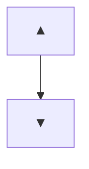
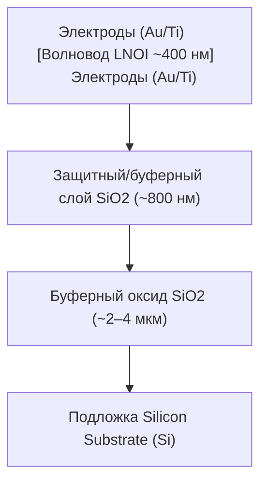
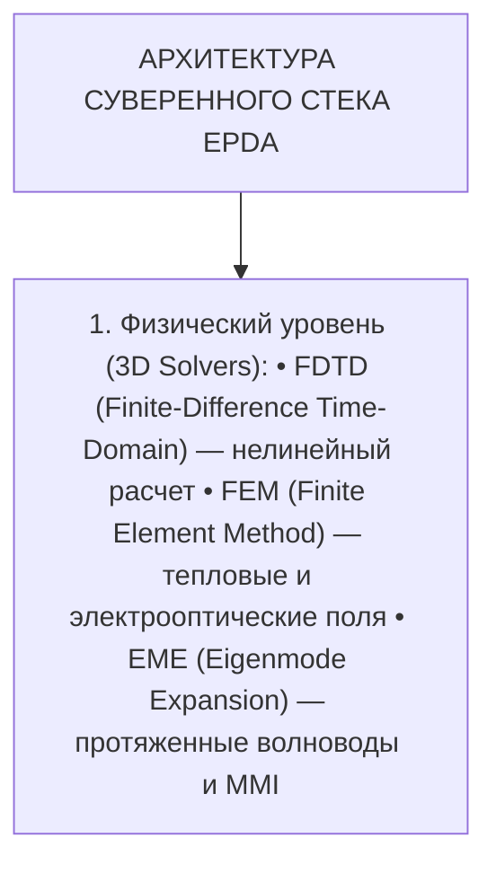
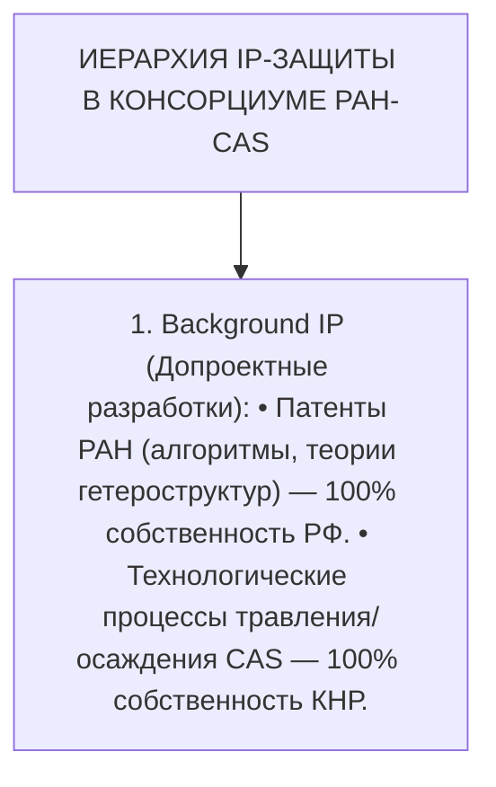


### ****Суть исследования****

| Настоящий документ представляет собой глубинное технико-экономическое, физико-технологическое и институциональное обоснование создания суверенного стека [фотонных интегральных схем (ФИС)](../lib-1/%D0%A4%D0%98%D0%A1.md) и квантовых коммутаторов в рамках стратегического консорциума **[РАН](../lib-1/%D0%A0%D0%90%D0%9D.md)** (Российская академия наук) и **[CAS](../lib-1/CAS.md)** (Китайская академия наук). Модель полностью охватывает цикл разработки от фундаментальной физики гетероструктур до валидированных пилотных образцов (**[TRL](../lib-1/TRL.md) 1–6**). Главная цель программы — полное замещение англо-американских решений в области САПР ([EDA](../lib-1/EDA.md)/[EPDA](../lib-1/EPDA.md)), базовых ячеек ([IP](../lib-1/IP.md)-ядер) и литографических процессов, используя фундаментальный задел РФ в области квантовой оптики и нелинейной физики и производственную экосистему КНР ([Made in China 2025](../Made%20in%20China%202025.md)). |
| --- | --- |



---

## 1. Институциональная модель кооперации РАН — CAS (TRL 1–6)

Кооперация строится в формате **Зеркального паритетного R&D-консорциума**, исключающего модель «аутсорсинга» или простой закупки технологических сервисов. Участие распределено по сквозным уровням технологической готовности ([TRL](../lib-1/TRL.md)) с жесткой системой контрольных точек (Stage-Gates).

  [ ИНСТИТУТЫ РАН ]                                       [ ИНСТИТУТЫ / ФАБЫ CAS ]
 ФТИ им. Иоффе, ИФП СО РАН,                               SIMIT CAS, ISCAS, USTC,
 ИФМ РАН, ФТИАН, ИТМО, ФИАН                               SITRI, CUMEC, ShanghaiTech
### │                                                         │

> **гетероструктур, нелинейная оптика и квантовые алгоритмы**

        │                                                         │
### ▼                                                         ▼

> **ЗЕРКАЛЬНЫЙ R&D-КОНСОРЦИУМ (РАН - CAS) • Совместная разработка суверенного EPDA / CML / PDK-стека • Проектирование топологий в формате Black-Box IP**

### │                                                         │

> **верстка GDSII/OASIS, синтез PDK**

        │                                                         │
### ▼                                                         ▼

> **ПИЛОТНОЕ ФАБРИЧНОЕ ПРОИЗВОДСТВО (MPW RUNS) • Литография и травление на чистых линиях КНР (200/300 мм) • Гетерогенная сборка (Flip-Chip, MTP, FAU, SSPD integration)**

### │                                                         │

> **среде (Сети КРК / QKD, CPO-модули)**

### Распределение ролей и исследовательских центров по уровням TRL


****Принцип взаимодополняемости (Synergy Principle)****
Российские академические институты выступают архитекторами физико-математических моделей, алгоритмов нелинейной оптики и специализированного ПО, тогда как институты CAS обеспечивают высокоточную технологическую базу, фронтенд-производство на 200/300 мм кремниевых подложках и метрологию производственных отклонений.


| Уровень TRL :--- **TRL 1** **TRL 2** | Зона ответственности [РАН](../lib-1/%D0%A0%D0%90%D0%9D.md) :--- **ФТИ им. Иоффе, ИФМ РАН:** Теория квантоворазмерных heterostructures $III-V/Si$, расчет эффективных индексов нелинейности $\chi^{(2)}/\chi^{(3)}$ в [LNOI](../lib-1/LNOI.md). **ФИАН, ИФП СО РАН:** Разработка математических моделей микрорезонаторов, численное моделирование процессов [ICP-RIE](../lib-1/ICP-RIE.md) травления. | Зона ответственности [CAS](../lib-1/CAS.md) :--- **SIMIT CAS, USTC:** Первичный эпитаксиальный синтез, исследование зонной структуры и комбинационного рассеяния. **SITRI, ShanghaiTech:** Эмпирическая калибровка моделей на тестовых структурах, эллипсометрия и AFM-картирование. | Совместный результат (Deliverables & Gates) :--- Физические модели нелинейного переноса, расчеты плотности дислокаций ($TDD < 10^6 \text{ cm}^{-2}$). Верифицированный набор физических уравнений для компенсации шероховатости граней. |  |  |
| --- | --- | --- | --- | --- | --- |
| **TRL 3** | **Университет ИТМО, ФТИАН:** Создание компактных моделей (CML) ячеек [MZI](../lib-1/Untitled%20Note.md), [MRR](../lib-1/Untitled%20Note.md), алгоритмы автотрассировки в [EPDA](../lib-1/EPDA.md). | **ISCAS, CUMEC:** Адаптация технологических правил (DRC/LVS) под фабричные нормы 180–250 нм $Si_3N_4$ и $LNOI$. | Независимый суверенный [PDK](../lib-1/PDK.md) (Process Design Kit) без лицензионных ключей США. |
| **TRL 4** **TRL 5** **TRL 6** | **ИТМО, Центр Квантовых Технологий МГУ:** Синтез топологии чипов $N \times N$, генерация проверенных GDSII/OASIS файлов, ко-симуляция. **ФТИ им. Иоффе, ВНИИФТРИ:** Разработка методик гибридной сборки, инкапсуляция cryo-[SSPD](../lib-1/SSPD.md), прецизионное позиционирование [FAU](../lib-1/FAU.md). **ЦКТ МГУ, ИОФ РАН:** Климатические и функциональные испытания в составе магистральных линий [КРК](../lib-1/%D0%9A%D0%A0%D0%9A.md) (QKD) и волоконных трасс. | **CUMEC, SITRI:** Изготовление фотошаблонов (Reticles), проведение пробных тестовых прогонов (Multi-Project Wafer — [MPW](../lib-1/MPW.md)). **SIMIT CAS, CICC:** Высокопроизводительный Flip-Chip бондинг, полировка фасеток, автоматизированная микросборка. **USTC, CUMEC:** Стресс-тестирование на выжигание (Burn-in), определение времени наработки на отказ (MTBF). | Готовая тестовая пластина (Wafer) с набором тестовых структур и измерительных тестовых ячеек. Прототип фотонного коммутатора с интегрированными лазерами и детекторами без корпусирования. Полностью валидированный предсерийный образец коммутатора/модуля с литерами O1/O2. |  |  |

---

## 2. Глубокая технологическая декомпозиция (TRL 1–6)

[TRL 1-2] ──► Гетероэпитаксия InP/Si & Поккельс-эффект в LNOI
│
[TRL 3-4] ──► Суверенный EPDA-стек + CML Библиотека + DRC/LVS
│
[TRL 5-6] ──► MPW-фабрикация, Micro-transfer printing & Cryo-SSPD

### TRL 1–2: Физика гетероструктур и материалы
Главной проблемой прямого выращивания лазерных гетероструктур группы $III-V$ (InP/GaAs) на кремнии является фундаментальное рассогласование постоянных кристаллической решетки ($\approx 8\%$) и коэффициентов термического расширения (КТР), приводящее к высокой плотности проникающих дислокаций ($TDD > 10^8 \text{ cm}^{-2}$) и безызлучательной рекомбинации.

### Кристаллическая решетка InP (5.869 Å)

| № | Структура / Компонент |
| --- | --- |
| 1 | ▲ |
| 2 | ▼ |

Кристаллическая решетка Si  (5.431 Å)

Для решения этой проблемы разрабатываются два суверенных подхода:
1.  **Выращивание квантовых точек (Quantum Dots, QDs) $InAs/GaAs$**: Метаморфические буферные слои $In_{x}Ga_{1-x}As$ с прослойками из сверхрешеток, напряженных в противоположных направлениях, фильтруют дислокации. Квантовые точки $InAs$, локализующие носители заряда, нечувствительны к одиночным дефектам, что позволяет достигать порога генерации $< 500 \text{ A/cm}^2$ при температурах до $+85^\circ\text{C}$.
2.  **Эффект Поккельса в монокристаллических пленках Thin-Film Lithium Niobate ([LNOI](../lib-1/LNOI.md))**: Использование тонких пленок $LNOI$ толщиной 300–500 нм на подложке $SiO_2/Si$. Линейный электрооптический эффект (эффект Поккельса) обеспечивает изменение показателя преломления $\Delta n \propto E$, исключая паразитное поглощение свободными носителями, характерное для кремния, и обеспечивая полосу фазовой модуляции $> 110 \text{ GHz}$.

### СТРУКТУРА ПЛЕНКИ LNOI (X-CUT)

| № | Структура / Компонент |
| --- | --- |
| 1 | Электроды (Au/Ti)    [Волновод LNOI ~400 нм]    Электроды (Au/Ti) |
| 2 | Защитный/буферный слой SiO2 (~800 нм) |
| 3 | Буферный оксид SiO2 (~2–4 мкм) |
| 4 | Подложка Silicon Substrate (Si) |

### TRL 3–4: Архитектура суверенного EPDA-стека и PDK


****Критическая зависимость от EDA/EPDA****
Использование закрытых проприетарных систем (Synopsys OptoCompiler, Cadence Virtuoso, Ansys Lumerical) влечет технологическую уязвимость: от отзыва сетевых лицензий до внесения аппаратных закладок на этапе генерации GDSII-сетки.


Консорциум разрабатывает независимую среду **Sovereign EPDA** на базе модульного ПО с открытым исходным кодом и закрытыми проприетарными вычислительными ядрами:

| № | Структура / Компонент |
| --- | --- |
| 1 | АРХИТЕКТУРА СУВЕРЕННОГО СТЕКА EPDA |
| 2 | 1. Физический уровень (3D Solvers): • FDTD (Finite-Difference Time-Domain) — нелинейный расчет • FEM (Finite Element Method) — тепловые и электрооптические поля • EME (Eigenmode Expansion) — протяженные волноводы и MMI |

                                   │
### ▼

> **2. Схемотехнический уровень (Circuit-Level Simulation): • Verilog-A / SPICE-подобный моделирующий движок • Компактные модели ячеек (CML): MZI, MRR, Edge Couplers • Статистический анализ Монте-Карло (учет флуктуаций litho/etch)**

                                   │
### ▼

> **3. Уровень топологии и макетирования (Mask Layout): • gdsfactory / KLayout Python API (скриптовое построение) • Автоматизированная трассировка оптических шин (Manhattan/Curve) • Модули DRC (Design Rule Check) и LVS (Layout Versus Schematic)**

                                   │
### ▼

> **Экспорт в формат GDSII / OASIS (Черный ящик для фаба КНР)**

#### Структура суверенного PDK (Process Design Kit)
PDK формируется как закрытый контейнер, включающий:
*   **Design Rules Check (DRC)**: Минимальный зазор между волноводами ($s_{min} = 200 \text{ нм}$), минимальная ширина волновода ($w_{min} = 180 \text{ нм}$), радиус изгиба ($R_{min} = 15 \text{ мкм}$ для $Si_3N_4$).
*   **Compact Model Library (CML)**: Полиномиальные и S-параметрические модели элементов, описывающие зависимость потерь и фазового сдвига от температуры ($\frac{dn}{dT}$) и отклонений геологии травления ($\Delta w, \Delta h$).
*   **Layout Versus Schematic (LVS)**: Правила экстракции топологии в электрико-оптическую принципиальную схему для верификации логики переключений.

### TRL 5–6: Сборка, корпусирование и пилотные испытания
На этапе TRL 5–6 осуществляется переход от кристалла на пластине (Die-on-Wafer) к гибридно-интегрированному оптическому модулю:

[Чип Si3N4/LNOI] ◄──(Micro-transfer printing)── [InP Лазерный гетеро-чип]
│
       ├────► [Flip-Chip бондинг] ───────────────► [ASIC Драйвер управления]
│
       ├────► [Криогенная инкапсуляция] ─────────► [Детектор SSPD (NbN)]
│
       └────► [Edge-Coupling / Sub-micron] ──────► [Массив волокон FAU]

1.  **Метод Micro-Transfer Printing (MTP)**: Прецизионный перенос предварительно изготовленных InP-лазеров и оптических усилителей ([SOA](../lib-1/SOA.md)) с исходной технологической подложки на целевой фотонный чип $Si_3N_4$ или $LNOI$ с использованием эластомерных штампов (PDMS). Точность позиционирования $< \pm 0.2 \text{ мкм}$.
2.  **Сверхпроводниковые детекторы одиночных фотонов ([SSPD](../lib-1/SSPD.md))**: Прямое нанесение полосок нитрида ниобия (NbN) или силицида вольфрама (WSi) толщиной 4–6 нм поверх волноводов $Si_3N_4$. Эффективность регистрации фотонов ($SDE$) достигают $> 92\%$ на длине волны 1550 нм при охлаждении до $2.1–4.2 \text{ K}$.
3.  **Присоединение волоконных массивов (Fiber Array Unit — FAU)**: Использование обратных спот-размерных конвертеров (Inverse Tapers) с размером острия 80–120 нм, закрепощенных оксидной обкладкой, что снижает вносимые потери стыковки с одномодовым волокном SMF-28 до $< 0.5 \text{ dB/фасетка}$.

---

## 3. Физико-технологические барьеры и платформы

Выбор ключевой материальной платформы определяет физические ограничения по потерям, полосе пропускания, термической стабильности и возможности масштабирования.

| СРАВНИТЕЛЬНАЯ ФИЗИКО-ТЕХНИЧЕСКАЯ МАТРИЦА |  |  |  |  |  |
| --- | --- | --- | --- | --- | --- |
| Параметр | Кремниевая фотоника ([Нитрид кремния ([[Нитрид | Ниобат лития на изоляторе ([[LNOI](../lib-1/%D0%9A%D1%80%D0%B5%D0%BC%D0%BD%D0%B8%D0%B5%D0%B2%D0%B0%D1%8F.md)) |  |  |
|  | фотоника\ | SiPh]]) | кремния\ | Si3N4]]) |  |
| **Оптические потери** **Окно прозрачности** **Нелинейный эффект** **Скорость фазового сдвига** **Эффективный индекс $\Delta n$** **Литографическая норма** **Чувствительность к T°** **Статус фабов CAS** | $1.0 - 2.0 \text{ dB/cm}$ $1.2 - 1.6 \text{ мкм}$ Дисперсия носителей $< 15 \text{ GHz}$ High ($\Delta n \approx 0.7$) 45–90 нм Высокая ($dn/dT = 1.8 \cdot 10^{-4} K^{-1}$) Зрелый (CUMEC/SITRI) | **$< 0.01 - 0.05 \text{ dB/cm}$** **$0.4 - 4.0 \text{ мкм}$** Термооптический / $\chi^{(3)}$ $< 100 \text{ kHz}$ Medium ($\Delta n \approx 0.35$) 180–250 нм Низкая ($dn/dT = 2.4 \cdot 10^{-5} K^{-1}$) Зрелый (SITRI) | $0.1 - 0.3 \text{ dB/cm}$ $0.4 - 5.0 \text{ мкм}$ **Прямой Поккельс $\chi^{(2)}$** **$> 110 \text{ GHz}$** Medium ($\Delta n \approx 0.35$) 150–250 нм Средняя ($dn/dT = 3.8 \cdot 10^{-5} K^{-1}$) Внедрение (SIMIT/CUMEC) |  |  |


****Стратегический выбор паритетных платформ****
Консорциум исключает базовую платформу **SiPh** из критического контура квантовых систем из-за высоких оптических потерь и нелинейного двухфотонного поглощения (TPA) на длине волны 1550 нм.
Основной упор делается на **$Si_3N_4$** для трактов квантовой памяти и низкопотерных коммутаторов в сетях [КРК](../lib-1/%D0%9A%D0%A0%D0%9A.md), и **$LNOI$** для сверхскоростных квантовых роутеров и модуляторов.


### Преодоление критических производственных барьеров (Bottlenecks)

#### 1. Борьба с шероховатостью стенок волноводов (Sidewall Roughness)
Рассеяние Рэлея на шероховатостях боковых стенок волновода является определяющим фактором потерь:
$$\alpha_{scat} \propto \sigma_{RMS}^2 \cdot \left(\frac{\partial n_{eff}}{\partial w}\right)^2$$
где $\sigma_{RMS}$ — среднеквадратичная шероховатость.

                  ХИМИКО-ФИЗИЧЕСКОЕ СГЛАЖИВАНИЕ СТЕНОК
### [ICP-RIE Травление]                [Водородый отжиг H₂ / High-T Anneal]

| Шероховатость σ > 2 нм |  | Шероховатость σ < 0.3 нм |
| --- | --- | --- |

▼                          ▼            ▼                                ▼
┌───┐                      ┌───┐        ┌───┐                            ┌───┐
│   │▒▒▒▒▒▒▒▒▒▒▒▒▒▒▒▒▒▒▒▒▒▒│   │ ──►    │   │────────────────────────────│   │
└───┘                      └───┘        └───┘                            └───┘
 (Критические потери ~2 dB/cm)            (Сверхнизкие потери <0.02 dB/cm)

*   **Технологический регламент CAS/РАН**: Переход на плазмохимическое травление с высокой плотностью плазмы ([ICP-RIE](../lib-1/ICP-RIE.md)) на базе смесей $CF_4/C_4F_8/Ar$ для $Si_3N_4$ и $Ar^+$ физического распыления для $LNOI$ с последующим высокотемпературным отжигом ($1050^\circ\text{C}$ в атмосфере $O_2$ или $H_2$) для перекристаллизации и сглаживания рельефа до $\sigma_{RMS} < 0.3 \text{ нм}$.

#### 2. Термостабилизация и фазовый дрейф
| При высокой плотности интеграции изменение температуры на $1^\circ\text{C}$ сдвигает резонансную длину волны кольцевого резонатора ([MRR](../lib-1/%D0%9C%D0%B8%D0%BA%D1%80%D0%BE%D0%BA%D0%BE%D0%BB%D1%8C%D1%86%D0%B5%D0%B2%D1%8B%D0%B5%20%D1%80%D0%B5%D0%B7%D0%BE%D0%BD%D0%B0%D1%82%D0%BE%D1%80%D1%8B.md)) на $\sim 10 \text{ GHz}$. |
| --- | --- |

*   **Решение**: Интеграция микронагревателей из титана/платины ($Ti/Pt$) в верхний защитный слой оксида с созданием теплоизолирующих воздухонаполненных канавок (Air-Trenches) методом селективного травления подложки, что снижает потребление энергии на фазовый сдвиг $\pi$ до $< 1.5 \text{ mW}$.

---

## 4. Юридическая модель Joint Venture (JV) и защита IP

Для исключения технологической зависимости и защиты результатов интеллектуальной деятельности ([IP](../lib-1/IP.md)) вводится строгая регламентация доступа к файлам и патентования.

| № | Структура / Компонент |
| --- | --- |
| 1 | ИЕРАРХИЯ IP-ЗАЩИТЫ В КОНСОРЦИУМЕ РАН-CAS |
| 2 | 1. Background IP (Допроектные разработки): • Патенты РАН (алгоритмы, теории гетероструктур) — 100% собственность РФ. • Технологические процессы травления/осаждения CAS — 100% собственность КНР. |

                                   │
### ▼

> **2. Foreground Device IP (Совместно созданные схемы и чипы): • Территориальный раздел исключительных прав: - РФ + ЕАЭС + СНГ: Исключительные права принадлежат институтам РАН. - КНР + АСЕАН: Исключительные права принадлежат CAS/фабам. - Страны ЕС, БРИКС+, США: Совместные патенты (Co-ownership) с равными роялти.**

                                   │
### ▼

> **3. Защита от раскрытия (Black-Box PDK Mechanism): • Передача файлов на фабы КНР производится ТОЛЬКО в виде скомпилированных топологических масок (GDSII/OASIS) без раскрытия аналитических математических моделей и алгоритмов работы схем.**


****Защита от патентного захвата (Patent Squatting) в патентных бюро****
Все топологии, схемы ячеек и физико-химические способы обработки подлежат безусловной первичной регистрации в формате приоритетных заявок в **[ЕАПО](../lib-1/%D0%95%D0%90%D0%9F%D0%9E.md)** (Евразийское патентное бюро) и **Роспатенте** до момента передачи любых GDSII-файлов на технологическую линию в КНР. Параллельно подается международная заявка по системе **PCT (WIPO)** с указанием Китая (CNIPA) как целевой национальной фазы.


---

## 5. Инженерно-физический практикум и кейсы

### Кейс 1: Расчет оптического бюджета потерь квантового матричного коммутатора $16 \times 16$

### **Исходные данные:**

| Проектируется квантовый реконфигурируемый коммутатор $16 \times 16$ на базе каскада интерферометров Маха-Цандера ([MZI](../lib-1/%D0%98%D0%BD%D1%82%D0%B5%D1%80%D1%84%D0%B5%D1%80%D0%BE%D0%BC%D0%B5%D1%82%D1%80%20%D0%9C%D0%B0%D1%85%D0%B0-%D0%A6%D0%B0%D0%BD%D0%B4%D0%B5%D1%80%D0%B0.md)) архитектуры Бенеша (Benes Network). |
| --- | --- |

*   Количество каскадов $MZI$: $2 \cdot \log_2(16) - 1 = 7$ каскадов.
*   Общая длина оптического волноводного тракта на чипе: $L = 6.5 \text{ см}$.
*   Количество волноводных пересечений (Crossings): $K = 24$ пересечения.
*   Потери на одном пересечении: $\alpha_{cross} = 0.03 \text{ dB/crossing}$.
*   Потери в одном directional coupler ($MZI$ splitter): $\alpha_{mzi} = 0.05 \text{ dB/элемент}$.
*   Потери на ввод/вывод излучения через Edge Couplers (2 фасетки): $\alpha_{coupler} = 0.6 \text{ dB/фасетка}$.
*   **Требование**: Суммарные вносимые потери (Insertion Loss, $IL$) для пропускания одиночных фотонов не должны превышать $2.5 \text{ dB}$.

**Задача:**
Определить максимально допустимые удельные потери волновода ($\alpha_{waveguide}, \text{dB/cm}$) и выбрать подходящую материальную платформу из раздела 3.


****Математическое решение кейса 1****
1.  Рассчитаем суммарные фиксированные компоненты потерь ($IL_{fixed}$):
    *   Потери на ввод/вывод: $IL_{io} = 2 \times \alpha_{coupler} = 2 \times 0.6 \text{ dB} = 1.20 \text{ dB}$.
    *   Потери на волноводных пересечениях: $IL_{cross} = K \times \alpha_{cross} = 24 \times 0.03 \text{ dB} = 0.72 \text{ dB}$.
    *   Потери в делителях $MZI$ (прохождение 7 каскадов): $IL_{mzi} = 7 \times \alpha_{mzi} = 7 \times 0.05 \text{ dB} = 0.35 \text{ dB}$.
    *   Итого фиксированных потерь: $IL_{fixed} = 1.20 + 0.72 + 0.35 = 2.27 \text{ dB}$.
2.  Вычислим остаточный лимит потерь, доступный на длинный тракт волновода:
    $$IL_{waveguide} = IL_{max} - IL_{fixed} = 2.50 \text{ dB} - 2.27 \text{ dB} = 0.23 \text{ dB}$$
3.  Определим предельные удельные потери волновода на единицу длины:
    $$\alpha_{waveguide} = \frac{IL_{waveguide}}{L} = \frac{0.23 \text{ dB}}{6.5 \text{ см}} \approx \mathbf{0.035 \text{ dB/cm}}$$
### 4.  **Вывод и выбор платформы**:

| *   Кремний на изоляторе ([SiPh](../lib-1/%D0%9A%D1%80%D0%B5%D0%BC%D0%BD%D0%B8%D0%B5%D0%B2%D0%B0%D1%8F%20%D1%84%D0%BE%D1%82%D0%BE%D0%BD%D0%B8%D0%BA%D0%B0.md)) ($1.0–2.0 \text{ dB/cm}$) — **Категорически непригоден** (потери превысят 10 dB). |
| --- | --- |

### *   Ниобат лития ([LNOI](../lib-1/LNOI.md)) ($0.1–0.3 \text{ dB/cm}$) — **Не проходит** по жесткому лимиту $2.5 \text{ dB}$ без оптического усиления.

| *   Нитрид кремния (**[Si3N4](../lib-1/%D0%9D%D0%B8%D1%82%D1%80%D0%B8%D0%B4%20%D0%BA%D1%80%D0%B5%D0%BC%D0%BD%D0%B8%D1%8F.md)**) ($\le 0.01–0.05 \text{ dB/cm}$) — **Единственная валидная платформа**, обеспечивающая выполнение оптического бюджета. |
| --- | --- |



---

### Кейс 2: Анализ теплового взаимовлияния (Crosstalk) и оптимизация плотности ячеек

**Исходные данные:**
В матрице коммутации на базе $Si_3N_4$ фазовый сдвиг в плечах MZI осуществляется термооптическими фазовращателями. Расстояние между параллельными плечами составляет $d = 15 \text{ мкм}$.
При подаче мощности $P_{\pi} = 15 \text{ mW}$ на нагреватель одного из плеч происходит утечка тепла к соседнему волноводу, что вызывает паразитный фазовый сдвиг $\Delta \phi_{parasitic} = 0.12 \text{ rad}$.

**Задача:**
Предложить архитектурно-технологическое решение в рамках разработки суверенного PDK для снижения паразитного фазового сдвига до уровня $\Delta \phi_{parasitic} < 0.01 \text{ rad}$ без увеличения расстояния $d$.


****Инженерное решение кейса 2****
1.  **Технологическая модификация слоя PDK**: Введение процесса глубокого сухой ионно-лучевого травления (Deep Reactive-Ion Etching) изоляционного оксида $SiO_2$ до кремниевой подложки с формированием **изолирующих воздушных канавок (Air Trenches)** с двух сторон от нагревательного элемента.
2.  **Физический эффект**: Коэффициент теплопроводности воздуха ($\kappa_{air} \approx 0.026 \text{ W/m}\cdot\text{K}$) на два порядка ниже коэффициента теплопроводности оксида кремния ($\kappa_{SiO2} \approx 1.4 \text{ W/m}\cdot\text{K}$).
3.  **Результат**: Локализация теплового поля внутри структуры волновода снижает паразитный тепловой поток на соседний канал более чем в 20 раз, уменьшая $\Delta \phi_{parasitic}$ до $< 0.005 \text{ rad}$ и одновременно снижая потребляемую мощность $P_{\pi}$ до $\approx 2.0 \text{ mW}$.


---

### Кейс 3: Статистический анализ выхода годных (Yield Analysis) методом Монте-Карло в EPDA

### **Исходные данные:**

| При изготовлении кольцевого резонатора ([MRR](../lib-1/%D0%9C%D0%B8%D0%BA%D1%80%D0%BE%D0%BA%D0%BE%D0%BB%D1%8C%D1%86%D0%B5%D0%B2%D1%8B%D0%B5%20%D1%80%D0%B5%D0%B7%D0%BE%D0%BD%D0%B0%D1%82%D0%BE%D1%80%D1%8B.md)) с радиусом $R = 20 \text{ мкм}$ на фабе КНР технологический разброс ширины волновода составляет $\Delta w = \pm 5 \text{ нм}$ ($3\sigma$), а разброс толщины пленки $\Delta h = \pm 3 \text{ нм}$ ($3\sigma$). |
| --- | --- |

Эти отклонения меняют эффективный показатель преломления $n_{eff}$ и сдвигают резонансную длину волны $\lambda_r$.

**Задача:**
Сформулировать математический алгоритм для модуля EPDA, позволяющий на этапе TRL 3 рассчитать процент попадания добротности резонатора в заданный оптический диапазон $\lambda_0 \pm 0.2 \text{ нм}$.


****Алгоритмическое решение кейса 3****
1.  **Экстракция чувствительности**: Путем FDTD-моделирования рассчитываются частные производные эффективного показателя преломления по геометрическим параметрам:
    $$\frac{\partial n_{eff}}{\partial w} = 1.2 \cdot 10^{-3} \text{ нм}^{-1}, \quad \frac{\partial n_{eff}}{\partial h} = 2.1 \cdot 10^{-3} \text{ нм}^{-1}$$
2.  **Расчет дисперсии резонансной длины волны**:
    $$\delta \lambda_r = \frac{\lambda_r}{n_{g}} \cdot \left( \frac{\partial n_{eff}}{\partial w} \Delta w + \frac{\partial n_{eff}}{\partial h} \Delta h \right)$$
    где $n_g$ — групповой показатель преломления.
3.  **Симуляция Монте-Карло**: Генерация $N = 10,000$ итераций с нормальным (Гауссовым) распределением параметров $\Delta w \sim \mathcal{N}(0, \sigma_w^2)$ и $\Delta h \sim \mathcal{N}(0, \sigma_h^2)$.
4.  **Выходной параметр PDK**: Формирование статистического профиля Yield, определяющего необходимость добавления встроенных каналов термооптической подстройки на этапе проектирования топологии (TRL 4).


---

## 6. Связанные понятия (WikiLinks)

*   [TRL](../lib-1/TRL.md) — Уровни готовности технологий (Technology Readiness Levels)
*   [ФИС](../lib-1/%D0%A4%D0%98%D0%A1.md) — Фотонные интегральные схемы (Photonic Integrated Circuits)
*   [РАН](../lib-1/%D0%A0%D0%90%D0%9D.md) — Российская академия наук
*   [CAS](../lib-1/CAS.md) — Китайская академия наук (Chinese Academy of Sciences)
*   [Made in China 2025](../Made%20in%20China%202025.md) — Национальная стратегия КНР по технологической независимости
*   [PDK](../lib-1/PDK.md) — Process Design Kit (Комплект технологических данных для проектирования)
*   [EPDA](../lib-1/EPDA.md) — Electronic-Photonic Design Automation (САПР электронно-фотонных систем)
*   [EDA](../lib-1/EDA.md) — Electronic Design Automation
*   [Кремниевая фотоника](../lib-1/%D0%9A%D1%80%D0%B5%D0%BC%D0%BD%D0%B8%D0%B5%D0%B2%D0%B0%D1%8F%20%D1%84%D0%BE%D1%82%D0%BE%D0%BD%D0%B8%D0%BA%D0%B0.md) — Silicon Photonics (SiPh)
*   [Нитрид кремния](../lib-1/%D0%9D%D0%B8%D1%82%D1%80%D0%B8%D0%B4%20%D0%BA%D1%80%D0%B5%D0%BC%D0%BD%D0%B8%D1%8F.md) — Silicon Nitride ($\text{Si}_3\text{N}_4$)
*   [LNOI](../lib-1/LNOI.md) — Thin-Film Lithium Niobate on Insulator (Тонкопленочный ниобат лития)
*   [Интерферометр Маха-Цандера](../lib-1/%D0%98%D0%BD%D1%82%D0%B5%D1%80%D1%84%D0%B5%D1%80%D0%BE%D0%BC%D0%B5%D1%82%D1%80%20%D0%9C%D0%B0%D1%85%D0%B0-%D0%A6%D0%B0%D0%BD%D0%B4%D0%B5%D1%80%D0%B0.md) — Mach-Zehnder Interferometer (MZI)
*   [Микрокольцевые резонаторы](../lib-1/%D0%9C%D0%B8%D0%BA%D1%80%D0%BE%D0%BA%D0%BE%D0%BB%D1%8C%D1%86%D0%B5%D0%B2%D1%8B%D0%B5%20%D1%80%D0%B5%D0%B7%D0%BE%D0%BD%D0%B0%D1%82%D0%BE%D1%80%D1%8B.md) — Micro-Ring Resonators (MRR)
*   [SSPD](../lib-1/SSPD.md) — Superconducting Single-Photon Detector (Сверхпроводниковый детектор одиночных фотонов)
*   [MPW](../lib-1/MPW.md) — Multi-Project Wafer (Совместные фабричные прогоны)
*   [КРК](../lib-1/%D0%9A%D0%A0%D0%9A.md) — Квантовое распределение ключей (Quantum Key Distribution, QKD)
*   [ICP-RIE](../lib-1/ICP-RIE.md) — Inductively Coupled Plasma Reactive-Ion Etching (Плазмохимическое травление)
*   [ЕАПО](../lib-1/%D0%95%D0%90%D0%9F%D0%9E.md) — Евразийская патентная организация
*   [SOA](../lib-1/SOA.md) — Semiconductor Optical Amplifier (Полупроводниковый оптический усилитель)