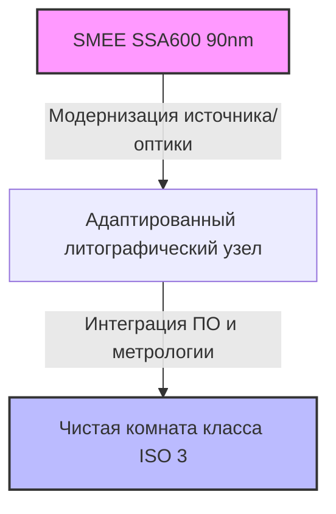
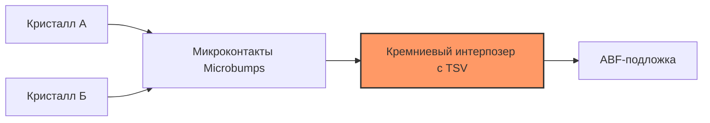
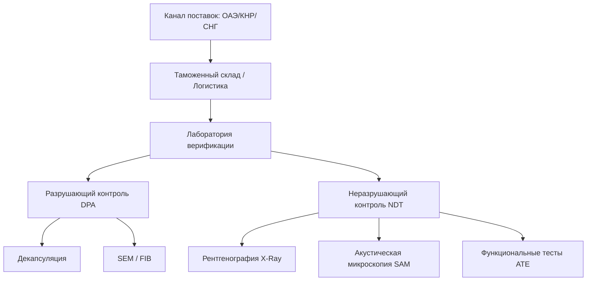

# Глубокий технико-экономический анализ: Локализация производства микроэлектроники, передовое корпусирование и верификация ЭКБ в РФ (TRL 7–9)


### **Обзор направления**

| Настоящий анализ посвящен критическим аспектам достижения [технологического суверенитета](../%D0%A2%D0%B5%D1%85%D0%BD%D0%BE%D0%BB%D0%BE%D0%B3%D0%B8%D1%87%D0%B5%D1%81%D0%BA%D0%B8%D0%B9%20%D0%A1%D1%83%D0%B2%D0%B5%D1%80%D0%B5%D0%BD%D0%B8%D1%82%D0%B5%D1%82.md) РФ в сфере [микроэлектроники](../lib-1/%D0%9C%D0%B8%D0%BA%D1%80%D0%BE%D1%8D%D0%BB%D0%B5%D0%BA%D1%82%D1%80%D0%BE%D0%BD%D0%B8%D0%BA%D0%B0.md) на этапе перехода от опытно-конструкторских разработок к серийному производству (**TRL 7–9**). В фокусе внимания — физико-химические и инженерные барьеры адаптации китайского литографического оборудования зрелых техпроцессов (90–28 нм), развертывание мощностей [передового корпусирования (Advanced Packaging)](../lib-1/Advanced%20Packaging.md), а также создание устойчивых каналов поставок и [верификации электронной компонентной базы (ЭКБ)](../lib-1/%D0%92%D0%B5%D1%80%D0%B8%D1%84%D0%B8%D0%BA%D0%B0%D1%86%D0%B8%D1%8F%20%D0%AD%D0%9A%D0%91.md) в условиях санкционного давления. |
| --- | --- | --- | --- | --- |



---

## 1. Поставки и адаптация китайского литографического оборудования (90–28 нм)

### 1.1. Технический ландшафт китайского литографического машиностроения

Основным игроком в КНР, способным поставлять литографические сканеры, является компания **[SMEE](../lib-1/SMEE.md) (Shanghai Micro Electronics Equipment)**. Переход от лабораторных установок (TRL 4–6) к промышленной эксплуатации (TRL 7–9) в РФ требует детального понимания физических ограничений поставляемых систем.

| *   **Сухой [DUV-литограф](../lib-1/DUV-%D0%BB%D0%B8%D1%82%D0%BE%D0%B3%D1%80%D0%B0%D1%84%D0%B8%D1%8F.md) SMEE SSA600/20**: Работает на длине волны $\lambda = 193\text{ нм}$ (эксимерный [ArF-лазер](../lib-1/ArF-%D0%BB%D0%B0%D0%B7%D0%B5%D1%80.md)). Заявленное разрешение — 90 нм при числовой апертуре объектива $NA = 0.75$. |
| --- | --- |

    Согласно критерию Рэлея для разрешения ($R$) и глубины фокуса ($DOF$):
### $$R = k_1 \frac{\lambda}{NA}, \quad DOF = k_2 \frac{\lambda}{NA^2}$$

| Для достижения $R = 90\text{ нм}$ коэффициент технологического процесса $k_1$ должен составлять около $0.35$, что требует применения сложных фазосдвигающих масок (PSM) и оптимизации освещения (OAI). Теоретически, при использовании [мультипаттернинга (Double Patterning, LELE/SADP)](../lib-1/%D0%9C%D1%83%D0%BB%D1%8C%D1%82%D0%B8%D0%BF%D0%B0%D1%82%D1%82%D0%B5%D1%80%D0%BD%D0%B8%D0%BD%D0%B3%20*%20%20%20**%D0%98%D0%BC%D0%BC%D0%B5%D1%80%D1%81%D0%B8%D0%BE%D0%BD%D0%BD%D0%B0%D1%8F%20%D0%BB%D0%B8%D1%82%D0%BE%D0%B3%D1%80%D0%B0%D1%84%D0%B8%D1%8F.md), на нем можно достичь топологических норм 65–45 нм, однако это критически снижает выход годных (Yield) и производительность (WPH — Wafers Per Hour) из-за накопления погрешности совмещения (Overlay Error, которая для SSA600 составляет $\le 15\text{ нм}$). Погружная (иммерсионная) литография (ArFi, 28 нм)]]**: Разработки SMEE в области иммерсионных сканеров (серия SSA800) используют воду в качестве иммерсионной среды ($n_{H_2O} \approx 1.44$ при $\lambda = 193\text{ нм}$), что позволяет поднять эффективную апертуру $NA$ до $1.35$. Однако поставки готовых систем класса 28 нм из КНР в РФ заблокированы не только внешними санкциями, но и внутренним экспортным контролем Министерства коммерции КНР (MOFCOM) в рамках защиты национальных критических технологий. |
| --- | --- |

### 1.2. Проблемы адаптации и интеграции (TRL 7 $\rightarrow$ TRL 8)

Перенос оборудования из КНР на российские фабы (например, ПАО «[Микрон](../lib-1/%D0%9C%D0%B8%D0%BA%D1%80%D0%BE%D0%BD.md)», «[НМ-Тех](../lib-1/%D0%9D%D0%9C-%D0%A2%D0%B5%D1%85.md)») требует решения комплекса сложнейших инженерных задач:

### 1.  **Источники излучения (Light Sources)**: Китайские сканеры используют эксимерные лазеры производства *Beijing Ruisheng* или импортные аналоги (Cymer/Gigaphoton). Адаптация требует интеграции российских лазерных источников (разработки [ИФМ РАН](../lib-1/%D0%98%D0%A4%D0%9C%20%D0%A0%D0%90%D0%9D.md), [РФЯЦ-ВНИИЭФ](../lib-1/%D0%A0%D0%A4%D0%AF%D0%A6-%D0%92%D0%9D%D0%98%D0%98%D0%AD%D0%A4.md)). Основная сложность — синхронизация частоты импульсов лазера (обычно $4-6\text{ кГц}$) с движением координатного стола (Stage) с субнанометровой точностью. Ошибка синхронизации ведет к неравномерности дозы экспонирования (Dose Uniformity) и, как следствие, к критическому разбросу критических размеров (CD Variation).

| 2.  **Оптические системы (Projection Optics)**: Объективы высокого разрешения крайне чувствительны к температурным колебаниям. Поглощение DUV-излучения кварцевыми линзами вызывает эффект «тепловой линзы» (Lens Heating). Китайские линзовые блоки (разработки *Changchun Institute of Optics*) требуют калибровки под российские системы термостабилизации [чистых зон](../lib-1/%D0%A7%D0%B8%D1%81%D1%82%D1%8B%D0%B5%20%D0%BA%D0%BE%D0%BC%D0%BD%D0%B0%D1%82%D1%8B.md) с точностью до $\pm 0.005^\circ\text{C}$ и интеграции активных газовых манипуляторов для компенсации аберраций в реальном времени. |
| --- | --- |

3.  **Программное обеспечение и СУ**: Китайское ПО жестко привязано к проприетарным контроллерам. Локализация требует реверс-инжиниринга интерфейсов обмена данными (EtherCAT, CANopen) и написания собственного ПО верхнего уровня для интеграции сканера в MES-систему (Manufacturing Execution System) фабрики.


**Риски интеллектуальной собственности (IP) и "Черного ящика"**
В рамках китайской стратегии **"Made in China 2025"** производители (SMEE, Naura, Piotech) подписывают жесткие обязательства по нераспространению чувствительных технологий. 
* **Проблема**: Китайские вендоры отказываются предоставлять исходные коды ПО, схемы разводки плат управления и спецификации оптических элементов.
* **Следствие**: При возникновении сбоев удаленная диагностика невозможна. Российские специалисты вынуждены проводить шеф-монтаж самостоятельно, что снижает реальный TRL внедрения до уровня 7 (требуются длительные НИОКР на месте).


### 1.3. Физико-инфраструктурные барьеры

*   **Виброизоляция**: Для литографии 90–28 нм требуются активные демпфирующие фундаменты (виброизоляция класса VC-E/VC-F, среднеквадратичная скорость вибрации $< 3.12\text{ мкм/с}$). Российские производственные корпуса старой постройки (класс VC-A/VC-B) требуют полной реконструкции фундамента с заливкой инертных бетонных блоков массой до 500 тонн, развязанных со стенами здания с помощью пневматических опор.
*   **Сверхчистые среды (UPW, Ultra-Pure Gases)**: Требуется сверхчистая вода (сопротивление $> 18.2\text{ M}\Omega\cdot\text{cm}$, содержание TOC $< 1\text{ ppb}$, отсутствие кремниевой кислоты) и газы чистоты $6.0$ ($99.9999\%$). Локальные системы фильтрации Pall или Entegris недоступны; переход на китайские аналоги (например, Cobetter) требует длительной квалификации, так как малейший проскок микрочастиц выводит из строя оптику сканера.

---

## 2. Технологии 3D-корпусирования (Advanced Packaging) на российских мощностях

| Поскольку уменьшение физического размера транзистора (More Moore) в РФ ограничено литографическим барьером, критическую важность приобретает концепция **More than Moore** — создание [систем-в-корпусе (SiP)](../lib-1/%D0%A1%D0%B8%D1%81%D1%82%D0%B5%D0%BC%D0%B0-%D0%B2-%D0%BA%D0%BE%D1%80%D0%BF%D1%83%D1%81%D0%B5.md), 2.5D и 3D-интеграция. |
| --- | --- |

### 2.1. Сравнение технологий корпусирования

| Параметр / Технология :--- **Плотность контактов** **Длина межсоединений** **Задержка сигнала** **Текущий TRL в РФ** | Wire Bonding (Традиционная) :--- Низкая ($< 100\text{ IO/mm}^2$) 1–5 мм Высокая ($> 100$ пс) **TRL 9** ([GS Group](../lib-1/GS%20Group.md), [Микрон](../lib-1/%D0%9C%D0%B8%D0%BA%D1%80%D0%BE%D0%BD.md)) | Flip-Chip (2D) :--- Средняя ($100 - 500\text{ IO/mm}^2$) 0.1–0.5 мм Средняя (20–50 пс) **TRL 7** (Опытные образцы) | 2.5D (Silicon Interposer / CoWoS-like) :--- Высокая ($500 - 3000\text{ IO/mm}^2$) 10–50 мкм Низкая (5–10 пс) **TRL 4–5** (Лабораторные макеты) | 3D Integration (TSV / Hybrid Bonding) :--- Экстремальная ($> 10^4\text{ IO/mm}^2$) $< 10$ мкм Минимальная ($< 1$ пс) **TRL 3** (НИР в академических институтах) |
| --- | --- | --- | --- | --- |

### 2.2. Технологические барьеры освоения 2.5D/3D (TRL 7–9)

| 1.  **Формирование [TSV (Through-Silicon Vias)](../lib-1/TSV.md)**: |
| --- | --- |

    *   *Процесс*: Глубокое реактивно-ионное травление кремния (Bosch-процесс) для создания отверстий с аспектным отношением $> 10:1$, нанесение барьерного слоя (Ti/TiN) и заполнение медью методом электрохимического осаждения (ECD).
### *   *Проблема "Copper Pumping"*: Из-за разности коэффициентов теплового расширения (КТР) меди ($\alpha_{Cu} \approx 16.5 \times 10^{-6}/\text{K}$) и кремния ($\alpha_{Si} \approx 2.6 \times 10^{-6}/\text{K}$) при термических циклах происходит выдавливание медных столбиков из отверстий (явление медного пумпинга). Это приводит к растрескиванию межслойного диэлектрика (ILD) и обрыву контактов RDL. В РФ отсутствуют промышленные установки ECD с прецизионным контролем органических добавок (акселераторов, супрессоров, левелеров), обеспечивающих бездефектное заполнение TSV.

| 2.  **Изготовление [кремниевых интерпозеров (Silicon Interposers)](../lib-1/%D0%9A%D1%80%D0%B5%D0%BC%D0%BD%D0%B8%D0%B5%D0%B2%D1%8B%D0%B9%20%D0%B8%D0%BD%D1%82%D0%B5%D1%80%D0%BF%D0%BE%D0%B7%D0%B5%D1%80.md)**: |
| --- | --- |

    *   Требует использования литографического оборудования (даже устаревшего, класса 250–130 нм) для формирования тонких линий разводки (RDL — Redistribution Layer) с шагом $< 1$ мкм. Основная сложность — обеспечение плоскостности интерпозера большой площади (до $26 \times 33\text{ мм}^2$) для предотвращения деламинации при монтаже чипов.
3.  **Утончение пластин (Wafer Thinning) и временный носитель (Temporary Bonding/Debonding)**:
    *   Для 3D-стекирования пластину необходимо утончить до $< 50$ мкм. Для этого она временно приклеивается к стеклянному или кремниевому носителю.
    *   *Барьер*: Термостойкие клеи (производства Brewer Science, 3M) находятся под строжайшим эмбарго. Китайские аналоги часто не выдерживают температурных режимов последующего напыления ($> 250^\circ\text{C}$), что приводит к деструкции адгезива и разрушению тонкой рабочей пластины при дебондинге.


### **Зависимость от ABF-субстратов**

| Монополистом на рынке диэлектрических пленок для подложек высокой плотности является японская Ajinomoto (**[ABF-пленка](../lib-1/ABF-%D1%81%D1%83%D0%B1%D1%81%D1%82%D1%80%D0%B0%D1%82.md)**). Без нее невозможно создать подложки для процессоров уровня «Эльбрус» или «Байкал». Попытки заменить ABF на китайские аналоги (например, от *Shengyi Technology*) требуют полного перепроектирования топологии плат из-за других диэлектрических характеристик (диэлектрическая проницаемость $\varepsilon_r$, тангенс угла потерь $\tan\delta$). |
| --- | --- |



---

## 3. Каналы поставок и верификация ЭКБ в условиях санкций

Обеспечение бесперебойного производства на уровне TRL 8–9 требует создания дублированных каналов поставок и жесткой системы входного контроля для отсечения контрафакта и недекларированных возможностей (аппаратных закладок).

### 3.1. Архитектура каналов поставок

Современные логистические схемы строятся по принципу «многослойного транзита»:
1.  **Первый контур (Закупка)**: Технические компании-интеграторы в нейтральных юрисдикциях (ОАЭ, Турция, Гонконг, Казахстан), не аффилированные с оборонно-промышленным комплексом РФ.
2.  **Второй контур (Дробление партий)**: Крупные оптовые партии оригинальных компонентов (TI, ADI, STM, Xilinx) закупаются у глобальных дистрибьюторов (Arrow, Avnet, Digi-Key) и дробятся на мелкие лоты для отправки через промежуточные склады в Юго-Восточной Азии.
3.  **Третий контур (Финансовый клиринг)**: Использование региональных банков КНР (например, *Kunlun Bank*) или трансграничных платежей в национальных валютах (юань, дирхам) для обхода системы SWIFT.

### 3.2. Методология верификации ЭКБ (Входной контроль для TRL 8–9)

| В условиях поставок через неофициальные каналы доля брака и контрафакта (перемаркировка, восстановленные компоненты) может достигать 15–20%. Для обеспечения надежности класса Space/Military/Industrial применяется многоступенчатый протокол [верификации](../lib-1/%D0%92%D0%B5%D1%80%D0%B8%D1%84%D0%B8%D0%BA%D0%B0%D1%86%D0%B8%D1%8F%20%D0%AD%D0%9A%D0%91.md): |
| --- | --- |

| #### А. [Неразрушающий контроль (Non-Destructive Testing - NDT)](../lib-1/%D0%9D%D0%B5%D1%80%D0%B0%D0%B7%D1%80%D1%83%D1%88%D0%B0%D1%8E%D1%89%D0%B8%D0%B9%20%D0%BA%D0%BE%D0%BD%D1%82%D1%80%D0%BE%D0%BB%D1%8C.md) |
| --- | --- |

*   **Рентгенографический контроль (X-Ray Inspection)**: Позволяет сравнить внутреннюю топологию рамки выводов (leadframe) и разварки проволоки с эталонным образцом (Golden Image). Эффективен для выявления перемаркированных пустышек.
*   **Сканирующая акустическая микроскопия (SAM)**: Выявляет скрытые дефекты — пустоты в компаунде, деламинацию слоев, трещины в кристалле, возникшие из-за нарушения условий транспортировки и хранения (MSL — Moisture Sensitivity Level).

| #### Б. [Разрушающий контроль (Destructive Physical Analysis - DPA)](../lib-1/%D0%A0%D0%B0%D0%B7%D1%80%D1%83%D1%88%D0%B0%D1%8E%D1%89%D0%B8%D0%B9%20%D0%BA%D0%BE%D0%BD%D1%82%D1%80%D0%BE%D0%BB%D1%8C.md) |
| --- | --- |

*   **Химическая декапсуляция (Decapsulation)**: Травление пластикового корпуса дымящей азотной ($HNO_3$) или серной ($H_2SO_4$) кислотой при температуре $60-90^\circ\text{C}$ для обнажения кристалла. Для микросхем с медной разваркой проволоки применяется лазерная декапсуляция или плазменное травление в атмосфере $CF_4/O_2$ во избежание коррозии медных проводников.
### *   **Оптическая микроскопия и SEM (Сканирующая электронная микроскопия)**: Считывание маркировки на самом кристалле (Die Marking), логотипа разработчика и года проектирования. Сравнение топологии металлизации.

| *   **[FIB (Focused Ion Beam - Сфокусированный ионный пучок)](../lib-1/FIB.md)**: Применяется для послойного анализа структуры кристалла при подозрении на наличие аппаратных закладок (Hardware Trojans) или для реверс-инжиниринга. Позволяет осуществлять локальное травление и осаждение металлов (Pt, W) для модификации схемы (circuit edit) на уровне TRL 7. |
| --- | --- |

#### В. Функциональное тестирование (Electrical Testing)
| *   **Параметрический контроль**: Измерение токов потребления в различных режимах, статических характеристик входов/выходов на автоматизированных измерительных системах (**[ATE — Automatic Test Equipment](../lib-1/ATE.md)**, например, отечественные системы серии «Формула»). |
| --- | --- |

*   **Температурный скрининг**: Тестирование в климатических камерах при экстремальных температурах (от $-60^\circ\text{C}$ до $+125^\circ\text{C}$) для подтверждения индустриального или военного класса исполнения.

---

## 4. Сводная матрица рисков и барьеров локализации

| Риск / Барьер :--- **Технологический (Литография)** **Геополитический (КНР)** **Материаловедческий** **Кадровый дефицит** | Описание :--- Невозможность закупки запчастей для DUV/ArFi сканеров, отсутствие сервисной поддержки вендоров. Введение Китаем жесткого экспортного контроля на оборудование двойного назначения под давлением США. Отсутствие отечественных фоторезистов, ABF-аналогов, сверхчистой химии. Острая нехватка инженеров-технологов по процессам 2.5D/3D и литографии глубокого ультрафиолета. | Уровень угрозы (1-10) :--- **9/10** **8/10** **8/10** **7/10** | Стратегия минимизации (Mitigation) :--- Создание консорциума по реверс-инжинирингу узлов (лазеры, прецизионная механика) на базе институтов РАН и Росатома. Диверсификация каналов через страны Юго-Восточной Азии (Малайзия, Вьетнам), создание СП на территории КНР без прямого импорта в РФ. Целевое субсидирование Минпромторга на разработку малотоннажной химии (синтез мономеров, очистка газов до уровня 6.0). Создание базовых кафедр при ведущих фабах, трансфер специалистов из азиатских OSAT-центров. |
| --- | --- | --- | --- |

---

## 5. Интерактивный блок самопроверки и кейс-стади


**Кейс 1: Проблема деламинации при 3D-корпусировании**
Вы — главный технолог на сборочном производстве (OSAT) в РФ. При сборке опытной партии процессоров по технологии 2.5D с использованием китайского аналога временного клея для утончения пластин, после этапа напыления RDL при температуре $260^\circ\text{C}$ обнаруживается массовое вздутие и деламинация пластин. 

**Каковы ваши действия по локализации и устранению дефекта?**

<b>Решение и технический разбор:</b>

1. **Анализ первопричины**: Китайский клей-аналог имеет более низкую температуру деструкции или высокий коэффициент термического расширения (CTE mismatch) по сравнению с оригинальным клеем Brewer Science. При $260^\circ\text{C}$ началось выделение летучих фракций (outgassing), что привело к образованию пузырей газа под пластиной.
2. **Тактические шаги**:
   * Снизить температуру процесса напыления RDL до $210-220^\circ\text{C}$ с компенсацией времени осаждения (изменение технологической карты).
   * Провести вакуумный отжиг (vacuum baking) склеенного сэндвича перед напылением для удаления остаточных растворителей из клея.
   * Направить ТЗ в ИНХС РАН или профильные химические институты на синтез кремнийорганических или полиимидных адгезивов с термостабильностью до $300^\circ\text{C}$.




**Кейс 2: Выявление скрытого контрафакта в партии ПЛИС**
На склад предприятия поступила партия ПЛИС Xilinx Kintex-7 через дилера из ОАЭ. Внешний вид корпусов идеален, лазерная маркировка соответствует спецификации. Однако при выборочном функциональном тестировании 2% микросхем выходят из строя при нагреве до $+85^\circ\text{C}$.

**Какой алгоритм верификации необходимо применить для выявления причин брака?**

<b>Решение и технический разбор:</b>

1. **Шаг 1: Рентген-контроль (NDT)** всей выборки. Сравнить топологию разварки золотой проволоки подозрительных образцов с заведомо оригинальным чипом (Golden Image). Если разварка отличается — перед нами перемаркированный чип другого семейства.
2. **Шаг 2: Акустическая микроскопия (SAM)**. Проверить наличие деламинации между компаундом и кристаллом. Если обнаружены пустоты, чипы были восстановлены (refurbished) — выпаяны со старых плат с помощью строительного фена, что повредило структуру кристалла.
3. **Шаг 3: Разрушающий контроль (DPA)**. Провести химическую декапсуляцию кислотой. Под микроскопом считать маркировку на самом кристалле (Die Marking). Если маркировка кристалла не соответствует маркировке на корпусе (например, кристалл более дешевой серии Spartan в корпусе Kintex) — зафиксировать факт фальсификации.



---

## 6. Стратегические рекомендации

1.  **Фокус на зрелых техпроцессах (90–65 нм)**: Данный диапазон закрывает до 80% потребностей критической инфраструктуры. Необходимо форсировать создание отечественного сухого DUV-литографа на 193 нм, используя китайские комплектующие лишь как временный мост.
2.  **Опережающее развитие Advanced Packaging**: Поскольку освоение суб-22 нм литографии в РФ займет не менее 7–10 лет, компенсация производительности процессоров должна идти за счет 2.5D/3D-интеграции (чиплетов) на базе отечественных дизайн-центров. Это требует срочного развертывания пилотной линии TSV и RDL на свободных площадях «НМ-Тех» или «Микрона».
3.  **Стандартизация верификации**: Создание единого государственного реестра доверенной ЭКБ, прошедшей многоступенчатый контроль в независимых аккредитованных лабораториях, для исключения использования бракованных «серых» компонентов в критических системах.