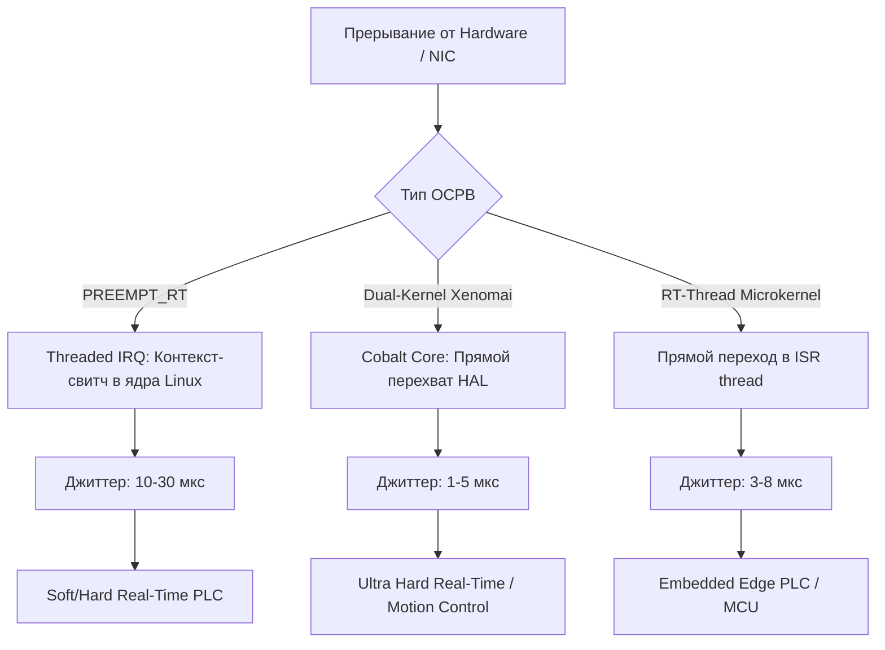
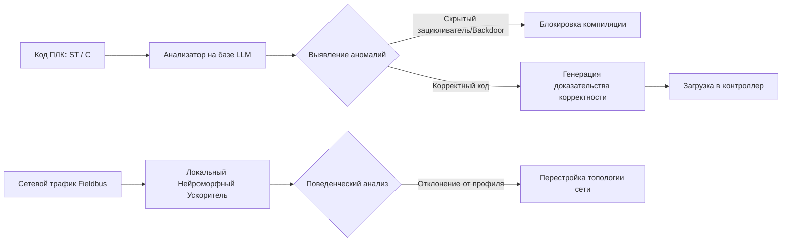

# Глубокий технико-экономический анализ: Миграция АСУ ТП с экосистем Siemens/Schneider Electric на китайский аппаратный стек и открытые ОСРВ

> [!abstract] Executive Summary
> Процесс замещения западных экосистем автоматизации ([[Siemens_TIA_Portal|Siemens TIA Portal/Simatic]], [[Schneider_EcoStruxure|Schneider Electric EcoStruxure/Modicon]]) распределился по двум параллельным трекам:
> 1. **Промышленный заказ (TRL 7–9):** Экстренное внедрение готовых китайских ПЛК и PAC-контроллеров на базе коммерческих архитектур ARM/x86 и проприетарной среды [[CODESYS_Dependency#Runtime Engine|CODESYS Control Runtime]].
> 2. **Фундаментальная суверенизация (TRL 1–6):** Разработка независимых вычислительных ядер (RISC-V, LoongArch), систем жесткого реального времени с формальной верификацией кода и открытых компиляторов стандарта [[IEC_61499_Standard#Distributed Runtime|IEC 61131-3 / IEC 61499]].
> 
> Ключевым технологическим барьером остается «зависимость второго порядка»: замена аппаратуры Siemens на контроллеры Inovance или Hollysys сохраняет критическую уязвимость от немецкой среды разработки CODESYS и закрытых бинарных компонентов (Binary Blobs) в прошивках.

---

## 1. Замещение аппаратно-программного стека: Сравнительный системный анализ

### Сравнительный стек технологий по уровням ISA-95 (TRL 1–9)

| Уровень (ANSI/ISA-95) | Western Baseline (Siemens / Schneider) | Китайская коммерческая альтернатива (TRL 7–9) | НИОКР и Суверенные платформы (TRL 1–6) | Критические узкие места (Bottlenecks) |
| :--- | :--- | :--- | :--- | :--- |
| **Level 3 (MES/SCADA)** | Siemens WinCC OA, Aveva System Platform | SUPCON InPlant, Inspur Kaiwu, Hollysys HiSCADA | Open-source SCADA / Linux Native Time-Series DB (TRL 5–6) | Низкая скорость обработки тегов (>500k) в режиме реального времени; отсутствие нативных драйверов для legacy-БД. |
| **Level 2 (PLC / PAC Control)** | Simatic S7-1500, Schneider Modicon M580 | Inovance AM600/AC800, SUPCON ECS-700, Hollysys LK/K-series | [[RISC_V_Industrial_Cores#Lockstep Architecture|RISC-V Lockstep Cores]] + Beremiz Runtime (TRL 3–5) | Нестабильность цикла вычислений FPU при высокой плотности I/O; зависимость от зарубежных компиляторов. |
| **Level 1 (Fieldbus & I/O)** | PROFINET IRT, EtherNet/IP (CIP Safety) | [[EtherCAT_Protocol#Architecture|EtherCAT]], Modbus TCP, Inovance GL10/GL20 | Открытый стек Ethernet TSN (Time-Sensitive Networking) (TRL 4–6) | Отсутствие аппаратной поддержки PROFINET IRT (необходимы чипы Siemens ERTEC200/400). |
| **Level 0 (Safety & Process)** | Fail-Safe S7-1500F, Triconex (Schneider) | Hollysys HiaSub, SUPCON TCS-900 (сертифицированы в КНР) | Формально верифицированные SIL3-контроллеры на ОСРВ seL4 (TRL 2–4) | Сложность сертификации по IEC 61508 (SIL3) за пределами КНР; малый объем статистической наработки на отказ (MTBF). |

### Микроархитектура и специфика ключевых китайских производителей

```
+-----------------------------------------------------------------------------------+
|                           ПРИКЛАДНОЕ ПО АСУ ТП                                    |
|             (IEC 61131-3: ST, LD, FBD / IEC 61499: Distributed FB)                |
+-----------------------------------------------------------------------------------+
                                          |
                                          v
+-----------------------------------------------------------------------------------+
|                     СРЕДА ВЫПОЛНЕНИЯ (RUNTIME ENGINE)                             |
|    [ Западный импорт: CODESYS V3 ]  <--->  [ Суверенный ТРЛ 4-6: Beremiz / 4diac ]  |
+-----------------------------------------------------------------------------------+
                                          |
                                          v
+-----------------------------------------------------------------------------------+
|                    ОПЕРАЦИОННАЯ СИСТЕМА РЕАЛЬНОГО ВРЕМЕНИ                         |
|   [ PREEMPT_RT Linux ]  |  [ RT-Thread / RTOS-Full ]  |  [ Xenomai Dual-Kernel ]   |
+-----------------------------------------------------------------------------------+
                                          |
                                          v
+-----------------------------------------------------------------------------------+
|                        АППАРАТНАЯ ПЛАТФОРМА (HARDWARE)                            |
|  [ Commercial: ARM64 / x86 ]    <--->    [ Sovereign: Loongson / Phytium / RISC-V] |
+-----------------------------------------------------------------------------------+
```

#### 1. Inovance (汇川技术)
* **Архитектура:** Построена на микропроцессорах ARM Cortex-A7/A53 и Intel x86 (Celeron/Core i3) с интеграцией ПЛИС Xilinx Zynq или отечественных **Gowin GW2A/GW5A**.
* **Программный слой:** Задействована лицензированная система [[CODESYS_Dependency#Runtime Engine|CODESYS V3 Runtime]] с модифицированными стеками драйверов.
* **Аппаратные особенности:** Нативная аппаратная поддержка [[EtherCAT_Protocol#Architecture|EtherCAT Distributed Clocks (DC)]], обеспечивающая синхронизацию сервоосей с точностью до 100 нс (TRL 9).
* **Технологический дефицит:** Высокая чувствительность объединительной шины (Backplane) к импульсным электромагнитным помехам промышленного уровня.

#### 2. SUPCON (中控技术) и Hollysys (和利时)
* **Архитектура:** Использование промышленной платформы DCS на базе RISC/ARM-процессоров и специализированных контроллеров **Phytium FT-2000/4** (ARMv8).
* **Системное резервирование:** Реализация 1oo2 (One-out-of-Two) и 2oo3 (Two-out-of-Three) на уровне объединительных плат собственного производства.
* **Ограничения:** Зависимость от китайских специализированных институтов при перекомпиляции системных библиотек под некорпоративные ОС.

---

## 2. Софтверный слой: Детерминизм ОСРВ и проблема зависимости от IDE

### Сравнительный глубокий разбор ОСРВ для задач Hard Real-Time

Детерминированность вычислений в АСУ ТП определяется минимальным джиттером (Jitter) — отклонением реального времени срабатывания прерывания от расчитанного.



#### 1. Linux `PREEMPT_RT` (TRL 9 в промышленности, TRL 5 в Safety)
Патч полностью превращает ядра Linux в прерываемую ОСРВ путем заблокирования спин-локов (`spinlock_t`) и замены их на спальные мутексы (`rt_mutex`), а также перевода обработчиков прерываний в потоки (`threaded IRQs`).
* **Критические параметры настройки ядра:**
  ```bash
  # Параметры загрузки ядра для изоляции задач реального времени:
  isolcpus=2,3 nohz_full=2,3 rcu_nocbs=2,3 intel_idle.max_cstate=0 processor.max_cstate=0 idle=poll
  ```
* **Метрики:** Среднее время задержки прерывания (Latency) — 12 мкс, максимальный джиттер —до 35 мкс под высокой нагрузкой I/O.
* **Слабая сторона:** Риск падения в `Kernel Panic` при инверсии приоритетов на высоконагруженных сетевых стеках.

#### 2. Dual-Kernel подходы: Xenomai 3 (Cobalt) (TRL 7–8)
Использует микроядерный слой абстракции (Adeos/I-pipe, а в последних версия — Dovetail) для перехвата аппаратных прерываний до их обработки основным ядром Linux.
* **Метрики:** Задержка прерывания < 3 мкс, джиттер < 1.5 мкс.
* **Ограничения:** Высокая сложность написания RTDM-драйверов (Real-Time Driver Model) под специализированные китайские Ethernet-MAC контроллеры.

#### 3. RT-Thread OS (КНР) (TRL 8 в КНР, TRL 5–6 глобально)
Открытая ОСРВ с модульным микроядром, разработанная китайским сообществом.
* **Технические детали:** Переключение контекста за 12–25 тактов процессора; занимает от 6 Кб RAM.
* **Проблема TRL 1–6:** Отсутствие формальной верификации микроядра на математическом уровне (в отличие от `seL4`), что закрывает возможность использования в системах Safety уровня SIL3 без глубокой доработки.

### Проблема зависимости от CODESYS и путь к альтернативам

> [!warning] Риск блокирования средообразующего ПО
> Использование CODESYS создает единую точку отказа: поставка лицензий Runtime-ключей (USB-донглы Wibu-Systems или программные привязки) подпадает под прямое действие экспортного контроля ЕС. 

```
                                [ CODESYS Ecosystem (ЕС) ]
                                             |
                                 (Блокировка лицензий / RISKS)
                                             v
               +-----------------------------------------------------------+
               | Alternative Sovereign Software Frameworks (TRL 1-6)        |
               +-----------------------------------------------------------+
                                             |
                    +------------------------+------------------------+
                    |                                                 |
                    v                                                 v
   [ Open Source Compilers (TRL 5-6) ]              [ Distributed Control (TRL 3-5) ]
   - MatIEC (ST/IL -> C Code Generator)             - Eclipse 4diac FORTE (IEC 61499)
   - Beremiz IDE (IEC 61131-3 Runtime)              - Dynamic Event-Driven Architecture
```

Для преодоления этой зависимости развиваются альтернативные софтверные стеки:
1. **[[CODESYS_Dependency#Beremiz Framework|Beremiz Framework]] (TRL 5–6):** Открытая среда автоматизации, использующая компилятор `MatIEC` для трансформации стандартизированного кода (ST, LD, FBD) в ANSI C с последующей сборкой бинарных модулей через GCC/Clang под целевую ОСРВ.
2. **[[IEC_61499_Standard#Distributed Runtime|Eclipse 4diac]] (TRL 4–5):** Реализация стандарта IEC 61499, основанная на событийно-ориентированной архитектуре (Event-driven execution). Позволяет распределять вычисления между независимыми ПЛК без общего координатора.

---

## 3. Инициатива "Made in China 2025" и альтернативная микроэлектроника

### Технологическая карта суверенных вычислительных ядер

```
+-----------------------------------------------------------------------------------+
|                        СУВЕРЕННАЯ КОМПОНЕНТНАЯ БАЗА КНР                           |
+-----------------------------------------------------------------------------------+
        |                                   |                                  |
        v                                   v                                  v
[ Loongson (LoongArch) ]          [ Phytium (ARM64) ]                [ RISC-V Open ISA ]
- MIPS-like ISA                   - ARMv8 Compatible                 - Open Source Spec
- Custom Vector Extensions        - Multi-core Server & PAC          - Custom Interrupt Extensions
- Hardware Binary Translation     - Built-in TrustZone Security      - Lockstep Cores (SIL3)
  (LAT for x86/ARM)               - TRL 8-9 (DCS/SCADA Level)        - TRL 3-6 (НИОКР/Прототипы)
- TRL 7-8 (Промышленный)
```

1. **Архитектура LoongArch (Loongson 3A5000/3A6000):**
   * **Особенности:** Собственная система команд, не требующая лицензирования ARM или x86. Содержит 256-битные векторные расширения (LSX) и 512-битные (LASX).
   * **Аппаратная трансляция кода (LAT):** Позволяет на аппаратном уровне исполнять инструкции x86 с потерей производительности не более 20–30%, что упрощает запуск софт-ПЛК, разработанных под Windows/Linux x86.
2. **Архитектура Phytium (FT-2000/4, D2000):**
   * Основа китайских серверов АСУ ТП и тяжелых PAC. Поставляется с аппаратными модулями доверенной загрузки (TPM) и расширениями безопасности.
3. **Платформы RISC-V для ПЛК жесткого реального времени (TRL 3–6):**
   * **Разработки (Bouffalo Lab, WCH CH32V307):** Интеграция микроконтроллерных ядер RISC-V (RV32IMAC) с контроллером прерываний CLIC (Core-Local Interrupt Controller), снижающим время входа в ISR до 6 тактов.
   * **Исследования TRL 1–4:** Разработка процессоров с архитектурой **Dual-Core Lockstep (DCLS)**, где два ядра исполняют одну инструкцию со смещением в 1–2 такта для аппаратного выявления сбоев (SEU — Single Event Upset).

---

## 4. Кибербезопасность, автономия и ИИ-аудит прикладного кода

### Защита от нерегулируемых возможностей в китайском кремнии

Использование зарубежных компонентов (даже из дружественных стран) создает угрозы компрометации Критической Инфраструктуры (КИИ). Закрытые бинарные блобы в прошивках сопроцессоров (например, драйверы DMA, системные контроллеры питания) могут содержать функционал удаленного сбора информации или скрытые сигналы блокировки.

> [!danger] Технологический риск
> Недокументированная сетевая активность Edge-контроллеров на базе процессоров общего назначения может обходить межсетевые экраны Уровня 2 (ISA-95) за счет туннелирования внутри стандартных протоколов Modbus TCP / EtherCAT.

### Нейроморфный и LLM-контроль автономных АСУ ТП (TRL 3–6)

Для решения задачи глубокой автономии и защиты критических объектов ТЭК/Металлургии разрабатываются решения на стыке ИИ и формального анализа кода. Подобные системы выходят за рамки синтаксического анализа и работают непосредственно со смыслом алгоритмов управления.



Применение концепций, описанных в [[12_AI_Neuromorphic_Systems#Суверенные фундаментальные LLM-модели|Суверенных фундаментальных LLM-моделях]], позволяет разворачивать локальные (On-Premise) интеллектуальные агенты проверки безопасного кода:
1. **Автоматическая верификация математических моделей:** Оценка безопасности алгоритма до заливки в RAM контроллера (Proof of Correctness).
2. **Анализ поведенческих аномалий:** Сравнение команд ПЛК с технологическими границами процесса в режиме real-time с использованием нейроморфных процессоров с низким энергопотреблением.

---

## 5. Инфраструктурные и физико-технические ограничения замещения

### Сравнительный математический анализ задержек при конвертации протоколов

При миграции legacy-объектов возникает необходимость объединения устаревших сетей PROFIBUS DP с новыми EtherCAT-сегментами.

```
+-----------------------------------------------------------------------------------+
|               ТАЙМИНГОВАЯ ДЕГРАДАЦИЯ ПРИ ИСПОЛЬЗОВАНИИ ШЛЮЗОВ                     |
+-----------------------------------------------------------------------------------+

 PROFIBUS DP Master           Gateway (PROFIBUS Slave -> EtherCAT Slave)         EtherCAT Master
+-------------------+        +------------------------------------------+       +---------------+
| T_cycle: 10-20 ms |  --->  | Serialization: +2-5 ms                   | --->  | T_cycle: 1 ms |
| Rate: 1.5 Mbps    |        | Memory Buffer Sync: +5-15 ms             |       | Rate: 100 Mbps|
+-------------------+        +------------------------------------------+       +---------------+

 ТУПИКОВАЯ ЗАДЕРЖКА (Total Latency Jitter): 17 - 40 мс! (Неприменимо для турбин и станов)
```

Математическая модель полной задержки ($\tau_{total}$) при прохождении сигнала через шлюз протокола:

$$\tau_{total} = T_{pb\_cycle} + \Delta t_{buffering} + \Delta t_{conversion} + T_{ec\_cycle}$$

Где:
* $T_{pb\_cycle}$ — время опроса шины PROFIBUS DP (при скорости 1.5 Мбит/с и 20 узлах $\approx 15\text{ мс}$).
* $\Delta t_{buffering}$ — задержка асинхронного буфера Dual-Port RAM шлюза ($5\text{--}15\text{ мс}$).
* $\Delta t_{conversion}$ — вычисление парсинга телеграмм в процессорном ядре шлюза ($2\text{--}5\text{ мс}$).
* $T_{ec\_cycle}$ — период цикла EtherCAT ($1\text{ мс}$).

**Итог:** Задержка в $20\text{--}40\text{ мс}$ фатальна для систем управления быстрыми объектами (гидравлические сервоприводы, компрессоры, системы возбуждения генераторов).

### Функциональная безопасность (Safety Integrity Level)

Сравнение требований к аппаратной структуре Safety-систем по IEC 61508:

```
Архитектура 1oo2D (One out of Two with Diagnostics)
+-----------------------------------------------------------------------+
|   +-----------------------+           +-----------------------+       |
|   |  Процессорное ядро A  |           |  Процессорное ядро B  |       |
|   +-----------------------+           +-----------------------+       |
|               |                                   |                   |
|               v                                   v                   |
|   +-----------------------+           +-----------------------+       |
|   | Диагностический модуль| <-------> | Диагностический модуль|       |
|   +-----------------------+           +-----------------------+       |
|               \                                   /                   |
|                v                                 v                    |
|             +---------------------------------------+                 |
|             | Голосование (Voting Mechanism / SIL3) |                 |
|             +---------------------------------------+                 |
+-----------------------------------------------------------------------+
```

Китайские контроллеры общего назначения (Inovance, Delta) используют схемы **1oo1** или **1oo1D**, что позволяет достичь максимума **SIL2**. Для систем противоаварийной защиты (ПАЗ) уровня **SIL3** требуются специализированные системы **1oo2D** или **2oo3** (Hollysys HiaSub, SUPCON TCS-900), которые поставляются только по спецзаказам и требуют прямой интеграции сертифицированных датчиков.

---

## 6. Экономическая модель (TCO) и Матрица рисков

### Расширенный 5-летний TCO-анализ для крупного объекта (10,000 I/O тегов)

```
               СРАВНЕНИЕ ТРАЕКТОРИИ ЗАТРАТ (TCO 5 ЛЕТ)

$2.5M +-------------------------------------------------------------------+
      |                                                                   |
$2.0M +---------------------------------------+---------------------------+
      |                                     / |                         * Western Stack
$1.5M +-----------------------------------/---+-----------------------*   (High CAPEX, Low OPEX Eng)
      |                                 /*    |                    /
$1.0M +-------------------------------/*------+------------------/        # Chinese Stack
      |                             /#        |                /#         (Low CAPEX, High OPEX Eng)
$0.5M +---------------------------/#----------+--------------/#
      |                         /#            |            /#
$0.0M +-----------------------/#--------------+----------/#---------------
      Year 0               Year 1          Year 3     Year 5
```

| Статья затрат | Western Baseline (Siemens) | Commercial Chinese (Inovance/CODESYS) | Sovereign Sovereign R&D (RISC-V/Beremiz) |
| :--- | :--- | :--- | :--- |
| **CAPEX: Аппаратное обеспечение** | $2,000,000 | $950,000 | $1,100,000 (Мелкосерийное производство) |
| **CAPEX: Лицензии на ПО** | $400,000 | $250,000 (CODESYS OEM) | $0 (Open Source) |
| **OPEX: Инжиниринг и Переписывание ПО** | $200,000 | $700,000 | $1,400,000 (Низкоуровневая отладка) |
| **OPEX: Сопровождение, ЗИП, Проишествия** | $200,000 | $500,000 | $300,000 |
| **ИТОГО TCO (5 Лет)** | **$2,800,000** | **$2,400,000 (-14.2%)** | **$2,800,000 (0%)** |

> [!info] Экономическое резюме
> Использование готового китайского стека экономит не более 14-15% TCO из-за возрастания затрат на инжиниринг (отсутствие автоматических конвертеров проектов Siemens TIA Portal в CODESYS/Beremiz). Переход на полностью суверенные R&D-платформы на старте равен по стоимости западному базису, но создает нулевую зависимость от внешних вендоров на горизонте 10+ лет.

### Матрица оценки системных рисков

| Угроза / Риск | Вероятность | Уровень ущерба | Инженерная стратегия митигации |
| :--- | :--- | :--- | :--- |
| **Санкционный отзыв лицензий CODESYS** | Высокая | Критический | Разработка модулей трансляции кода ST/FBD в ANSI C через компиляторы `MatIEC` с запуском в Linux `PREEMPT_RT`. |
| **Нерегулируемые закладки в кремнии КНР** | Средняя | Катастрофический | Сетевая изоляция (Air-Gapping), внедрение протоколов взаимной аутентификации на базе ГОСТ/SM4, применение [[Cybersecurity_ICS#Zero_Trust|Zero-Trust ICS]]. |
| **Аппаратный сбой non-SIL ПЛК в ПАЗ** | Высокая | Катастрофический | Сохранение физических дублирующих гидравлических/релейных защит; применение специализированных DCS (SUPCON TCS-900). |
| **Высокий джиттер ОСРВ (Потеря шагов)** | Средняя | Высокий | Перевод контуров движения на Xenomai Cobalt Dual-Kernel или аппаратно реализованный EtherCAT Master на ПЛИС. |

---

## 7. Практический интерактивный разбор (Self-Assessment)

### Сценарий для решения:
> Вы главный архитектор АСУ ТП на химическом комбинате. Происходит модернизация участка синтеза аммиака (ОПО I класса опасности). 
> * **Требования:** Время опроса контура аварийной отсечки клапанов $< 5\text{ мс}$, поддержка сертификации SIL3, 100% независимость от софта из ЕС и США.
> * **Подрядчик предлагает:** Поставить ПЛК Inovance AC800, установить шлюз Modbus TCP -> PROFINET, написать программу в CODESYS V3.

### Оценка решений:

> [!question] Вопрос 1: Допустимо ли принятие предложения подрядчика в текущем виде?
> * А) Допустимо, так как AC800 — производительный контроллер.
> * Б) Недопустимо ни по одному из ключевых критериев (Безопасность SIL3, Детерминизм сетей через шлюз, Софтверная суверенность).
> * В) Допустимо, если заменить шлюз на оптоволокно.
> 
> > [!success] Ответ
> > **Правильный вариант: Б.**
> > 1. Inovance AC800 не имеет сертификата SIL3 (IEC 61508) для ОПО I класса.
> > 2. Шлюз Modbus TCP -> PROFINET создаст недетерминированную задержку, превышающую лимит в 5 мс.
> > 3. Использование CODESYS сохраняет полную зависимость от софтверного ядра из ФРГ (3S-Smart Software Solutions).

> [!question] Вопрос 2: Какой архитектурный стек является технически корректным для данного задачи?
> * А) SUPCON TCS-900 / Hollysys HiaSub (для контура ПАЗ SIL3) + Отдельный PAC на базе Linux `PREEMPT_RT` с Beremiz / 4diac (для технологического процесса).
> * Б) Внедрение стандартных контроллеров Siemens S7-1500 по параллельному импорту без поддержки.
> * В) Сборка контроллера на базе Raspberry Pi с RT-Thread.
> 
> > [!success] Ответ
> > **Правильный вариант: А.**
> > Система разделяется на два контура: контур безопасности (ПАЗ) закрывается специализированными сертифицированными китайскими DCS-системами (SUPCON/Hollysys уровня SIL3), а контур общего управления строится на базе открытой ОСРВ и открытого компилятора (Beremiz/MatIEC), исключая CODESYS.

---

## 8. Выводы и стратегическая дорожная карта

1. **Дискретные процессы (Машиностроение, Сборка, TRL 8–9):** Допустима прямая миграция на китайские связки Inovance/Delta + EtherCAT. Вектор развития — постепенный перевод среды выполнения с CODESYS на [[CODESYS_Dependency#Beremiz Framework|Beremiz/OpenPLC]].
2. **Непрерывные процессы (Химия, Нефтегаз, TRL 7–8):** Требуется использование распределенных систем управления уровня SUPCON ECS-700 / Hollysys LK с нативным аппаратным дублированием.
3. **Фундаментальная независимость (TRL 1–6):** Стратегический приоритет — разработка отечественных/открытых процессорных ядер [[RISC_V_Industrial_Cores#Lockstep Architecture|RISC-V Lockstep]], верифицированных микроядерных ОСРВ (класса `seL4` / `RT-Thread Safety`) и компиляторов распределенного стандарта [[IEC_61499_Standard#Distributed Runtime|IEC 61499]].

---
*Ассоциированные связи:*
* [[12_AI_Neuromorphic_Systems#Суверенные фундаментальные LLM-модели]] — Интеллектуальный формальный аудит и авто-генерация безопасного кода ПЛК.
* [[EtherCAT_Protocol#Architecture]] — Детерминированные протоколы передачи данных промышленного уровня.
* [[CODESYS_Dependency#Runtime Engine]] — Анализ рисков и архитектура замещения софтверного движка CODESYS.
* [[RISC_V_Industrial_Cores#Lockstep Architecture]] — Проектирование отказоустойчивых процессорных ядер TRL 1–6.
* [[IEC_61499_Standard#Distributed Runtime]] — Распределенные событийно-ориентированные архитектуры управления.