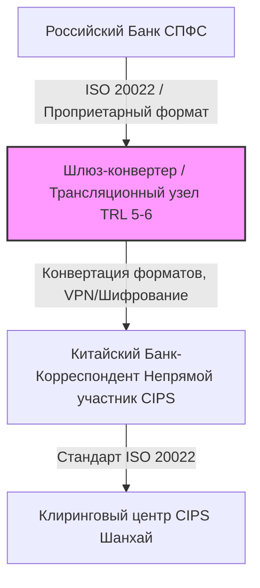

# Глубокий технико-экономический анализ: Инфраструктура платежей и логистическая интеграция (TRL 7-9)

## Введение и стратегический контекст

В условиях геополитической фрагментации и жесткого санкционного давления интеграция финансово-логистических систем России и Китая перешла из плоскости теоретического партнерства в фазу критического развертывания (**TRL 7-9**). Данный процесс напрямую пересекается с китайской государственной стратегией **«Made in China 2025» (MIC 2025)**, нацеленной на достижение технологического суверенитета, доминирование в высокотехнологичных секторах и создание альтернативной глобальной финансовой инфраструктуры, независимой от западных институтов (SWIFT, CHIPS).

Успешность этой интеграции критически зависит от способности преодолевать внешние регуляторные шоки, подробно описанные в материале [Геополитические риски и санкционные ограничения](../00_Strategy/00_Global_Framework.md#геополитические-риски-и-санкционные-ограничения). При этом надежность систем уровня TRL 7-9 напрямую опирается на фундаментальные технологические решения уровней **TRL 1-6** в области прикладной криптографии, низкоуровневого ПО и автоматизированного перевода протоколов.

---

## 1. Интеграция платёжных систем СПФС и CIPS (TRL 8-9)

Интеграция Системы передачи финансовых сообщений (СПФС, Банк России) и Cross-Border Interbank Payment System (CIPS, Народный банк Китая) находится на уровне **TRL 8–9** (система полностью работоспособна и внедрена в промышленную эксплуатацию, однако сталкивается с проблемами масштабирования и регуляторными барьерами).



### Техническая архитектура и протоколы
* **Стандартизация сообщений:** Обе системы используют стандарт **ISO 20022**, однако архитектура схем XML-сообщений различается. СПФС использует собственные форматы финансовых сообщений (включая поддержку MT-форматов SWIFT), тогда как CIPS полностью базируется на MX-форматах ISO 20022. Интеграция требует развертывания промежуточного ПО (middleware) для бесшовной трансляции и валидации схем (например, конвертация сообщений `pacs.008` и `pacs.009`).
* **Каналы связи:** Прямое подключение российских банков к CIPS в качестве *прямых участников (Direct Participants)* ограничено из-за жестких требований НБК и риска вторичных санкций. Большинство российских институтов классифицируются как *непрямые участники (Indirect Participants)*, осуществляющие расчеты через китайские банки-корреспонденты (например, ICBC, Bank of China). Связь осуществляется через защищенные выделенные каналы связи и VPN-туннели, минуя SWIFT.

### Фундаментальный уровень (TRL 4-6): Криптографическая совместимость и трансляция протоколов
Обеспечение бесшовного взаимодействия на уровне TRL 8-9 невозможно без решения фундаментальных задач криптографического сопряжения:
1. **Асимметрия криптографических стандартов:** Российский сегмент опирается на ГОСТ Р 34.12-2015 (Кузнечик/Магма) и ГОСТ Р 34.10-2012 (электронная подпись). Китайская финансовая система использует национальные коммерческие криптографические алгоритмы (семейство SM: SM2 для асимметричного шифрования, SM3 для хеширования, SM4 для симметричного шифрования).
2. **Аппаратные модули безопасности (HSM):** На уровне **TRL 5-6** разработаны специализированные шлюзы трансляции подписей (Signature Translation Gateways). Эти устройства в реальном времени принимают пакет СПФС, подписанный по ГОСТ, верифицируют его в изолированном анклаве HSM, осуществляют переподписание пакета эквивалентным ключом SM2 и направляют его в контур CIPS. Это исключает компрометацию закрытых ключей обеих сторон.

### Экономические аспекты и связь с MIC 2025
Для Китая развитие CIPS — это ключевой инструмент интернационализации юаня (RMB) и снижения зависимости от долларовой системы (CHIPS/SWIFT), что является финансовым фундаментом для MIC 2025. 
* **Проблема ликвидности:** Юань является частично конвертируемой валютой. Ограничения Китая на движение капитала (Capital Controls) создают асимметрию: российские экспортеры накапливают юаневую ликвидность, которую сложно репатриировать или конвертировать в другие валюты без одобрения Государственного управления валютного контроля КНР (SAFE).
* **Транзакционные издержки:** Из-за отсутствия сквозного автоматизированного клиринга (STP — Straight-Through Processing) для непрямых участников, комплаенс-проверки на стороне китайских банков занимают от 3 до 10 рабочих дней, увеличивая стоимость транзакций на 1.5–3% за счет замораживания оборотного капитала.


**Риск вторичных санкций**
Крупнейшие китайские банки-клиринги CIPS глубоко интегрированы в мировую финансовую систему и опасаются отключения от долларовых расчетов. Это приводит к скрытому саботажу платежей даже при использовании связки СПФС-CIPS.


---

## 2. Параллельный импорт оборудования двойного назначения (TRL 7-8)

Каналы поставок промышленного оборудования, микроэлектроники и компонентов двойного назначения (dual-use) находятся на уровне **TRL 7–8** (системы логистики и обхода ограничений функционируют в реальных условиях, но требуют постоянной модификации из-за динамического изменения санкционных списков).


### Технологическая цепочка и роль Совместных Предприятий (СП)
Поставки осуществляются через сложные цепочки реэкспорта с использованием третьих стран (ОАЭ, Турция, Казахстан, Киргизия) и создание специализированных СП в КНР.

* **Схема через СП:** В свободных экономических зонах КНР (например, Шэньчжэнь, Шанхай) создаются СП, где китайская сторона обеспечивает доступ к внутреннему рынку и закупкам компонентов, а российская — финансирование и конечные ТЗ. Оборудование (например, прецизионные станки с ЧПУ, ПЛИС (FPGA), промышленные контроллеры) закупается якобы для нужд внутреннего рынка КНР, после чего де-факто реэкспортируется.
* **Техническая модификация:** На этапе прохождения через СП часто происходит замена прошивок (firmware), удаление систем удаленного мониторинга (геофенсинга), которые могут заблокировать оборудование при изменении GPS-координат. Это критически важно при обходе жестких экспортных ограничений, накладываемых западными регуляторами на литографическое и прецизионное оборудование (подробнее см. [Ограничения экспортного контроля](21_Legacy_Lithography_Substitution.md#ограничения-экспортного-контроля)).

### Фундаментальный уровень (TRL 4-6): Санация прошивок и аппаратное эмулирование
Для обеспечения работоспособности импортируемого оборудования двойного назначения на уровне **TRL 5-6** реализуются следующие инженерные решения:
1. **Реверс-инжиниринг бинарных блобов (Binary Blob Sanitization):** Извлечение прошивок из ПЗУ контроллеров (например, систем ЧПУ Fanuc или Siemens) с помощью JTAG-отладчиков. Специалисты осуществляют декомпиляцию кода в средах типа Ghidra или IDA Pro для поиска и нейтрализации функций удаленного отключения (Kill Switch) и модулей телеметрии, отправляющих данные через сотовые сети или Wi-Fi.
2. **Аппаратное эмулирование датчиков (Sensor Spoofing):** Разработка микроконтроллерных плат (на базе архитектур RISC-V или ARM Cortex-M, уровень TRL 5), которые подключаются к шинам CAN/Ethercat оборудования и генерируют ложные сигналы от датчиков GPS/ГЛОНАСС, имитируя нахождение станка на территории авторизованного завода в КНР.

### Связь с «Made in China 2025»
MIC 2025 ставит целью достижение 70% самообеспеченности в критических секторах (полупроводники, робототехника, авиакосмос) к 2025 году. 
* **Замещение западных компонентов китайскими аналогами:** В рамках параллельного импорта происходит постепенный переход с американских/европейских компонентов на китайские аналоги (например, замена ПЛИС Xilinx на продукцию китайской *GigaDevice* или *Anlogic*, замена контроллеров Siemens на *Inovance*). Это стимулирует масштабирование производства внутри КНР, снижая себестоимость китайской продукции за счет гарантированного российского спроса.

### Риски интеллектуальной собственности (IP Risks)
* **Обратный инжиниринг (Reverse Engineering):** Китайские партнеры в СП активно используют доступ к импортируемому оборудованию для реверс-инжиниринга. Российские разработчики, передающие свои ТЗ и топологии микросхем для производства на китайских фабриках (foundries, таких как SMIC), сталкиваются с риском несанкционированного копирования IP-блоков.
* **Отсутствие правовой защиты:** В юрисдикции КНР защита прав интеллектуальной собственности иностранных (включая российских) компаний против государственных китайских предприятий практически невозможна. Патенты, зарегистрированные в РФ, не имеют силы в КНР без национальной регистрации.

---

## 3. Институциональные механизмы обеспечения бесперебойности поставок (TRL 7-9)

Для минимизации рисков срыва поставок компонентов TRL 7-9 на государственном и межведомственном уровнях развернуты специализированные институциональные механизмы.

### А. Двусторонние межправительственные комиссии и рабочие группы
Координация осуществляется в рамках Подкомиссии по торгово-экономическому сотрудничеству и Рабочей группы по сотрудничеству в сфере промышленности. Эти органы обеспечивают:
* Согласование закрытых перечней критического импорта и экспорта.
* Оперативное решение вопросов заторов на пограничных переходах.
* Создание «зеленых коридоров» для приоритетных грузов двойного назначения.

### Б. Специализированные финансовые институты и непубличные клиринговые центры
Для обхода комплаенс-фильтров крупных китайских банков создана сеть региональных сельских и городских банков КНР (Regional Joint-Stock Banks), не имеющих долларовых активов и корреспондентских счетов в США/ЕС. 
* **Механизм:** Платежи за компоненты TRL 7-9 проводятся через эти локальные банки, которые затем осуществляют клиринг внутри КНР. Это полностью изолирует транзакционный контур от западного мониторинга.

### В. Перспективные технологии (TRL 4-6): Трансграничные платформы цифровых валют (mBridge)
В качестве альтернативы традиционному клирингу ведутся исследования и пилотные испытания платформ на базе цифровых валют центральных банков (CBDC):
* **Архитектура mBridge:** Использование распределенного реестра (DLT) на базе консенсуса *DumboBFT* или *HotStuff* позволяет проводить мгновенные трансграничные расчеты в паре Цифровой рубль — Цифровой юань (e-CNY) без участия банков-корреспондентов. На уровне **TRL 5** тестируются смарт-контракты, автоматически исполняющие платеж при подтверждении прохождения таможенного терминала (интеграция с IoT-датчиками на контейнерах).

---

## 4. Стандартизация и гармонизация сертификатов качества (TRL 7)

Процесс взаимного признания и гармонизации стандартов находится на уровне **TRL 7** (разработаны двусторонние соглашения, запущены пилотные проекты по взаимному признанию, но системная интеграция сдерживается лоббизмом и техническими различиями).

### Сравнение стандартов: ГОСТ/ЕАС vs. GB/T (Guobiao)

| Параметр сравнения | Система стандартов РФ/ЕАЭС (ГОСТ Р / ТР ТС) | Система стандартов КНР (GB / GB/T) | Технический барьер интеграции |
| :--- | :--- | :--- | :--- |
| **Базовая методология** | Гармонизирована с европейскими стандартами (EN/ISO/IEC). | Собственная методология, частично адаптированная под ISO, но с жесткой национальной спецификой. | Различия в методах испытаний и предельно допустимых нагрузках (до 20-30%). |
| **Взрывозащита (Ex)** | ТР ТС 012/2011 (на базе IECEx). | GB 3836 (на базе IEC, но с локальными требованиями NEPSI). | Требуются повторные физические испытания в лабораториях КНР; протоколы РФ не принимаются автоматически. |
| **Электромагнитная совместимость (ЭМС)** | ТР ТС 020/2011. | GB/T 17626. | Различия в сетке частот и методах фильтрации помех. |
| **Промышленная безопасность** | Экспертиза промышленной безопасности (Ростехнадзор). | Специальные лицензии на производство оборудования (TSG). | Китайские производители неохотно проходят аудит Ростехнадзора из-за раскрытия конструкторской документации. |

### Преодоление барьеров на уровне TRL 5-6: Цифровые двойники стандартов
Для ускорения сертификации разрабатываются программные комплексы автоматизированного сопоставления требований (Semantic Mapping Engines). Они используют онтологические модели для автоматического выявления расхождений в методиках испытаний ГОСТ и GB/T, что позволяет проводить виртуальные испытания оборудования на этапе проектирования, снижая риск отказа при физической сертификации в КНР.


**Стандарты GB/T как нетарифные барьеры**
Китай активно использует национальные стандарты **GB/T** для защиты внутреннего рынка. Для получения обязательного сертификата соответствия GB иностранная компания обязана предоставить полную конструкторскую документацию и исходные коды ПО в китайские государственные лаборатории, что создает легальный канал для утечки IP.


---

## 5. Матрица рисков и стратегические рекомендации

| Область анализа | Текущий TRL | Ключевые риски | Инфраструктурные барьеры | Стратегические рекомендации |
| :--- | :--- | :--- | :--- | :--- |
| **Платежная интеграция (СПФС-CIPS)** | **TRL 8-9** | • Вторичные санкции против банков-посредников.<br>• Замораживание ликвидности в юанях.<br>• Утечка данных транзакций. | • Валютный контроль КНР (SAFE).<br>• Различия в схемах ISO 20022.<br>• Требования КНР по локализации данных (DSL). | 1. Создание специализированных непубличных банков-клирингов (без активов на Западе).<br>2. Развертывание децентрализованных шлюзов конвертации на базе цифрового рубля и цифрового юаня (CBDC) (TRL 7). |
| **Параллельный импорт оборудования** | **TRL 7-8** | • Блокировка оборудования через встроенное ПО.<br>• Утечка IP-адресов и топологий при производстве в КНР.<br>• Прекращение поддержки со стороны OEM. | • Разница ж/д колей (1520/1435 мм).<br>• Пропускная способность погранпереходов.<br>• Отсутствие специализированных платформ. | 1. Обязательный аудит и «очистка» прошивок (firmware) импортируемого оборудования.<br>2. Использование контрактного производства в КНР только по схеме разделения IP (раздельное производство блоков). |
| **Гармонизация стандартов** | **TRL 7** | • Потеря контроля над КД при сертификации в КНР.<br>• Технологическая зависимость от китайской компонентной базы. | • Отсутствие соглашений о взаимном признании протоколов испытаний.<br>• Монополия китайских испытательных центров. | 1. Создание совместных независимых испытательных лабораторий в нейтральных зонах.<br>2. Разработка зеркальных стандартов ЕАЭС-КНР с автоматическим признанием сертификатов для критических групп товаров. |

---

## 6. Интерактивный кейс для самопроверки


**Кейс: Блокировка прецизионного оборудования**
Российское оборонно-промышленное предприятие закупило через китайское СП прецизионный пятиосевой обрабатывающий центр. При пусконаладке на заводе в РФ сработал встроенный модуль геофенсинга (GPS/ГЛОНАСС-трекер в блоке ЧПУ), заблокировав стойку управления. Попытка связаться с китайским поставщиком привела к отказу из-за опасений вторичных санкций.

**Вопрос:** Каков должен быть превентивный алгоритм действий инженерной и логистической служб на этапах TRL 7-8 для предотвращения подобных инцидентов?


<details>
<summary><b>Посмотреть правильное инженерное решение</b></summary>

### Пошаговый технический алгоритм нейтрализации геофенсинга:

1. **Превентивный аудит прошивки (Firmware Sanitization):** 
   На этапе нахождения оборудования на территории китайского СП (до пересечения границы РФ) необходимо произвести физическое выпаивание или программное отключение GPS/GSM-модулей из платы ЧПУ.
   
2. **Эмуляция сигналов позиционирования (GNSS Spoofing):** 
   Если программное обеспечение ЧПУ требует постоянного подтверждения координат для работы, устанавливается аппаратный эмулятор (спуфер), транслирующий в шину ЧПУ статические координаты завода-изготовителя в КНР. Схема подключения эмулятора на уровне TRL 5:
   ```
   [Антенный вход ЧПУ] <--- (РЧ-кабель) --- [Генератор сигналов / SDR-плата] <--- [Контроллер эмуляции координат]
   ```
   
3. **Локализация контура управления:** 
   Полная изоляция стойки ЧПУ от внешних сетей (Air-gapping). Запрет на подключение любых диагностических кабелей с доступом в Интернет. Физическое удаление eSIM-чипов с материнской платы контроллера.
   
4. **Юридическое и программное разделение:** 
   Контракт должен предусматривать передачу "голого" железа (bare metal) без предустановленного проприетарного ПО, с последующей установкой отечественного или открытого ПО (например, на базе LinuxCNC) силами российских интеграторов.
</details>