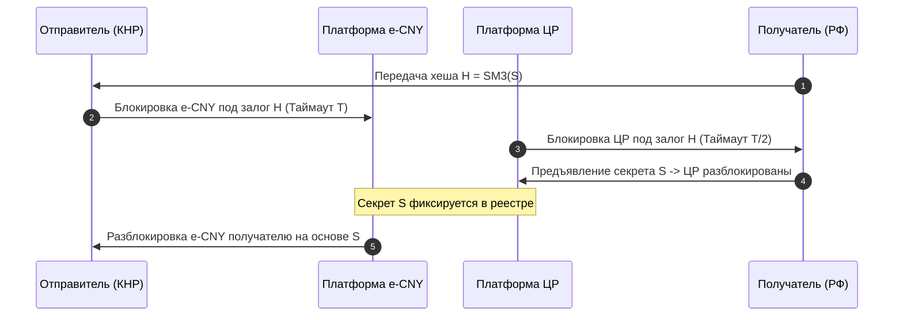

# Спецификация инфраструктуры финансово-логистического суверенитета РФ — КНР — ЕАЭС (TRL 6-9)

> [!abstract] Назначение документа
> Настоящая техническая спецификация определяет архитектурные решения, протоколы сопряжения и меры обеспечения безопасности для развертывания отказоустойчивой трансграничной инфраструктуры между РФ, КНР и ЕАЭС. Документ ориентирован на переход от прикладных прототипов (**TRL 6**) к промышленной эксплуатации (**TRL 9**) в условиях санкционного давления и реализации китайской стратегии [[Made in China 2025]].

---

## 1. Финансовая инфраструктура: Шлюзы сопряжения [[СПФС]] и [[CIPS]]

Прямая интеграция Системы передачи финансовых сообщений (СПФС, Банк России) и Cross-Border Interbank Payment System (CIPS, Народный банк Китая) на уровне TRL 8–9 требует преодоления фундаментальной несовместимости стандартов данных и криптографических контуров.

```mermaid
graph TD
    subgraph RF_Secure_Zone [Контур РФ (ГОСТ)]
        SPFS[СПФС Участник] -->|CyberFT / XML-РФ| TransGate[Шлюз-Конвертер ISO 20022]
        HSM_RU[HSM Континент / ГОСТ] <-->|Шифрование/Подпись| TransGate
    end

    subgraph Transit_Zone [Крипто-транслятор в Secure Enclave]
        TransGate -->|Динамическая переподпись| CryptoBridge[Гибридный ПАК]
        Enclave[SGX/SEV-SNP Enclave] <-->|Изолированная память| CryptoBridge
    end

    subgraph PRC_Secure_Zone [Контур КНР (SM)]
        CryptoBridge -->|CIPS XML / ISO 20022| CIPS_Direct[CIPS Direct Participant]
        HSM_CN[HSM SM2/SM3/SM4] <-->|Шифрование/Подпись| CIPS_Direct
    end
```

### 1.1. Техническая архитектура и трансляция протоколов
*   **Стандарты данных:** СПФС использует проприетарные конверты для передачи сообщений формата SWIFT MT (с постепенным переходом на отечественный прикладной XML), тогда как CIPS полностью базируется на XML-схемах [[ISO 20022]] (сообщения типов `pacs.008`, `pacs.009`, `camt.053`).
*   **Шлюз-конвертер (Translation Gateway):** Развертывается на базе отказоустойчивого кластера под управлением ОС Astra Linux Special Edition. Задержка (latency) преобразования пакетов не превышает $50$ мс.
*   **Спецификация маппинга полей (MT103 $\to$ `pacs.008.001.08`):**
    *   Поле `20` (Sender's Reference) $\to$ `/Document/FIToFICstmrCdtTrf/GrpHdr/MsgId`
    *   Поле `32A` (Value Date/Currency/Interbank Settled Amount) $\to$ `/Document/FIToFICstmrCdtTrf/CdtTrfTxInf/IntrBkSttlmAmt` (с валидацией кода валюты ISO 4217).
    *   Поле `50a` (Ordering Customer) $\to$ `/Document/FIToFICstmrCdtTrf/CdtTrfTxInf/Dbtr` (с обязательным извлечением ИНН/LEI и транслитерацией по стандарту ГОСТ 7.79-2000).

### 1.2. Криптографический мост (Cryptographic Bridge) на стыке стандартов
Ключевой барьер — несовместимость национальных стандартов шифрования.

```
[ГОСТ Р 34.12-2015 (Магма/Кузнечик)] <===> [Гибридный ПАК в Secure Enclave] <===> [SM2 / SM3 / SM4 (КНР)]
```

Для обеспечения сквозного доверия применяется гибридный программно-аппаратный комплекс (ПАК):
1.  **Российский сегмент:** Аппаратные модули безопасности (HSM) «Континент» или «Соболь» (алгоритмы ГОСТ Р 34.12-2015 и ГОСТ Р 34.10-2012).
2.  **Китайский сегмент:** HSM с поддержкой государственных коммерческих криптоалгоритмов КНР: **SM2** (асимметричное шифрование на эллиптических кривых, кривая $F_p$ с длиной ключа 256 бит), **SM3** (криптографическая функция хеширования, размер выхода 256 бит), **SM4** (симметричное блочное шифрование, размер блока и ключа 128 бит).
3.  **Процесс трансляции в изолированном анклаве (Secure Enclave):**
    *   ПАК принимает сообщение, зашифрованное по ГОСТ Р 34.12-2015.
    *   Дешифрование происходит внутри аппаратного анклава (например, AMD SEV-SNP или Intel SGX), защищенного от чтения со стороны гипервизора и ОС хоста.
    *   Внутри анклава происходит синтаксический разбор XML, валидация подписи ГОСТ Р 34.10-2012.
    *   Формируется новое сообщение, вычисляется хеш-сумма по алгоритму SM3:
        $$\text{Hash} = \text{SM3}(M)$$
    *   Сообщение подписывается приватным ключом SM2 и зашифровывается симметричным ключом SM4 в режиме CBC/CTR.

> [!danger] Риск закрытых библиотек (Binary Blobs) и аппаратных закладок
> Китайская сторона поставляет SDK для работы с алгоритмами SM2/3/4 в виде скомпилированных бинарных файлов без исходного кода. Существует критический риск наличия недокументированных возможностей (backdoors) на уровне компиляции.
> 
> **Решение (TRL 6-7):** Разработка и сертификация отечественной чистой реализации алгоритмов SM2/SM3/SM4 на базе открытых спецификаций (RFC 8998) силами ТК 26. Использование только верифицированных компиляторов (например, SafeComp) для сборки криптографического ПО.

---

## 2. Трансграничные расчеты в цифровых рублях и цифровых юанях ([[e-CNY]])

Интеграция национальных цифровых валют ([[CBDC]]) реализуется по модели **двустороннего моста (Bilateral CBDC Bridge)**, полностью исключающего корреспондентские счета в западных банках.

### 2.1. Механизм атомарных свопов (Atomic Swaps)
Для исключения риска неисполнения обязательств одной из сторон (риска Херштатта) применяется протокол **HTLC (Hash Time-Locked Contracts)**.

$$\text{Transaction}_{\text{RUB}} \iff \text{Transaction}_{\text{CNY}} \quad \text{выполняются атомарно.}$$

#### Алгоритм выполнения транзакции:
1.  **Генерация секрета:** Получатель платежа в РФ генерирует криптографически стойкий секретный ключ $S \in \{0,1\}^{256}$ и вычисляет его хеш по алгоритму SM3:
    $$H = \text{SM3}(S)$$
2.  **Блокировка в КНР:** Отправитель в КНР блокирует сумму в e-CNY на смарт-контракте в платформе НБК с условием: средства будут переведены получателю, если в течение времени $T$ (например, 4 часа) будет предъявлен секрет $S$, соответствующий $H$.
3.  **Блокировка в РФ:** Российский банк-посредник блокирует эквивалент в [[Digital Ruble|Цифровых рублях]] на платформе Банка России с тем же хешем $H$ и временем блокировки $T/2$ (2 часа).
4.  **Раскрытие секрета:** Получатель в РФ забирает Цифровые рубли, предъявляя секрет $S$ платформе Банка России. Секрет $S$ фиксируется в распределенном реестре и становится публично доступным для участников сделки.
5.  **Завершение сделки:** Платформа НБК автоматически считывает секрет $S$ из реестра, проверяет равенство $\text{SM3}(S) \stackrel{?}{=} H$ и разблокирует e-CNY в пользу получателя в КНР.



### 2.2. Управление ликвидностью и автоматизированный маркетмейкер (AMM)
> [!warning] Асимметрия ликвидности и волатильность
> Спрос на юань в РФ значительно превышает спрос на рубли в КНР. Прямая конвертация e-CNY/Цифровой рубль требует создания автоматизированных маркетмейкеров (AMM) на уровне центральных банков для сглаживания волатильности и предотвращения истощения пулов ликвидности.

Для обеспечения стабильности курса на уровне TRL 6-7 применяется гибридный алгоритм постоянного продукта с виртуальным коридором (Virtual Pegged AMM):

$$(x + \alpha) \cdot (y + \beta) = k$$

Где $x$ — резерв Цифровых рублей, $y$ — резерв e-CNY, а $\alpha$ и $\beta$ — виртуальные параметры, определяющие жесткость валютного коридора, устанавливаемого соглашением Банка России и НБК. Это позволяет минимизировать проскальзывание (slippage) при крупных трансграничных транзакциях.

---

## 3. Логистический коридор «Север — Юг» ([[INSTC]]) и цифровая таможня

Мультимодальный коридор требует бесшовного цифрового сопровождения для компенсации физических задержек на границах.

### 3.1. Архитектура распределенного реестра таможенного транзита
Для исключения фальсификации таможенных документов применяется распределенный реестр на базе **Hyperledger Fabric** с поддержкой **Private Data Collections (PDC)**. Это позволяет странам-участницам (РФ, Иран, Индия) сохранять коммерческую и государственную тайну, обмениваясь только криптографическими доказательствами (хэшами) документов.

```
[Экспортер РФ] ──(Загрузка инвойса)──> [PDC РФ-Иран] (Данные скрыты от Индии)
                                             │
                                             ▼
[ФТС РФ / Таможня Ирана] <──(Сверка хэша)── [Общий реестр INSTC] (Только хэш-суммы)
```

*   **Навигационные пломбы:** Контейнеры оснащаются интеллектуальными навигационными пломбами БПТ (Блок передачи телеметрии), поддерживающими двухсистемные модули **ГЛОНАСС/BeiDou**.
*   **Аппаратный уровень защиты пломбы (TRL 6):** Использование криптопроцессора первого класса защиты для предотвращения подмены координат (GPS/ГЛОНАСС spoofing) путем валидации фазовых измерений спутникового сигнала.

### 3.2. Физические барьеры vs. Цифровые компенсаторы

| Сегмент коридора | Физический барьер | Техническое решение (TRL 9) | Цифровой компенсатор (TRL 6-7) |
| :--- | :--- | :--- | :--- |
| **Западная ветвь** | Разница колеи (1520 мм в РФ vs 1435 мм в Иране). Разрыв Решт — Астара. | Строительство путей, автоматические системы смены ширины колесных пар. | Предварительное декларирование и автоматическое назначение слотов перевалки грузов на основе прогнозных моделей ИИ. |
| **Транскаспийский маршрут** | Мелководье портов Волги и Каспия. Дефицит судов класса «река-море». | Дноуглубительные работы, оптимизация загрузки судов. | Динамический мониторинг осадки судов на базе гидрографических данных в реальном времени, интегрированный со смарт-контрактами фрахтования. |
| **Восточная ветвь** | Низкая пропускная способность однопутных участков в Туркменистане. | Модернизация тяговых подстанций, разъездов. | Системы интервального регулирования движения поездов на базе радиоканала ГЛОНАСС и технологии виртуальной сцепки. |

---

## 4. Безопасность цепей поставок электронных компонентов и [[Made in China 2025]]

В рамках стратегии «Made in China 2025» КНР стремится к доминированию в полупроводниковом секторе. Для РФ критически важно обеспечить безопасность при производстве чипов на китайских фабриках (Foundries).

### 4.1. Конвейер безопасного проектирования и производства (Fabless-to-Foundry)

```
[Проектирование в РФ (без САПР США)] 
       │ (Файл физической топологии GDSII / OASIS)
       ▼
[Внедрение SRAM PUF-структур и водяных знаков]
       │ 
       ▼
[Передача на фабрику SMIC / Hua Hong (КНР)]
       │ (Изготовление пластин / Корпусирование)
       ▼
[Входной контроль в РФ: Рентген + FIB-анализ + PUF-активация]
```

*   **Проблема САПР ([[EDA]]):** Зависимость от американских систем (Synopsys, Cadence) нивелируется переходом на китайские аналоги (Empyrean) на уровне TRL 7, либо развитием отечественного ПО (проект «Альфа-САПР»).
*   **Защита от копирования (IP Protection) на базе PUF:**
    Интеграция в топологию кристалла **Физически неклонируемых функций (PUF)** на основе статического ОЗУ (SRAM PUF). При подаче питания случайные флуктуации пороговых напряжений транзисторов $\Delta V_{th}$ формируют уникальную для каждого чипа битовую маску (сигнатуру).
    
    Для компенсации температурного дрейфа и старения кремния применяется **Fuzzy Extractor** (помехоустойчивое кодирование на кодах БЧХ):
    
    $$\text{Gen}(R) \to (K, P)$$
    $$\text{Rep}(R', P) \to K$$
    
    Где $R$ — исходная PUF-сигнатура, $P$ — публичные данные помощи (helper data), $R'$ — зашумленная сигнатура при эксплуатации, $K$ — стабильный криптографический ключ, используемый для расшифровки прошивки процессора. Без физического чипа прошивка превращается в бесполезный массив данных, что делает невозможным нелегальное копирование чипа на фабрике-изготовителе.

### 4.2. Противодействие аппаратным закладкам ([[Hardware Trojans]])
Для исключения скрытых модификаций топологии на этапе изготовления фотошаблонов в КНР, спецификация TRL 6-7 предписывает:

> [!danger] Угроза аппаратных закладок (Hardware Trojans)
> Аппаратная закладка может быть активирована редкой последовательностью сигналов (например, переполнением счетчика тактов) и привести к утечке ключей шифрования или переходу процессора в режим суперпользователя.
> 
> **Методы контроля (TRL 6-7):**
> 1.  **Разрушающий контроль (выборочный):** Послойное стравливание кремния (химико-механическая полировка) и сканирование сфокусированным ионным пучком (FIB) с последующим автоматическим сравнением полученных изображений с исходным GDSII-файлом.
> 2.  **Неразрушающий контроль (100% партии):** Высокоскоростной рентгеновский контроль внутренней структуры (X-ray computed tomography) и анализ сигнатур динамического энергопотребления (Power Signature Analysis) при прохождении тестовых векторов на специализированных стендах.

---

## 5. Стратегическая матрица рисков и готовности систем

| Направление | Текущий TRL | Ключевой барьер | Риск потери IP | Целевое решение (TRL 9) |
| :--- | :--- | :--- | :--- | :--- |
| **Шлюзы СПФС — CIPS** | **8** | Различие криптостандартов (ГОСТ vs SM). | Средний (риск бэкдоров в HSM). | Развертывание ПАК-трансляторов в изолированных анклавах с отечественной реализацией SM-алгоритмов. |
| **CBDC Мост (RUB/CNY)** | **7** | Валютный контроль КНР, дефицит ликвидности. | Высокий (доминирование стандартов НБК). | Создание пулов ликвидности под эгидой Межгосударственного банка ЕАЭС с использованием AMM. |
| **Цифровизация INSTC** | **7** | Отсутствие единого доверенного реестра документов. | Низкий. | Внедрение смарт-контрактов на базе Hyperledger Fabric с технологией Private Data Collections. |
| **Поставки полупроводников** | **5** (передовые) / **8** (зрелые) | Отсутствие у РФ фабрик $<28$ нм. | Экстремальный (обратный инжиниринг в КНР). | Использование SRAM PUF-меток, обфускация топологии, развитие отечественного корпусирования (OSAT). |

---

## 6. Интерактивный самоанализ: Проектирование защищенного контура

> [!question] Кейс-задача для архитектора систем безопасности
> Российское КБ разработало топологию специализированного микроконтроллера для систем управления на транспорте (техпроцесс 40 нм). Производство планируется разместить на фабрике SMIC (Шанхай). Оплата услуг фабрики должна осуществляться в цифровых юанях (e-CNY) через трансграничный шлюз.
> 
> **Какую архитектуру защиты интеллектуальной собственности и платежного контура вы выберете?**

### Варианты решений:

#### А. Максимально быстрый запуск (Time-to-Market)
*   Передача исходного GDSII-файла фабрике без изменений.
*   Оплата через стандартный коммерческий банк-посредник в КНР с конвертацией рублей в безналичные юани на бирже.
*   *Оценка:* Высокий риск утечки IP (копирование топологии), риск блокировки платежа из-за вторичных санкций. TRL 9 не достигается из-за внешней зависимости.

#### Б. Сбалансированный суверенный контур (Рекомендуется)
*   Интеграция в топологию кристалла SRAM PUF-генератора ключей с Fuzzy Extractor и обфускация критических блоков схемы.
*   Проведение выборочного FIB-контроля готовых пластин в РФ.
*   Оплата через двусторонний CBDC-мост с использованием смарт-контрактов HTLC для фиксации курса и атомарного проведения платежа в момент отгрузки партии (FOB Шанхай).
*   *Оценка:* Обеспечивает защиту от копирования, исключает санкционные риски платежей. Соответствует уровню TRL 9.

```
Ваш выбор: [Вариант Б] 
Обоснование: Интеграция PUF защищает физический уровень (кремний), а смарт-контракты HTLC гарантируют финансовую безопасность сделки без участия третьих стран.
```