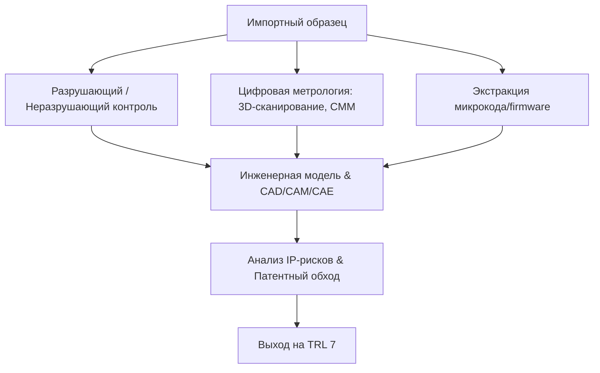
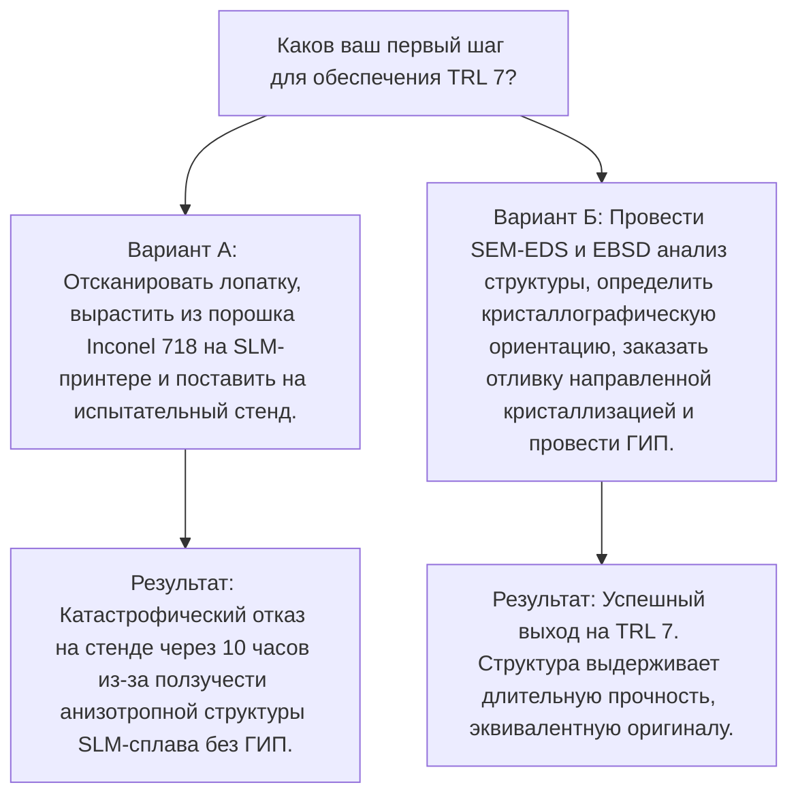

# Переход от концепта к промышленной эксплуатации (TRL 7–9)

Переход от обратного проектирования (реверс-инжиниринга) на уровнях [[Technology_Readiness_Levels#TRL_1_6|TRL 1–6]] (лабораторные образцы, характеризация и демонстрация концепта) к уровням **TRL 7** (демонстрация прототипа системы в эксплуатационной среде), **TRL 8** (завершение испытаний реальной системы и квалификация) и **TRL 9** (успешная промышленная эксплуатация) представляет собой наиболее критический этап импортозамещения. 

На уровнях TRL 7–9 воспроизводимый компонент перестает быть просто «геометрической копией». Он должен полностью совпасть с оригиналом по ресурсу (MTBF), пределу усталостной прочности, химической и термической стойкости, а также бесшовно интегрироваться в цифровые и механические контуры сложного оборудования.

> [!abstract] Ключевой вызов TRL 7–9: Преодоление дефицита неявного знания
> Главная проблема глубокого реверс-инжиниринга — отсутствие доступа к **неявному знанию (Tacit Knowledge)**: режимам термообработки, допускам на износ инструмента, технологическим картам, логике работы закрытого ПО и граничным условиям проектирования. Без преодоления этого барьера копия будет обладать лишь $40\% - 70\%$ ресурса оригинала, что ведет к катастрофическим отказам на этапе опытно-промышленной эксплуатации.

---

## Реверс-инжиниринг компонентов

Процесс покомпонентного разбора (Teardown) на уровнях TRL 7–9 — это не просто разборка узла, а глубокий физико-химический и цифровой криминалистический анализ (*Forensic Engineering*).



### 1. Метрология и аналитическая материаловедческая экспертиза

#### Геометрический реверс-инжиниринг и метрологический контроль
*   **Контактные и бесконтактные измерения:** Использование координатно-измерительных машин (КИМ/CMM) с субмикронной точностью ($\le 1$ мкм) для построения базовых баз данных позиционирования. Оптические 3D-сканеры синего света (Blue Light LED) применяются для оцифровки сложных свободных поверхностей.
*   **Промышленная компьютерная томография (Industrial CT):** Для выявления геометрии скрытых внутренних полостей (например, каналов конвективного охлаждения [[Gas_Turbine_Engineering#Single_Crystal_Blades|монокристаллических лопаток]] газовых турбин) применяются высокоэнергетические КТ-системы (300–450 кВ). Метод позволяет получить воксельную модель с разрешением до нескольких микрон, исключая необходимость разрушающего распила уникального образца на начальном этапе.

#### Материаловедческий разбор и деструктивный анализ
Для точного воспроизведения физико-механических свойств сплава на уровне TRL 7 необходимо раскрыть его «генетический код»:
*   **Элементный состав:** Определение концентрации легирующих элементов (включая примеси внедрения: $C, N, O, H, S$) методами оптико-эмиссионной спектрометрии (OES) и масс-спектрометрии с индуктивно-связанной плазмой (ICP-MS).
*   **Микроструктурный анализ:** Применение сканирующей электронной микроскопии (SEM) совместно с [[Materials_Characterization_Methods#EBSD|дифракцией обращенно-рассеянных электронов (EBSD)]] для картирования текстуры, определения размера зерен, идентификации фазового состава (например, объемной доли и морфологии упрочняющей $\gamma'$-фазы $Ni_3(Al, Ti)$ в никелевых суперсплавах) и оценки плотности дислокаций.
*   **Определение термической предыстории:** Измерение микротвердости по Виккерсу ($HV$) по градиенту сечения для выявления зон поверхностного упрочнения (цементация, азотирование, ТВЧ). Дифференциальная сканирующая калориметрия (DSC) позволяет определить температуры фазовых переходов (сольвус $\gamma'$-фазы, солидус, ликвидус), что критически важно для воссоздания карты термической обработки.

```
[Химический состав (ICP-MS)] + [Фазовый состав (EBSD)] + [Термический анализ (DSC)] 
                                      │
                                      ▼
                     [Реконструкция карты термообработки]
```

### 2. Реверс-инжиниринг встроенного ПО и электроники

При локализации сложных систем (например, блоков управления ГПА, станков с ЧПУ) механическая копия бесполезна без восстановления алгоритмов управления.

*   **Hardware/Firmware Teardown:** Декапсуляция интегральных схем (ASIC, MCU) с использованием концентрированных кислот ($HNO_3/H_2SO_4$) для оптического считывания топологии кристалла. Считывание бинарного кода (дампа прошивки) через отладочные интерфейсы JTAG/SWD. В случае установленных битов защиты (Lock bits) применяются методы аппаратного взлома: атаки по сторонним каналам (Side-Channel Analysis), инъекции неисправностей (Voltage/Electromagnetic Glitching) для обхода проверок безопасности загрузчика.
*   **Анализ прошивки (Firmware Reverse Engineering):** Декомпиляция бинарного кода в средах IDA Pro или Ghidra. Восстановление алгоритмов реального времени, ПИД-регуляторов и таблиц калибровок датчиков.
*   **Протоколы связи и шифрование:** Анализ проприетарных протоколов обмена данными на шинах CAN, RS-485, Industrial Ethernet с помощью логических анализаторов и ПО для анализа пакетов (Wireshark). Выявление и обход аппаратных ключей защиты (DRM) и криптографических чипов аутентификации, блокирующих работу неоригинальных узлов.

> [!info] Интеграция с промышленными системами
> Подробный разбор архитектуры промышленных контроллеров, протоколов синхронизации реального времени и методов интеграции стороннего ПО приведен в статье [[Industrial_Automation_and_CNC#ЧПУ и Сервоприводы|ЧПУ и Сервоприводы]].

### 3. Юридические и патентные риски (IP Risks)

Вывод изделия на уровень TRL 9 сопряжен с рисками судебных исков от OEM-производителей за нарушение патентных прав и авторского права на ПО.

*   **Патентный ландшафт:** Проводится аудит действующих патентов на полезные модели, изобретения (составы сплавов, геометрию) и способы производства на территории целевых рынков.
*   **Метод «Чистой комнаты» (Clean Room Design):** Для минимизации рисков нарушения авторских прав на ПО применяется разделение команд. Группа А («Грязная комната») проводит реверс-инжиниринг оригинального ПО, анализирует код и составляет подробную функциональную спецификацию (Functional Specification). Группа Б («Чистая комната»), не имеющая доступа к оригинальному коду и оборудованию, пишет новое ПО строго по спецификации Группы А. Данный подход юридически защищает продукт от обвинений в прямом копировании. Подробнее о правовых аспектах читайте в [[Intellectual_Property_Law#Clean_Room_Design|Clean Room Design Protocols]].

---

## Аддитивное прототипирование на этапе TRL 7

Аддитивные технологии (AM) позволяют сократить время изготовления прототипа для испытаний TRL 7 с месяцев до дней. Однако прямое использование напечатанных деталей в нагруженных узлах ограничено физико-металлургическими особенностями процесса.

### 1. Применяемые технологии и материалы
*   **[[Additive_Manufacturing_Metallurgy#L-PBF|L-PBF (Laser Powder Bed Fusion)]] / SLM:** Синтез деталей из металлических порошков (Inconel 718/625, Ti-6Al-4V, CoCr, нержавеющие стали) сфокусированным лазерным лучом. Обеспечивает высокую геометрическую точность, но создает экстремальные температурные градиенты.
*   **EBM (Electron Beam Melting):** Плавление электронным лучом в вакууме. Процесс идет при повышенных температурах слоя ($600 - 1000^\circ\text{C}$), что снижает остаточные напряжения, но ухудшает шероховатость поверхности по сравнению с L-PBF.

### 2. Физико-металлургические барьеры и методы их преодоления

> [!warning] Ловушка "STL-копии"
> Попытка вырастить деталь по CAD-модели, полученной 3D-сканированием, без учета специфики аддитивной металлургии, гарантирует разрушение прототипа на TRL 7 из-за анизотропии свойств, остаточных напряжений и скрытой пористости.

```
[Высокий температурный градиент G] ──► [Остаточные напряжения] ──► [Коробление и трещины]
                 │
                 ▼
[Высокая скорость охлаждения R] ──► [Метастабильные фазы] ──► [Низкая пластичность]
```

1.  **Анизотропия механических свойств:** Кристаллизация при L-PBF идет направленно вдоль оси построения ($Z$), формируя столбчатую структуру зерен. Предел прочности ($\sigma_b$) и пластичность ($\delta$) вдоль и поперек оси построения могут отличаться на $15 - 25\%$.
2.  **Остаточные термические напряжения:** Скорости охлаждения при лазерном плавлении достигают $10^5 - 10^6\text{ К/с}$. Это приводит к накоплению упругих напряжений, сопоставимых с пределом текучести материала. Без немедленного отжига деталь подвержена растрескиванию или короблению при срезании с плиты построения.
3.  **Пористость и непровары (Lack of Fusion):** Наличие микропор (размером $10 - 50\text{ мкм}$) резко снижает сопротивление многоцикловой усталости (High Cycle Fatigue, HCF).
4.  **Постобработка как обязательный этап:**
    *   **ГИП (Горячее изостатическое прессование / HIP):** Выдержка детали при температурах $1100 - 1200^\circ\text{C}$ под давлением аргона $100 - 200\text{ МПа}$. ГИП обеспечивает пластическую деформацию и диффузионное залечивание внутренних пор, переводя относительную плотность детали к $>99.9\%$.
    *   **Вакуумная термообработка:** Проведение гомогенизирующего отжига и дисперсионного твердения (старения) для разрушения столбчатой структуры, снятия напряжений и выделения упрочняющих фаз.

---

## Сертификационные испытания и квалификация (TRL 7 $\rightarrow$ TRL 9)

Переход от прототипа к серийному внедрению — это точка, где гибнет до $70\%$ проектов реверс-инжиниринга из-за неспособности подтвердить надежность в рамках нормативного поля.

```
TRL 6                      TRL 7                      TRL 8                      TRL 9
[Демонстрация] ──► [Стендовые испытания] ──► [Опытно-промышленная] ──► [Штатная]
 в лаборатории      в реальной среде            эксплуатация            эксплуатация
                     (HASS / HALT)            (Ограниченный ресурс)     (Полная гарантия)
```

### 1. Методология испытаний и оценка надежности

Для подтверждения эквивалентности ресурса локализованной детали оригинальной применяется комплексный подход:
*   **Ускоренные испытания на надежность (HALT - Highly Accelerated Life Testing):** Подвержение прототипа комбинированным нагрузкам (быстрые температурные циклы от $-60^\circ\text{C}$ до $+150^\circ\text{C}$, случайная многоосевая вибрация до $50\text{ g}$) для быстрого выявления слабых мест конструкции и дефектов пайки/сборки.
*   **Стендовые эквивалентно-циклические испытания (ЭЦИ):** Имитация рабочих циклов оборудования в форсированном режиме (повышенные температуры, давления, обороты) для подтверждения расчетного ресурса.
*   **Статистический анализ долговечности:** Обработка результатов испытаний с использованием [[Reliability_Engineering#Weibull_Distribution|распределения Вейбулла]] для определения параметров надежности:

$$R(t) = e^{-\left(\frac{t}{\eta}\right)^\beta}$$

где:
*   $\beta$ — параметр формы (определяет режим отказов: приработка, нормальная эксплуатация, износ);
*   $\eta$ — параметр масштаба (характеристический ресурс).
Для успешного прохождения TRL 8 локализованная деталь должна показать параметры $\beta$ и $\eta$ не хуже, чем у оригинальной выборки OEM.

### 2. Нормативно-правовые барьеры
*   **Отраслевая сертификация:** В зависимости от отрасли, вывод на TRL 9 требует прохождения жестких процедур: одобрения типа (Росавиация, АП-21 для авиастроения), экспертизы промышленной безопасности (Ростехнадзор для ОПО), сертификации на соответствие ТР ТС (010, 012, 032).
*   **Разработка ТУ и ПМКИ:** Создание Технических условий (ТУ) и Программ и методик квалификационных испытаний (ПМКИ) «с нуля» — сложнейшая инженерная задача, требующая воссоздания нормативной базы, которая у оригинального производителя нарабатывалась десятилетиями.

---

## Стратегический анализ: Реверс vs. R&D

Китайская модель технологического суверенитета в рамках инициативы **«Made in China 2025» (MIC2025)** продемонстрировала, что чистый реверс-инжиниринг без перехода к собственным разработкам (Forward Engineering) ведет в тупик.

Копирование деталей без знания технологической карты (*Manufacturing Process Sheet*) приводит к «эффекту накопления погрешностей». Можно измерить геометрические допуски и состав стали шестерни тяжелого редуктора, но не имея данных о режимах химико-термической обработки (цементация, азотирование), невозможно получить оригинальный ресурс.

### Сравнение стратегий воспроизводства технологий

| Критерий | Чистый реверс-инжиниринг | Гибридный реверс (Teardown + AM + JV) | Собственная разработка (Forward R&D) |
| :--- | :--- | :--- | :--- |
| **Сроки вывода на TRL 9** | Быстро (1–2 года) | Средне (2–4 года) | Долго (5–10 лет) |
| **Капитальные затраты (CapEx)**| Низкие на TRL 1–6, Высокие на TRL 7–9 | Средние | Высокие на старте |
| **Ресурс изделия (% от оригинала)** | $40\% - 70\%$ (без Tacit Knowledge) | $85\% - 100\%$ | $100\%+$ (под конкретные условия) |
| **Риск патентных исков** | Экстремально высокий | Умеренный (через локализацию) | Нулевой |
| **Устойчивость к смене поколений**| Никакая (всегда догоняющая) | Средняя | Высокая (собственные патенты) |

> [!warning] Риск «Ловушки догоняющего развития»
> Опора исключительно на реверс-инжиниринг запечатывает отрасль в состоянии вечного отставания. Пока копируется поколение продукции $N$ (уходящее 3–5 лет на доведение до TRL 9), оригинальный производитель (OEM) выводит на рынок поколение $N+1$ с повышением эффективности на $20\% - 30\%$, делая реверсивную копию экономически неконкурентоспособной. Реверс-инжиниринг должен служить лишь *трамплином* для перехода к Forward R&D.

---

## Интерактивный разбор кейса

### Сценарий
Перед вами стоит задача локализовать рабочую лопатку турбины высокого давления импортной ГТУ (газотурбинной установки). Лопатка работает при температуре газов $1250^\circ\text{C}$ под воздействием высоких центробежных нагрузок. Оригинальный материал — монокристаллический никелевый суперсплав с термобарьерным покрытием (TBC).



> [!question] Вопрос для самопроверки
> Почему в данном кейсе аддитивное производство методом SLM без последующего ГИП (HIP) и вакуумного отжига гарантирует разрушение лопатки?
> 
> <details>
> <summary>Разбор ответа</summary>
> Метод SLM создает мелкозернистую структуру с высокой плотностью дислокаций и остаточных напряжений. При температурах выше $0.5 T_{пл}$ (что характерно для лопаток ГТУ, работающих при $1250^\circ\text{C}$) основным механизмом разрушения становится высокотемпературная ползучесть (creep) по границам зерен. Без монокристаллической структуры (или направленной столбчатой кристаллизации, минимизирующей поперечные границы зерен) и без ГИП для устранения микропор деталь разрушится от ползучести и усталости на несколько порядков быстрее литого оригинала.
> </details>