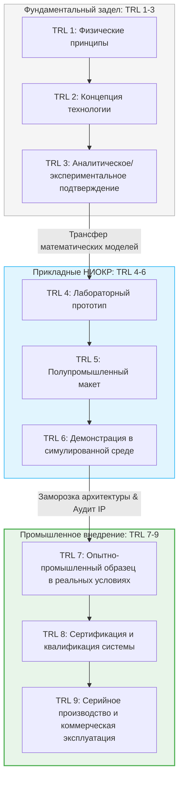
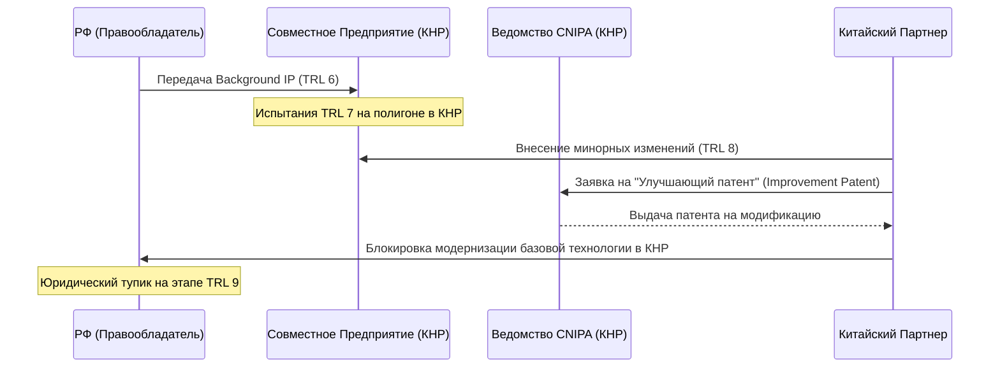

> [!abstract] **Введение в проблематику TRL 7–9**
> Переход совместных российско-китайских проектов из стадии прикладных НИОКР (TRL 4–6) в фазу промышленного внедрения, сертификации и коммерциализации (TRL 7–9) смещает фокус с чисто научных проблем на барьеры регуляторного, юридического и финансово-логистического характера. 
> 
> На этом этапе критически важно обеспечить паритет интересов сторон, не допустив неконтролируемой утечки критических технологий. Базовые принципы этого баланса заложены в [[RU_CN_Sovereignty_Matrix#Модель паритета|Модели паритета технологического суверенитета]]. Без прочного фундамента, заложенного на этапах фундаментальных исследований [[TRL_1_3_Basic_Research#Фундаментальные заделы|TRL 1–3]] и лабораторного прототипирования [[TRL_4_6_Applied_R&D#Лабораторное прототипирование|TRL 4–6]], развертывание масштабируемых систем TRL 7–9 невозможно.

---

## Преемственность: от TRL 1–6 к TRL 7–9

Успех на этапах TRL 7–9 напрямую зависит от того, насколько корректно были пройдены и задокументированы ранние стадии разработки. Ошибки в управлении интеллектуальной собственностью (IP) и метрологией на уровнях TRL 1–6 неизбежно приводят к юридическому тупику или техническому отказу при попытке промышленного внедрения.



### Ключевые транзитные барьеры:
1. **Метрологический разрыв (TRL 5 $\rightarrow$ TRL 7):** Калибровочные стенды в лабораторных условиях (TRL 5) часто используют симулированные сигналы. При переходе к реальным испытаниям (TRL 7) на китайских полигонах выявляется несовместимость национальных эталонов и методик измерений.
2. **"Заморозка" архитектуры (Freeze Point):** На уровне TRL 6 должна быть жестко зафиксирована спецификация интерфейсов. Любые изменения, вносимые на этапе TRL 7 под давлением китайских интеграторов, ведут к размыванию прав на интеллектуальную собственность.
3. **Аудит чистоты IP:** Перед демонстрацией прототипа в КНР необходимо провести сквозной аудит всей цепочки создания технологии начиная с [[TRL_1_3_Basic_Research#Патентная чистота|TRL 1–3]], чтобы исключить наличие сторонних (в т.ч. западных) лицензий в составе ПО или аппаратной части.

---

## Патентные пулы и кросс-лицензирование

На этапах **TRL 7** (демонстрация прототипа в реальных условиях) и **TRL 8** (завершение разработки и квалификация системы) риски несанкционированного трансфера технологий достигают максимума. В рамках китайской государственной стратегии **«Made in China 2025» (MIC 2025)** российские технологические заделы (особенно в авиастроении, материаловедении и двигателестроении) рассматриваются как ключевые элементы для ускорения собственного импортозамещения КНР.

### Риски совместных предприятий (СП) и асимметрия IP

1. **Принудительный трансфер технологий (Forced Tech Transfer):** Локализация производства на уровне TRL 8–9 в КНР часто требует раскрытия конструкторской документации (КД) и исходных кодов ПО для прохождения китайской государственной сертификации в Министерстве промышленности и информатизации КНР (MIIT).
2. **«Улучшающие» патенты (Improvement Patents):** Получая доступ к базовой технологии, китайские партнеры патентуют в Государственном управлении по делам интеллектуальной собственности КНР (**CNIPA**) незначительные модификации (например, оптимизацию топологии охлаждения лопатки турбины или новые алгоритмы фильтрации сигналов). Это блокирует российскому разработчику возможность модернизации собственного продукта без лицензии от китайской стороны.



### Механизмы защиты на этапах TRL 7–9

* **Сегментированные патентные пулы (Segmented Patent Pools):** Права на базовую технологию (*Background IP*), разработанную на этапах [[TRL_4_6_Applied_R&D#Разработка КД|TRL 4–6]], жестко закрепляются за российской стороной. Совместно создаваемая интеллектуальная собственность (*Foreground IP*) разграничивается по географическому и отраслевому признакам (*Field of Use*).
* **Асимметричное кросс-лицензирование:** РФ предоставляет лицензии на использование технологий TRL 7–8 исключительно для внутреннего рынка КНР без права реэкспорта. В обмен запрашиваются кросс-лицензии на китайские технологии массового производства (компонентная база, прецизионное литье, аддитивные технологии), соответствующие TRL 9, для использования в РФ и ЕАЭС. Подробнее о методологии защиты см. в [[IP_Protection_Methodology#Оборонительное патентование|Инструкции по оборонительному патентованию]].
* **Технологический эскроу (Technology Escrow):** Передача критически важных элементов технологии (исходных кодов систем управления, формул катализаторов) независимым доверенным агентам (например, в депозитарии дружественных юрисдикций). Доступ китайской стороне предоставляется только при наступлении строго определенных триггеров (например, прекращение поставок компонентов из КНР или банкротство партнера).

> [!warning] **Важное правило оборонительного патентования**
> Не начинайте совместные испытания уровня TRL 7 без предварительной регистрации товарных знаков и ключевых патентов в ведомстве **CNIPA** (Китай) по процедуре PCT или напрямую. Любая демонстрация незащищенного прототипа в КНР ведет к мгновенной потере новизны и приоритета.

---

## Гармонизация стандартов

Различия в национальных стандартах — один из главных барьеров для вывода совместных продуктов на уровень TRL 9 (серийное производство и коммерческая эксплуатация). Китай активно продвигает стратегию **«China Standards 2035»**, стремясь установить глобальные правила игры в новых технологических укладах.

### Сравнительный анализ регуляторных ландшафтов

| Параметр | Система ГОСТ / ГОСТ Р (РФ / ЕАЭС) | Система GB / GB/T (КНР) | Технологический барьер (TRL 7–9) | Путь преодоления |
| :--- | :--- | :--- | :--- | :--- |
| **Базовая философия** | Наследие советской школы (жесткие параметрические требования) + частичная гармонизация с ISO/IEC. | Ориентация на MIC 2025. GB — обязательные стандарты безопасности, GB/T — рекомендуемые технические. | Несовместимость методик испытаний. Требуется повторная дорогостоящая сертификация в КНР. | Создание совместных испытательных лабораторий, аккредитованных одновременно в **Росаккредитации** и **CNAS** (China National Accreditation Service). |
| **Энергетика и СНН** | Стандарты Россетей, ГОСТ 32144 (качество электроэнергии). | Стандарты State Grid, GB/T 18487 (зарядка электромобилей), UHV (сверхвысокое напряжение). | Различия в протоколах связи и физических интерфейсах (например, CCS/CHAdeMO vs. GB/T в электротранспорте). | Разработка гибридных стандартов сопряжения (Interoperability Standards) на уровне протоколов связи. |
| **Железнодорожный транспорт** | ГОСТ 34759 (электромагнитная совместимость), колея 1520 мм. | Стандарты CRRC, колея 1435 мм, система сигнализации CTCS. | Физическая и цифровая несовместимость систем управления движением на трансграничных переходах. | Внедрение шлюзов конвертации протоколов сигнализации в реальном времени (интеграция КЛУБ-У и CTCS-3). |
| **Авиастроение** | Стандарты АП-25 (гармонизированы с FAR/CS). | Стандарты CCAR-25 (CAAC). | Затягивание валидации сертификатов типа (пример: проект широкофюзеляжного самолета CR929/C929). | Переход на модель раздельных сертификатов типа с сохранением суверенных прав на ключевые узлы (двигатель ПД-35 vs. CJ-2000). |

---

## Санкционная устойчивость

Достижение TRL 9 требует бесперебойного функционирования цепочек поставок сырья, компонентов и готовой продукции, а также проведения трансграничных платежей в условиях жесткого санкционного давления со стороны США (OFAC) и ЕС.

### Финансовые коридоры: Обход SWIFT и вторичных санкций

Крупные китайские банки (ICBC, Bank of China, CCB) ограничивают операции с РФ из-за страха потери доступа к долларовой системе (вторичные санкции). Решение проблемы на уровне TRL 9 требует создания изолированной финансовой инфраструктуры, детально описанной в [[Sanctions_Resilient_Infrastructure#Финансовые шлюзы|Архитектуре финансовых шлюзов]].

1. **Двухуровневая система клиринга:**
   * *Первый уровень:* Использование Системы передачи финансовых сообщений (СПФС) Банка России и китайской CIPS (Cross-Border Interbank Payment System) в режиме прямого подключения (*Direct Participant*), минуя SWIFT.
   * *Второй уровень:* Использование региональных китайских банков (например, сельских коммерческих банков провинций Хэйлунцзян, Цзилинь, таких как Harbin Bank), которые не имеют активов в США/ЕС и не ведут расчетов в USD/EUR.
2. **Цифровые валюты центральных банков (CBDC):** Интеграция Цифрового рубля и цифрового юаня (e-CNY) для прямых B2B-расчетов. Поскольку транзакции проходят внутри балансов ЦБ двух стран, они технически невидимы для систем мониторинга западных регуляторов.
3. **Агентские схемы и трансграничный неттинг:** Использование специализированных торговых домов-посредников в третьих странах (ОАЭ, Оман, Казахстан) для проведения платежей за компоненты двойного назначения (микроэлектроника, прецизионные станки), необходимые для поддержания производств TRL 9.

### Логистические коридоры и инфраструктурные барьеры

* **Железнодорожный транспорт (Восточный полигон):**
  * *Барьер:* Разница в ширине колеи (1520 мм в РФ vs. 1435 мм в КНР) требует перегрузки контейнеров или смены тележек на погранпереходах (Забайкальск/Маньчжурия, Нижнеленинское/Тунцзян). Это увеличивает время доставки и риски повреждения высокотехнологичного оборудования (TRL 8–9).
  * *Решение:* Развитие трансграничных переходов с совмещенной колеей и автоматизированными системами перегрузки, а также расширение мощностей сухопутных портов (например, ТЛЦ «Селятино»).
* **Северный морской путь (СМП):**
  * *Барьер:* Экстремальные климатические условия, необходимость ледокольной проводки, дефицит судов ледового класса (Arc7).
  * *Решение:* Совместное проектирование и строительство арктических контейнеровозов в рамках СП. КНР предоставляет верфи (судостроительные мощности уровня TRL 9), РФ — технологии ледостроения и атомных реакторов (ОКБМ Африкантов).
* **Автодорожные коридоры (Западная Европа — Западный Китай):** Использование беспилотных логистических коридоров (на базе трассы М-12 «Восток» в РФ) с перспективой интеграции с китайскими беспилотными магистралями. Требует гармонизации стандартов V2X и систем позиционирования (ГЛОНАСС / BeiDou).

> [!info] **Концепция «Черного ящика» (Black Box)**
> При передаче технологий в СП на территории КНР наиболее критические компоненты (например, монокристаллические лопатки турбин, чипы шифрования, СВЧ-модули) должны производиться исключительно на территории РФ и поставляться в КНР в виде неразборных, залитых компаундом модулей («черных ящиков») с аппаратной защитой от реверс-инжиниринга (активное затирание ключей при вскрытии корпуса).

---

## Интерактивный самоанализ: Оценка готовности проекта к TRL 9

> [!question] **Кейс-тест: Вывод совместной разработки на рынок КНР**
> Российское предприятие разработало инновационную систему управления для тяговых подстанций высокоскоростных поездов (текущий уровень **TRL 7**). Китайский партнер предлагает создать СП в Шэньчжэне для масштабирования технологии до **TRL 9** и участия в тендерах State Grid. 
> 
> **Какую стратегию защиты IP и стандартизации следует выбрать?**

### Варианты решений:

* **Вариант А:** Передать полную конструкторскую документацию (КД) китайскому партнеру для быстрой адаптации под стандарты GB/T и прохождения сертификации в CNAS. Это ускорит выход на рынок.
* **Вариант Б:** Отказаться от создания СП в КНР. Попытаться самостоятельно сертифицировать систему в РФ по ГОСТу и экспортировать готовые изделия в КНР без локализации.
* **Вариант В:** Применить модель [[RU_CN_Sovereignty_Matrix#Модель паритета|технологического паритета]]:
  1. Зарегистрировать базовые патенты в CNIPA.
  2. Локализовать в КНР только сборку и корпус (по стандартам GB/T).
  3. Микропроцессорный блок с управляющим ПО поставлять из РФ в виде неразборного модуля («черного ящика») с использованием защищенного загрузчика (Secure Boot).
  4. Проводить испытания в совместной лаборатории (Росаккредитация/CNAS).

```mermaid
decisionGrid
    %% Оценка вариантов по критериям Безопасность IP / Скорость выхода на рынок
    X-Axis: Скорость выхода на рынок (Низкая -> Высокая)
    Y-Axis: Безопасность IP (Низкая -> Высокая)
    "Вариант А": [0.9, 0.1]
    "Вариант Б": [0.1, 0.9]
    "Вариант В (Оптимум)": [0.7, 0.8]
```

<details>
<summary><b>Посмотреть правильный ответ и анализ рисков</b></summary>

**Правильный выбор — Вариант В.**

* **Анализ Варианта А:** Приведет к мгновенной потере технологии. Китайский партнер запатентует «улучшающий» патент в CNIPA на алгоритм фильтрации помех, и через 2 года российская компания будет вытеснена из проекта, потеряв права даже на собственную разработку.
* **Анализ Варианта Б:** Невозможен на практике. Без локализации и соответствия стандартам GB/T государственная компания State Grid не допустит иностранное оборудование к критической инфраструктуре КНР по соображениям национальной безопасности.
* **Анализ Варианта В:** Оптимальный баланс. Защищает ключевое *Background IP* (ПО и архитектуру чипа) через физическое и программное ограничение доступа («черный ящик»), при этом обеспечивая формальное соответствие китайским стандартам GB/T для успешного прохождения TRL 8 и выхода на TRL 9.

</details>