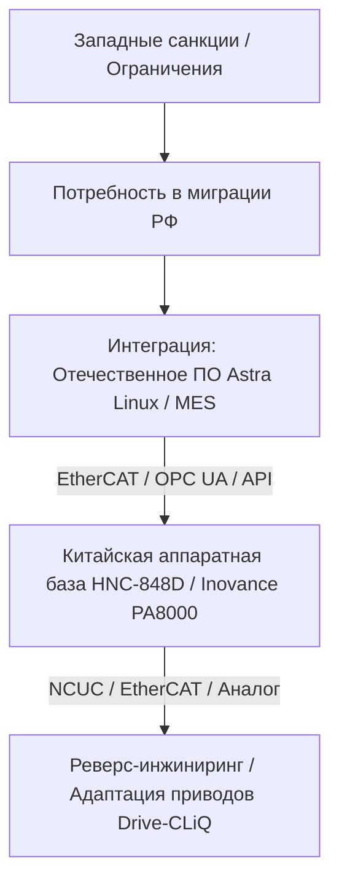

# Миграция и локализация тяжелого станкостроения и систем ЧПУ (TRL 7-9)

> [!abstract] Введение
> В условиях геополитической фрагментации и санкционных ограничений критически важной задачей для тяжелого машиностроения (производство крупногабаритных портально-фрезерных, карусельных, расточных станков) является миграция с экосистем **Siemens (Sinumerik 840D sl/ONE)** и **Fanuc (Series 30i/31i)** на альтернативные решения. 
> 
> Настоящий документ представляет собой практическое руководство по переводу российских машиностроительных предприятий на китайские аппаратные платформы класса High-End (**[[Huazhong CNC]]**, **[[Inovance Technology]]**), адаптации приводных протоколов, интеграции с отечественным ПО верхнего уровня и развертыванию локальной инфраструктуры поддержки на этапах **TRL 7** (демонстрация прототипа), **TRL 8** (квалификация) и **TRL 9** (промышленная эксплуатация), опираясь на фундаментальные научно-технические заделы уровней **TRL 1-6**.

---

## 1. Стратегический контекст: «Made in China 2025» и технологический суверенитет

Китайская государственная программа **[[Made in China 2025]] (MIC 2025)** определила высокотехнологичные станки с ЧПУ (高档数控机床) как одно из 10 приоритетных направлений. Государственные субсидии позволили таким компаниям, как **Wuhan Huazhong Numerical Control ([[Huazhong CNC]] / HNC)** и **[[Inovance Technology]]**, совершить качественный скачок, пройдя путь от копирования базовых архитектур (TRL 1-3) до создания коммерческих систем управления движением (Motion Control) пятого поколения (TRL 7-9).



### Позиционирование ключевых игроков

*   **[[Huazhong CNC]] (HNC):** Прямой бенефициар MIC 2025. Серия **HNC-848D** разрабатывалась как прямой аналог Siemens 840D для 5-осевой синхронной обработки. Система базируется на собственных алгоритмах компенсации погрешностей и поддерживает закрытый протокол NCUC (National CNC Utility Protocol) на базе Ethernet, а также [[EtherCAT]].
*   **[[Inovance Technology]]:** Лидер в области общепромышленной автоматизации Китая. Серия ЧПУ **PA8000** (разработанная на базе приобретенных технологий немецкой Power Automation) ориентирована на открытую архитектуру [[EtherCAT]] и Codesys-совместимую среду программирования.

> [!warning] Риск «Восточной зависимости»
> Импортируя готовые решения из КНР, заказчики рискуют сменить западную зависимость на восточную. Китайские производители жестко контролируют исходный код математических ядер ЧПУ (CNC Kernel). Стратегическим решением является выстраивание гибридных систем: отечественный верхний уровень (HMI, SCADA, MES) + китайское аппаратное ядро.

---

## 2. Технический анализ миграции ЧПУ (TRL 7 -> TRL 9)

Переход с Siemens/Fanuc на HNC/Inovance на уровне тяжелых станков сопряжен с фундаментальными различиями в архитектуре систем управления движением (Motion Control).

### Сравнительный анализ аппаратных платформ класса High-End

| Параметр | Siemens Sinumerik ONE | Huazhong HNC-848D | Inovance PA8000 |
| :--- | :--- | :--- | :--- |
| **Архитектура ядра** | Проприетарная (NCU на базе Intel/ARM + PLC Simatic S7-1500F) | Двухъядерная (Промышленный ПК на Linux + RTOS на сопроцессоре) | Открытая архитектура (ПК-совместимая плата + RTOS + [[EtherCAT]]) |
| **Основная шина приводов** | [[DRIVE-CLiQ]] (проприетарная, 100 Мбит/с) | NCUC (проприетарная, 100 Мбит/с) / [[EtherCAT]] | [[EtherCAT]] (открытая, 100 Мбит/с) |
| **Кол-во каналов / осей** | До 10 каналов / до 31 оси | До 10 каналов / до 32 осей (5-осевая синхронная) | До 8 каналов / до 64 осей |
| **Интерполяция (микротакт)** | 0.5 мс (опционально 0.125 мс) | 1.0 мс (в последних ревизиях 0.25 мс) | 1.0 мс (на базе [[EtherCAT]]) |
| **Интегрированная безопасность** | Safety Integrated (SIL 3 / PL e) | Базовая (STO на аппаратном уровне приводов) | Базовая (STO / SS1 через [[EtherCAT]] FSoE) |

### Ключевые технические барьеры при миграции

#### 1. Синхронная 5-осевая обработка ([[RTCP]] - Real-time Tool Center Point)
Алгоритмы [[RTCP]] у Siemens (TRAORI) и Fanuc отличаются высокой точностью аппроксимации сплайнов (**[[NURBS]]** - Non-Uniform Rational B-Splines). Математическое ядро Siemens выполняет непрерывный расчет кинематической трансформации с учетом мгновенного вектора ориентации инструмента:

$$\vec{P}_{tool} = \mathbf{M}_{kin}(q) \cdot \vec{P}_{local}$$

где $\mathbf{M}_{kin}(q)$ — матрица прямого кинематического преобразования, зависящая от обобщенных координат поворотных осей $q$. 

У HNC-848D функция [[RTCP]] присутствует, но математический аппарат сглаживания траектории (Look-Ahead алгоритмы) имеет меньший объем буфера предвычислений (до 1000 кадров против 5000+ у Siemens ONE). Это требует тонкой калибровки кинематической схемы станка вручную через таблицы компенсации геометрических погрешностей (Volumetric Compensation). На этапе **TRL 7** выявляются отклонения геометрии при непрерывном пятикоординатном фрезеровании крупногабаритных деталей, требующие доработки постпроцессоров CAM-систем для снижения шага дискретизации траектории.

```
[CAM-система] ──► [Постпроцессор (Генерация мелких линейных сегментов G01)] ──► [ЧПУ HNC-848D (Look-Ahead)]
```

#### 2. Динамическая компенсация нагрузок
Тяжелые станки обладают огромной инерцией узлов (масса портала может превышать 30 тонн). Системы Siemens используют адаптивное управление моментом в зависимости от положения осей и массы заготовки (Dynamic Stiffness Control, DSC). В китайских ЧПУ эти функции реализованы по упрощенным ПИД-схемам без динамической адаптации коэффициентов усиления (Gain Scheduling) в реальном времени. 

Для предотвращения автоколебаний конструкции на этапах **TRL 7-8** приходится снижать динамические характеристики (ускорения $a_{max}$ и рывок $j_{max}$ - Jerk) на 15–20%, что увеличивает общее время машинной обработки.

---

## 3. Адаптация сервисных протоколов и обратный инжиниринг приводов

Наиболее затратная часть модернизации тяжелого станка — замена главных приводов и подач. Мощные синхронные и асинхронные двигатели (шпиндели от 45 до 100 кВт, моментные двигатели поворотных столов) Siemens (серии 1FT7/1FK7/1PH8) менять экономически нецелесообразно. Задача — сохранить двигатели, заменив ЧПУ и, при необходимости, силовые модули.

```
[Двигатель Siemens (1FT7)] ──► [Энкодер EnDat 2.2 / DRIVE-CLiQ]
                                      │
                                      ▼ (Физический барьер: Закрытый протокол)
                         [Преобразователь сигналов (Шлюз)]
                                      │
                                      ▼ (Конвертация в EtherCAT)
                         [Привод Inovance SV660 / HNC HSV-180]
                                      │
                                      ▼
                         [ЧПУ HNC-848D / Inovance PA8000]
```

### Проблема закрытых протоколов обратной связи

*   **[[DRIVE-CLiQ]] (Siemens):** Протокол полностью закрыт, использует физический уровень Ethernet (100BASE-TX), но с проприетарным канальным уровнем и шифрованием данных. Прямое подключение датчиков обратной связи (энкодеров) Siemens к китайским приводам невозможно.
*   **Решение (TRL 5-7):** Разработка и применение аппаратных шлюзов-декодеров. На уровне **TRL 5** в лабораторных условиях исследуется возможность съема сигналов с датчиков EnDat 2.2, встроенных в двигатели Siemens, в обход интерфейсных модулей [[DRIVE-CLiQ]] (SMI). На этапах **TRL 7-8** применяются промышленные конвертеры сигналов (например, SSI/EnDat в [[EtherCAT]]) или производится замена измерительных головок на датчики с открытыми протоколами (**EnDat 2.2, BiSS-C, SSI**). Китайские приводы (**Inovance SV660** или **HNC HSV-180**) поддерживают EnDat и BiSS-C на аппаратном уровне.

### Обратный инжиниринг и сопряжение приводов

При сохранении силовых модулей Siemens (Sinamics S120) и замене только стойки ЧПУ на китайскую возникает необходимость управления приводами Sinamics по шине, отличной от [[DRIVE-CLiQ]] или PROFINET (с профилем [[PROFIdrive]]).

1.  **Аппаратный мост (Gateway):** Применение шлюзов **EtherCAT-to-PROFIdrive** на базе программируемых логических интегральных схем (**[[FPGA]]**). Это позволяет ЧПУ Inovance ([[EtherCAT]] Master) управлять приводами Sinamics S120 (как [[EtherCAT]] Slave), преобразуя циклические телеграммы (например, Телеграмму 105 с поддержкой DSC) в понятный для Sinamics формат.
2.  **Проблема задержек ([[Jitter]]):** Для тяжелых станков критически важен джиттер шины $< 1$ мкс. При использовании аппаратных мостов задержка передачи пакетов (Cycle Time) возрастает с 1 мс до 2–4 мс, что делает невозможным высокоскоростное прецизионное фрезерование. На этапе **TRL 8** требуется оптимизация стека реального времени (**[[RT-Preempt]]** в Linux) на стороне ЧПУ и тонкая настройка распределенных часов (Distributed Clocks, DC) в сети [[EtherCAT]].

---

## 4. Интеграция отечественного ПО верхнего уровня с китайским железом

Для достижения уровня **TRL 9** система должна быть полностью интегрирована в ИТ-контур предприятия (MES, ERP, системы мониторинга).

```
┌────────────────────────────────────────────────────────┐
│             Отечественное ПО верхнего уровня           │
│  (Astra Linux, SCADA, MES "Диспетчер", Winnum, и др.)  │
└───────────────────────────┬────────────────────────────┘
                            │ (OPC UA / Modbus TCP / SDK)
                            ▼
┌────────────────────────────────────────────────────────┐
│                 Китайское ядро ЧПУ                     │
│         (HNC-848D API / Inovance Codesys PLC)          │
└───────────────────────────┬────────────────────────────┘
                            │ (EtherCAT / NCUC)
                            ▼
┌────────────────────────────────────────────────────────┐
│             Аппаратный уровень (Приводы, В/В)          │
└────────────────────────────────────────────────────────┘
```

### Архитектурные уровни интеграции

#### 1. Операционная система и HMI
Перенос интерфейса оператора (HMI) на отечественную ОС (**[[Astra Linux]] Special Edition** или **Ред ОС**).
*   *Техническая реализация:* HNC предоставляет SDK для разработки собственного HMI на базе фреймворка **Qt/C++**. Ядро ЧПУ работает на выделенной плате под управлением RTOS (VxWorks / Linux RT), а интерфейсная часть запускается на x86-совместимом промышленном ПК под управлением [[Astra Linux]]. Связь между HMI (Astra Linux) и ядром ЧПУ осуществляется через локальный TCP/IP сокет или разделяемую память (Shared Memory) с использованием проприетарного API-интерфейса HNC.

#### 2. Интеграция с MES/MDC (Мониторинг станков)
Отечественные системы мониторинга (например, **«Диспетчер» (Цифра)**, **Winnum**) требуют съема данных о работе станка в реальном времени.
*   *Протоколы:* Переход от проприетарных протоколов Siemens (S7 Protocol) к открытому стандарту **[[OPC UA]]** (в частности, с использованием спецификации **[[Umati]]** / OPC UA Companion Specification for Machine Tools). Стойки HNC-848D и контроллеры Inovance имеют встроенные [[OPC UA]] серверы. Требуется ручное конфигурирование адресного пространства ПЛК (PLC) в среде разработки (HNC PLC Programming Tool или Codesys) для маппинга внутренних переменных (координаты, токи двигателей, активные G-коды, состояния концевых выключателей) в стандартные узлы (Nodes) [[OPC UA]].

---

## 5. Экономический анализ, совместные предприятия (СП) и риски ИС

### Сравнительный экономический анализ (CAPEX/OPEX) модернизации тяжелого станка
*(На примере продольно-фрезерного станка 6000х2500 мм)*

| Статья расходов | Решение на Siemens (до 2022 г.) | Решение на HNC/Inovance + РФ ПО (TRL 8-9) | Отклонение стоимости |
| :--- | :--- | :--- | :--- |
| **Аппаратная часть ЧПУ и приводы** | $120,000 | $75,000 | -37.5% |
| **Кабели, датчики, периферия** | $25,000 | $18,000 | -28% |
| **Инжиниринг, ПНР, разработка ПО** | $40,000 | $65,000 (включая реверс-инжиниринг) | +62.5% |
| **Лицензии на ПО (HMI, MES, ОС)** | $15,000 | $8,000 | -46.6% |
| **Итого CAPEX** | **$200,000** | **$166,000** | **-17%** |
| **OPEX (ежегодное обслуживание)** | $10,000 (доступность запчастей) | $15,000 (риски дефицита инженеров КНР) | +50% |

### Риски интеллектуальной собственности (IP Risks) и роль Joint Ventures (СП)

*   **«Черный ящик» китайского ПО:** Основной риск при работе с Huazhong CNC — закрытость математического ядра интерполятора. В случае обнаружения системных ошибок в алгоритмах 5-осевой трансформации отечественный интегратор не может самостоятельно исправить код. Зависимость от техподдержки из Уханя (HNC) становится критической.
*   **Стратегия Joint Ventures (Совместных предприятий):** Для достижения реального TRL 9 необходимо создание СП на территории РФ с частичной передачей прав на исходный код HMI и ПЛК-уровня, а также локализацией сборки аппаратных компонентов (сборка шкафов управления, пайка плат ввода-вывода). Без этого «локализация» остается чисто отверточной, что несет риски вторичных санкций КНР.

---

## 6. Физические и инфраструктурные барьеры

При модернизации тяжелых станков (весом от 50 тонн и более) инженеры сталкиваются с жесткими физическими ограничениями:

### 1. Электромагнитная совместимость (ЭМС) и кабельное хозяйство
*   Китайские приводы высокой мощности (Inovance IS810, HNC HSV-180) обладают более высокими уровнями наведенных помех в сравнении с Siemens Sinamics из-за более высокой крутизны фронтов переключения IGBT-транзисторов ($du/dt$). Они крайне чувствительны к качеству питающей сети и требуют обязательной установки входных и выходных синус-фильтров, а также сетевых дросселей (Line Chokes), которые часто не помещаются в существующие электрошкафы станка.
*   Длина кабельных трасс на тяжелых станках может достигать 50–70 метров. При использовании шины [[EtherCAT]] требуются специализированные кабели категории не ниже Cat5e с повышенным экранированием (SF/UTP) для предотвращения потери пакетов от наводок силовых кабелей приводов.

### 2. Тепловыделение в шкафах управления
*   КПД китайских силовых модулей в среднем на 3–5% ниже, чем у последних поколений Siemens Sinamics. На мощностях шпинделя в 75 кВт это дает дополнительные 2.2–3.7 кВт тепловыделения в шкафу, что требует модернизации систем кондиционирования шкафов управления (переход на активное фреоновое охлаждение с контролем точки росы).

### 3. Интеграция гидравлических и смазочных систем
*   Тяжелые станки имеют сложные гидростанции (управление гидростатическими направляющими, разгрузка шпиндельной бабки). Управление ими завязано на логику ПЛК. Перенос этой логики со среды Siemens Step 7 в среду Huazhong PLC требует полной перестройки циклограмм работы станка, что на этапе **TRL 7** часто приводит к аварийным остановам из-за несовпадения времени отклика клапанов (разница в миллисекундах может привести к задиру направляющих).

---

## 7. Пошаговое руководство по переходу и локализации (TRL 8-9)

Для успешного перевода российских машиностроительных предприятий на китайские решения ЧПУ с минимизацией рисков простоя оборудования разработана следующая дорожная карта.

```
[Этап 1: Аудит и ТЗ] ──► [Этап 2: Проектирование и ЭМС] ──► [Этап 3: Разработка ПО и HMI]
                                                                     │
[Этап 6: TRL 9 и Минпромторг] ◄── [Этап 5: Локальный ЗИП] ◄── [Этап 4: ПНР и Тест NAS 979]
```

### Этап 1: Технический аудит и дефектовка (Срок: 1-2 месяца)
1.  **Инвентаризация датчиков обратной связи:** Определить тип энкодеров на двигателях и линейках (Heidenhain, Fagor). При наличии протокола [[DRIVE-CLiQ]] заложить в проект шлюзы-конвертеры или замену измерительных голов на EnDat 2.2.
2.  **Анализ циклограмм ПЛК:** Выгрузить исходный код логики электроавтоматики (Step 7 / TIA Portal). Составить карту сигналов ввода-вывода (I/O Map).
3.  **Разработка ТЗ:** Зафиксировать требования к точности позиционирования, скоростям быстрых перемещений и времени цикла ПЛК (не более 4 мс).

### Этап 2: Проектирование и решение проблем ЭМС (Срок: 2-3 месяца)
1.  **Разработка схемы шкафа управления:** Интегрировать сетевые фильтры и дроссели для приводов Inovance/HNC.
2.  **Расчет тепловыделения:** При необходимости заменить пассивную вентиляцию шкафа на промышленный кондиционер мощностью от 1.5 до 2.5 кВт.
3.  **Трассировка кабелей:** Спроектировать новые кабельные каналы с физическим разделением силовых кабелей (380В) и сигнальных кабелей [[EtherCAT]] (минимальное расстояние — 200 мм).

### Этап 3: Разработка ПО и кастомизация HMI (Срок: 3 месяца)
1.  **Портирование ПЛК:** Переписать логику управления вспомогательными узлами (гидравлика, смазка, инструментальный магазин) в среде Codesys (для Inovance) или HNC PLC Programming Tool.
2.  **Создание HMI на [[Astra Linux]]:** Разработать интерфейс оператора на Qt/C++, обеспечив интеграцию с ядром ЧПУ через предоставленный производителем API/SDK.
3.  **Интеграция с [[OPC UA]]:** Настроить сервер [[OPC UA]] на ЧПУ для передачи параметров (нагрузка на шпиндель, координаты осей, коды ошибок) в систему мониторинга «Диспетчер» или Winnum.

### Этап 4: Пусконаладочные работы (ПНР) и калибровка (Срок: 1-2 месяца)
1.  **Первичная настройка приводов:** Провести автонастройку (Auto-tuning) контуров тока, скорости и положения.
2.  **Компенсация люфтов:** Провести лазерную калибровку осей с помощью интерферометра (например, Renishaw XL-80) и ввести таблицы компенсации шага ходового винта в ЧПУ.
3.  **Тестирование по стандарту [[NAS 979]]:** Выполнить обработку тестовой детали «конус-шар» для подтверждения точности 5-осевой интерполяции.

> [!info] Стандарт NAS 979
> Обработка детали по стандарту **[[NAS 979]]** является обязательным условием перехода проекта из стадии **TRL 7** в **TRL 8**. Допустимое отклонение профиля для тяжелых станков класса точности «П» не должно превышать 15 мкм при непрерывном движении по круговой траектории с одновременным наклоном оси инструмента.

### Этап 5: Создание локальной сервисной инфраструктуры и склада ЗИП (Параллельный процесс)
Для обеспечения непрерывности производства на этапе **TRL 9** предприятие обязано развернуть локальный контур поддержки:

1.  **Формирование склада ЗИП (Запасные части, Инструменты, Принадлежности):**
    *   *Минимальный комплект на каждые 5 модернизированных станков:* 1 модуль ЧПУ (процессорная плата), 2 силовых модуля приводов подач (наиболее ходовые номиналы, например, 20А и 40А), 1 блок питания шины постоянного тока, 3 оптических датчика обратной связи, комплект кабелей [[EtherCAT]] и разъемов.
    *   *Локализация хранения:* Склад должен находиться на территории РФ (время доставки до станка — не более 24 часов).
2.  **Обучение персонала:**
    *   Проведение курсов для инженеров-электронщиков предприятия по диагностике приводов Inovance/HNC (работа с ПО *InoServo* и *HNC Servo Studio*).
    *   Обучение технологов-программистов особенностям G-кода китайских стоек (различия в циклах глубокого сверления, нарезания резьбы и вызова подпрограмм).
3.  **Сервисный контракт 24/7:** Заключение соглашения с авторизованным российским интегратором, имеющим прямой канал связи с заводом-изготовителем в КНР для оперативного получения патчей ПО ядра ЧПУ.

### Этап 6: Квалификация и внесение в реестр (Срок: 2 месяца)
1.  **Сертификация по ЭМС и безопасности:** Проведение испытаний на соответствие ТР ТС 004/2011 и ТР ТС 020/2011.
2.  **Внесение в реестр Минпромторга:** Подготовка пакета документов для подтверждения локализации (в соответствии с Постановлением Правительства РФ № 719) для получения статуса отечественного оборудования (при условии использования российского ПО HMI и локальной сборки шкафов).

---

## 8. Интерактивный кейс для самопроверки

> [!question] Кейс: Модернизация портально-фрезерного станка
> Вы являетесь главным инженером проекта модернизации тяжелого портально-фрезерного станка (длина стола 8000 мм, шпиндель 55 кВт). На станке установлены двигатели Siemens 1FT7 с энкодерами [[DRIVE-CLiQ]]. Бюджет ограничен, замена двигателей невозможна. Вы выбрали ЧПУ **Inovance PA8000** на базе [[EtherCAT]].
> 
> **Вопрос:** Какое техническое решение для сопряжения приводов и ЧПУ вы выберете для достижения уровня **TRL 8** с учетом минимизации джиттера и стоимости?
> 
> *   **Вариант А:** Полная замена кабелей и установка новых энкодеров EnDat 2.2 на двигатели Siemens с прямым подключением к приводам Inovance SV660.
> *   **Вариант B:** Использование шлюзов-конвертеров DRIVE-CLiQ в EtherCAT стороннего китайского производителя без изменения кабельной трассы.
> *   **Вариант C:** Использование аппаратного моста EtherCAT-to-PROFIdrive для сохранения существующих силовых модулей Sinamics S120 и двигателей, с оптимизацией RT-ядра ЧПУ.

```
[Вариант А] ──► Высокая надежность, но экстремальная стоимость и сложность монтажа на 50-метровых трассах.
[Вариант B] ──► Риск высокого джиттера (> 5 мкс) и потери точности при 5-осевой интерполяции.
[Вариант C] ──► Оптимальный баланс CAPEX/OPEX для TRL 8, требует высокой квалификации программистов ПЛК.
```

> [!tip] Правильное решение
> **Вариант C** является наиболее экономически и технически обоснованным для тяжелых станков на этапе **TRL 8**. Он позволяет сохранить дорогостоящую силовую часть Siemens, минимизируя CAPEX. Однако он требует обязательного выполнения работ по оптимизации времени цикла шины и джиттера на стороне ЧПУ (Этап 3 и 4 дорожной карты). Если же требуется максимальная надежность и бюджет позволяет — **Вариант А** предпочтителен для серийного производства (**TRL 9**).

---

## Дорожная карта достижения TRL 9

```
[TRL 7: Пилотный проект] ──► [TRL 8: Квалификация и стандарты] ──► [TRL 9: Серийное внедрение]
  - Стендовые испытания        - Оптимизация RT-ядра (джиттер)       - Единый реестр Минпромторга
  - Тест-деталь (NAS 979)      - Сертификация ЭМС                    - Сервисная сеть 24/7
  - Базовый HMI на Astra       - Фиксация карт адресов ПЛК           - Локальные склады ЗИП
```