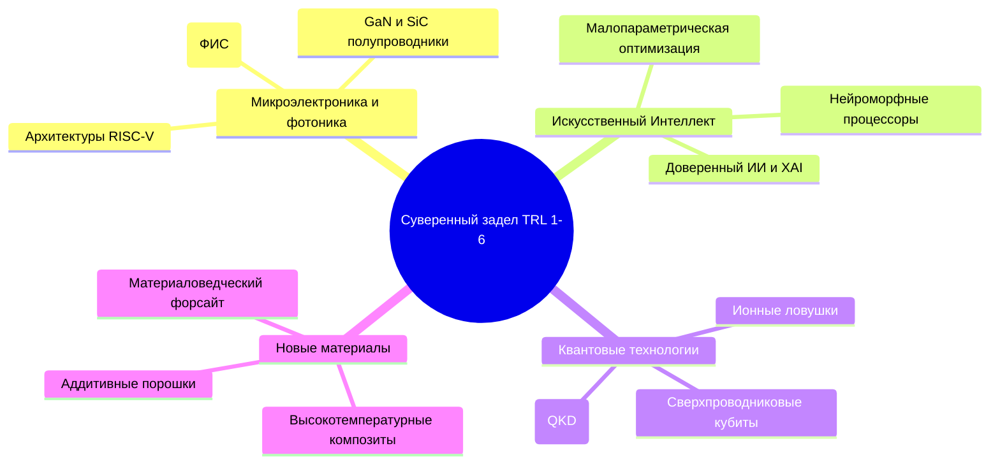
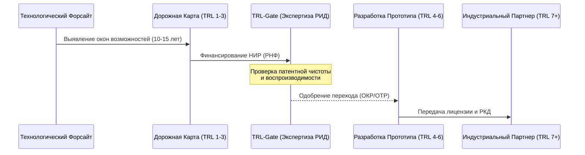

> [!abstract] Стратегическая суть
> **Технологический суверенитет** — это способность государства обеспечивать независимость, безопасность и конкурентоспособность за счет владения критическими технологиями, исключающего неконтролируемый внешний доступ или блокировку. 
> Смещение фокуса на ранние и средние уровни готовности **[[Уровни готовности технологий|TRL 1-6]]** обусловлено тем, что именно здесь формируется фундаментальная [[Интеллектуальная собственность|интеллектуальная собственность (IP)]], создаются базовые физико-химические и алгоритмические принципы и преодолевается первая [[Долина смерти инноваций|«долина смерти»]] (переход от фундаментальной науки к прикладному макетированию). Без суверенного контроля над TRL 1-6 последующее масштабирование на TRL 7-9 превращается в «отверточную сборку» на базе импортных лицензий и компонентов.

---

## 1. Теоретическая База и Декомпозиция TRL 1-6 по ГОСТ Р 58048-2017

В Российской Федерации шкала TRL (Technology Readiness Level) адаптирована и закреплена национальным стандартом **[[ГОСТ Р 58048-2017]]** («Трансфер технологий. Методические указания по оценке уровня зрелости технологий»). 

Потеря контроля над технологией на любом из этапов TRL 1-6 создает критическую зависимость от зарубежных правообладателей, так как патенты, защищающие базовые принципы (core IP), блокируют возможность легальной модернизации конечного продукта на этапах TRL 7-9.

```
[ TRL 1 ] ──> [ TRL 2 ] ──> [ TRL 3 ] ──> [ TRL 4 ] ──> [ TRL 5 ] ──> [ TRL 6 ]
  НИР           Концепция     Лаб. макет    Интеграция    Валидация     Прототип
 (Физика)      (Применение)     (PoC)       в лаб. (ОТР)   в среде     в реал. среде
```

### Детальная структура и суверенные риски TRL 1-6:

| Уровень TRL | Определение по ГОСТ Р 58048-2017 | Ключевой результат (Deliverable) | Точка уязвимости суверенитета |
| :--- | :--- | :--- | :--- |
| **TRL 1** | Выявлены и описаны фундаментальные принципы. | Научные публикации, отчеты о НИР, теоретические модели. | **Утечка мозгов:** Публикация прорывных результатов в зарубежных базах (Scopus/WoS) без предварительной оценки коммерческого и оборонного потенциала. |
| **TRL 2** | Сформулирована технологическая концепция. | Патентные заявки на изобретения, аналитические записки, ТЗ на НИР. | **Патентное блокирование:** Зарубежные конкуренты патентуют смежные области применения, закрывая выход на рынок. |
| **TRL 3** | Получено экспериментальное подтверждение концепции (Proof of Concept). | Лабораторный стенд, первые экспериментальные данные, [[РИД]] (результаты интеллектуальной деятельности). | **Отсутствие воспроизводимости:** Использование импортных реактивов/компонентов высокой чистоты, недоступных для закупки в РФ. |
| **TRL 4** | Компоненты интегрированы в лабораторный макет. | Лабораторный прототип, методика испытаний, эскизная конструкторская документация (ЭКД). | **Инфраструктурный тупик:** Зависимость от импортного измерительного и аналитического оборудования (спектрометры, микроскопы). |
| **TRL 5** | Компоненты макета испытаны в условиях, близких к реальным. | Опытно-технологические работы (ОТР), макет в реальном масштабе, ТУ. | **Дефицит САПР/EDA:** Проектирование ведется в нелицензионном или облачном зарубежном ПО, что грозит утечкой геометрии и топологии. |
| **TRL 6** | Прототип системы продемонстрирован в реальных условиях. | Опытный образец, прошедший приемочные испытания, конструкторская документация (РКД). | **Вторая «Долина смерти»:** Отсутствие отечественных инжиниринговых мощностей для перехода к опытно-промышленному производству (TRL 7). |

---

## 2. Метрики и Количественные Индикаторы Суверенитета

Для оценки устойчивости научно-технологического задела на этапах TRL 1-6 необходимо использовать систему количественных показателей, выходящую за рамки простого подсчета публикаций.

### 1. Коэффициент патентного самообеспечения (Patent Self-Reliance Ratio, $PSRR$)
Показывает долю отечественных патентных семейств в критической технологической области по отношению к общему числу патентов, действующих на территории РФ:

$$PSRR = \frac{P_{dom}}{P_{dom} + P_{imp}}$$

*Где:*
* $P_{dom}$ — количество действующих патентов, принадлежащих резидентам РФ в целевом технологическом кластере (например, "силовая микроэлектроника").
* $P_{imp}$ — количество действующих патентов иностранных правообладателей, зарегистрированных в Роспатенте по тому же кластеру.
* *Целевое значение для суверенных технологий:* $PSRR \ge 0.75$.

### 2. Индекс импортозамещения средств проектирования ($IDSI$)
Определяет уровень независимости процесса разработки (TRL 3-5) от зарубежного софта (CAD/CAE/EDA):

$$IDSI = \frac{N_{sub\_rus}}{N_{total\_sub}}$$

*Где:*
* $N_{sub\_rus}$ — количество рабочих мест разработчиков, обеспеченных отечественным ПО с поддержкой и обновлениями.
* $N_{total\_sub}$ — общее количество критических рабочих мест проектировщиков.
* *Целевое значение:* $IDSI \to 1.0$ в оборонных и критических гражданских отраслях.

### 3. Скорость прохождения TRL-воронки (TRL Transition Velocity, $TTV$)
Среднее время (в месяцах) перехода технологии из TRL 1 в TRL 6. Позволяет оценить бюрократическую нагрузку и эффективность финансирования.

---

## 3. Стратегические Приоритеты НИОКР в РФ (Фокус TRL 1-6)

В рамках актуализированной [[Стратегия научно-технологического развития РФ|СНТР РФ]] выделены критические направления, где создание суверенного задела на ранних TRL критически важно:



### Подробный анализ технологических барьеров TRL 1-6:

#### А. [[Микроэлектроника и фотоника]]
* **Текущий статус TRL 1-3:** Высокий уровень теоретических разработок в области фотоники и новых полупроводников (GaN, GaAs).
* **Узкое горлышко (TRL 4-6):** Отсутствие отечественных фабрик (foundries) для верификации прототипов интегральных схем по топологическим нормам менее 90 нм. Разработчики вынуждены использовать зарубежные фабрики (TSMC, SMIC), что блокирует переход на TRL 6 из-за санкционных ограничений.
* **Решение:** Развитие бесшаблонной литографии (TRL 3-4) и создание мелкосерийных научно-технологических линий на базе ведущих НИИ (МИЭТ, ФТИ им. Иоффе).

#### Б. [[Искусственный интеллект]]
* **Текущий статус TRL 1-3:** Сильные математические школы, создание базовых алгоритмов машинного обучения.
* **Узкое горлышко (TRL 4-6):** Зависимость от вычислительной инфраструктуры (GPU Nvidia). Невозможность обучения фундаментальных моделей (LLM, мультимодальные сети) на отечественном «железе».
* **Решение:** Разработка энергоэффективных алгоритмов разреженного обучения (sparse training) и нейроморфных чипов (архитектуры, альтернативные фон-неймановской) на уровне TRL 3-5.

#### В. [[Квантовые технологии]]
* **Текущий статус TRL 1-3:** Успешные лабораторные демонстрации многокубитных систем (Росатом, РКЦ).
* **Узкое горлышко (TRL 4-6):** Отсутствие отечественной компонентной базы для криогенных систем (разбавительные рефрижераторы растворения) и прецизионных лазеров.
* **Решение:** Локализация производства СВЧ-компонентов и лазерных диодов в рамках сквозных проектов.

---

## 4. Методология Долгосрочного Планирования и TRL-Gates

Для минимизации рисков неэффективного расходования бюджетных средств внедряется система **TRL-Gates (Технологических шлюзов)**, интегрированная с методами прогнозирования.



### Система TRL-Gates:
1. **Gate 1 (Переход TRL 2 $\to$ TRL 3):** Обязательный патентный поиск по международным базам данных. Если обнаружены блокирующие патенты, проект отправляется на перепроектирование (разработку обходных технических решений).
2. **Gate 2 (Переход TRL 4 $\to$ TRL 5):** Аудит технологической независимости макета. Оценка доли импортных комплектующих, сырья и ПО. При превышении порога в 30% (по критическим позициям) разрабатывается суб-карта локализации.
3. **Gate 3 (Переход TRL 6 $\to$ TRL 7):** Привлечение индустриального партнера. Проект не получает дальнейшего государственного финансирования без подтвержденного софинансирования со стороны бизнеса или госкорпорации, готовой внедрять технологию.

---

## 5. Сравнительный Анализ Моделей Суверенитета

### РФ vs. Китай ([[Made in China 2025]]) vs. США (DARPA Model)

| Параметр | Модель РФ (Текущий вектор) | Модель КНР (Made in China 2025) | Модель США (DARPA / NSF) |
| :--- | :--- | :--- | :--- |
| **Стратегическая доминанта** | Опережающее импортозамещение, технологическая автономность в условиях санкций. | Глобальное доминирование в цепочках поставок, "двойная циркуляция". | Технологическое превосходство, удержание лидерства на TRL 1-3. |
| **Финансирование TRL 1-3** | Преимущественно государственное (РНФ, госзадания). | Смешанное (госфонды + гигантские субсидии корпорациям). | Государственные гранты (NSF, NIH) + венчурный капитал на ранних стадиях. |
| **Переход TRL 4 $\to$ TRL 6** | Слабое звено (дефицит венчура и инжиниринга). | Сильное звено (быстрое масштабирование за счет развитой промбазы). | Эффективная экосистема (SBIR-программы, спин-оффы университетов). |
| **Управление IP** | Жесткий контроль государства над РИД гражданского и военного назначения. | Агрессивное патентование внутри страны и за рубежом, трансфер через СП. | Коммерциализация через Закон Бая-Доула (университеты владеют IP). |

---

## 6. Интерактивные Практические Кейсы

### Кейс 1: Оценка технологической готовности и IP-стратегии (Микроэлектроника)

**Сценарий:** Консорциум разработчиков создал топологию интегральной схемы для управления питанием на базе GaN-on-Si. Проведены симуляции в САПР (TRL 2) и изготовлены единичные образцы на зарубежной фабрике по контракту (Multi-Project Wafer). Образцы протестированы в лаборатории консорциума, параметры подтверждены (TRL 4). Разработчики планируют подать заявку на субсидию Минпромторга для перехода на TRL 6.

```
Вопрос: Какие критические риски с точки зрения технологического суверенитета заложены в данном проекте и как изменить стратегию?
```

> [!question]- Решение и Анализ Кейса 1
> **Анализ рисков:**
> 1. **Зависимость от фабрики (Foundry Dependency):** Изготовление прототипа на зарубежной фабрике означает, что уровень TRL 4 достигнут в "невоспроизводимых" для РФ условиях. При переходе на TRL 5-6 фабрика может отказать в обслуживании из-за санкций, что обнулит результаты.
> 2. **Утечка топологии (IP Leakage):** Передача GDSII-файла (файла топологии) на зарубежную фабрику без патентной защиты в международной юрисдикции создает риск кражи архитектуры.
>
> **Реструктуризация проекта:**
> * **Шаг 1:** Провести ретаргетинг топологии под доступные отечественные технологические линии (например, Микрон 180/90 нм), даже если это приведет к ухудшению массогабаритных характеристик.
> * **Шаг 2:** Оформить патент на полезную модель/изобретение на топологию интегральной микросхемы в РФ и дружественных юрисдикциях до отправки файлов на производство.
> * **Шаг 3:** Переопределить уровень готовности: зафиксировать текущий уровень как **TRL 3 (зависимый)** и направить субсидию на адаптацию технологии под отечественное производство (достижение истинного TRL 4/5).

---

### Кейс 2: Управление рисками совместной разработки (Новые материалы)

**Сценарий:** Российский НИИ совместно с институтом из дружественной страны разрабатывает биосовместимый полимер для 3D-печати имплантатов (целевой уровень — TRL 5). Зарубежный партнер берет на себя синтез исходных мономеров высокой чистоты, а российский НИИ — радиационную сшивку и испытания макетов. Партнер предлагает зарегистрировать совместный патент, где он будет указан как единственный производитель сырья.

```
Вопрос: Какие угрозы для технологического суверенитета несет данное соглашение и каковы условия безопасного партнерства?
```

> [!danger]- Решение и Анализ Кейса 2
> **Анализ угроз:**
> 1. **Сырьевая монополия:** Закрепление за партнером статуса единственного производителя мономеров ставит РФ в полную зависимость от поставок сырья. В случае изменения политического курса или логистических сбоев производство имплантатов в РФ будет остановлено.
> 2. **Асимметрия IP:** Российский НИИ вносит вклад на стадии TRL 4-5 (испытания, технологии применения), но базовая интеллектуальная собственность (TRL 1-3, формула мономера) остается у партнера.
>
> **Условия безопасного партнерства:**
> * **Локализация синтеза:** Включить в соглашение пункт о передаче технологии синтеза мономеров (ноу-хау) российской стороне при достижении TRL 6 или при превышении определенного объема закупок.
> * **Раздельное патентование:** 
>   * Патент 1 (совместный или партнера): Формула мономера.
>   * Патент 2 (исключительно РФ): Способ радиационной сшивки и композиция полимера для 3D-печати. Это создаст ситуацию "взаимного блокирования", вынуждающую партнера к паритетному сотрудничеству.
> * **Резервный канал:** Параллельно запустить НИР (TRL 1-3) по разработке альтернативного отечественного метода синтеза аналогичных мономеров.

---

## Взаимосвязанные заметки ([[WikiLinks]])
* [[Уровни готовности технологий]] — базовая шкала и методология оценки.
* [[ГОСТ Р 58048-2017]] — национальный стандарт оценки зрелости технологий в РФ.
* [[Долина смерти инноваций]] — барьеры перехода между этапами разработки.
* [[Интеллектуальная собственность]] — правовые аспекты защиты суверенных разработок.
* [[Made in China 2025]] — китайская стратегия достижения технологического лидерства.
* [[Технологический форсайт]] — методы долгосрочного прогнозирования.
* [[Стратегия научно-технологического развития РФ]] — верхнеуровневый целеполагающий документ.
* [[Микроэлектроника и фотоника]] — сквозное критическое направление развития.