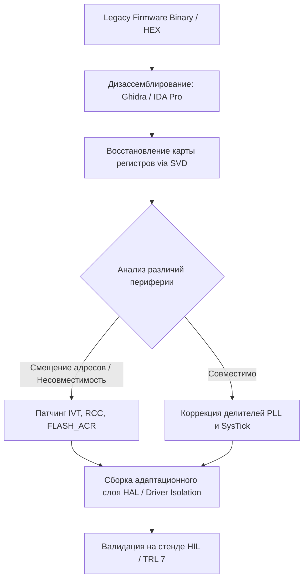
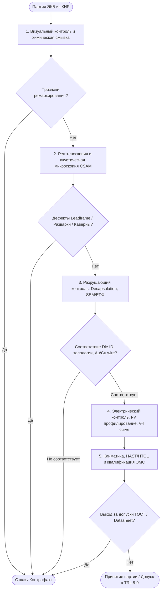


**Экспертный обзор**
В данном материале рассматривается комплекс проблем, связанных с миграцией отечественной промышленной, специальной и критической информационной инфраструктуры (КИИ) с западной электронно-компонентной базы ([ЭКБ](../%D0%AD%D0%9A%D0%91.md)) компаний STMicroelectronics, Texas Instruments, NXP, Analog Devices на китайские аналоги ([GigaDevice](../GigaDevice.md), [CKS](../CKS.md), [MindMotion](../MindMotion.md), [Artery](../Artery.md), [Geehy](../Geehy.md), [Novosense](../Novosense.md)). Особое внимание уделено рискам перехода с уровня прототипа на уровни готовности **TRL 7–9**: физической и электрической несопоставимости "Drop-in" решений, алгоритмам бинарного патчинга и адаптации SDK, выявления аппаратных закладок ([Hardware Trojans](../Hardware%20Trojans.md)), технологической зависимости от китайских [Foundry](../Foundry.md) (SMIC, Hua Hong) и построению сквозного входного контроля (IQC/DPA) по государственным и отраслевым стандартам.


---

## 1. Pin-to-Pin замещение на физическом и аппаратном уровнях (Hardware Level)

Иллюзия полного соответствия («Drop-in Replacement») — ключевой системный риск при внедрении ЭКБ на этапах [TRL 7](../TRL%207.md) (проведение испытаний опытных образцов в реальных условиях) и [TRL 8](../TRL%208.md) (квалифицированная серийная система). Несмотря на внешнюю идентичность корпусов (LQFP48, LQFP64, QFN36, SOP8) и программную совместимость по набору инструкций ISA ([ARM Cortex-M](../ARM%20Cortex-M.md), [RISC-V](../RISC-V.md)), кремниевая реализация китайских аналогов имеет фундаментальные отличия в физической топологии, схемотехнике периферии и характеристиках полупроводниковых материалов.


**Критический риск «быстрого кремния» (Fast Silicon Effect)**
Переход с техпроцессов 180/90 нм (STMicroelectronics, TI) на 55/40/28 нм (SMIC, HLMC в чипах [GigaDevice](../GigaDevice.md), [Artery](../Artery.md)) приводит к сокращению времени нарастания фронта сигналов ($dt$). При неизменной индуктивности выводов и трасс ($L$) это вызывает масштабный бросок напряжения $V_{\text{bounce}} = L \cdot \frac{di}{dt}$, провоцирующий паразитный звон (ringing), перекрестные помехи (crosstalk) и сбои при прохождении тестов по [ЭМС ГОСТ Р 51318](../%D0%AD%D0%9C%D0%A1%20%D0%93%D0%9E%D0%A1%D0%A2%20%D0%A0%2051318.md).


```
               Влияние крутизны фронта (Slew Rate) на целостность сигнала
  
  STM32 (180 нм) : t_r ≈ 5-8 нс  ───►  ┌────────────────┐  (Низкий уровень EMI)
                                       │                │
  GD32/AT32 (40 нм): t_r ≈ 1-2 нс ───►  /^\_/\_/\───────  (Высокий dI/dt -> Звон / EMI)
```

### 1.1. Сравнительный анализ микроконтроллеров и аналоговых компонентов

| Параметр / Характеристика | Оригинал (STMicroelectronics / TI) | Китайский аналог ([GigaDevice](../GigaDevice.md) GD32) | Китайский аналог ([Artery](../Artery.md) AT32 / [Geehy](../Geehy.md)) |
| :--- | :--- | :--- | :--- |
| **Техпроцесс (Fab node)** | 180 нм / 90 нм (TSMC, ST Fab) | 55 нм / 40 нм (SMIC, HLMC) | 55 нм / 28 нм (SMIC, UMC) |
| **Архитектура Flash-памяти** | Прямой доступ с таймаутами (Wait-States) | SRAM Mirroring / Zero-Wait Engine | T-Flash / Hardware Prefetch Accelerator |
| **Токопотребление ($I_{DD}$)** | Строго по Datasheet ($\pm 5\%$) | Динамическое $I_{DD}$ ниже, пики выше | Разброс до $+30\%$ в режиме DeepSleep |
| **Устойчивость к ESD (HBM)** | 2.0–4.0 кВ (гарантированная) | Заявлено 2.0 кВ (факт: 1.0–1.5 кВ) | Заявлено 4.0 кВ (факт: высокая чувствительность к CDM) |
| **Параметры GPIO (Slew Rate)** | Настраиваемый $dV/dt$ ($2\text{–}10\text{ нс}$) | Фиксированный быстрый фронт ($< 1.5\text{ нс}$) | Очень высокий $dI/dt$, требуется внешней демпфер |
| **Разварка выводов (Wire Bonding)** | Золотая проволока ($Au$, $99.99\%$) | Медная ($Cu$) или медная с палладием ($PCC$) | Медная проволока ($Cu$) без пассивации |
| **Стабильность LDO/VCAP** | $C_{\text{out}} = 2.2\text{ мкФ}$, ESR $0.1\text{–}2.0\text{ Ом}$ | Критичен к ESR, $C_{\text{out}} \ge 4.7\text{ мкФ}$ | Требует $C_{\text{out}} = 10\text{ мкФ}$ X7R близко к выводу |
| **Pierce Oscillator (Gain Margin)** | High $g_m$ (уверенный старт при $-55^\circ\text{C}$) | Low $g_m$ (срывы генерации при $T < -30^\circ\text{C}$) | Среднее $g_m$, требуется точный подбор $C_{L1}, C_{L2}$ |

### 1.2. Физические и схемотехнические барьеры замещения

#### 1. Выполнение кода из Flash: SRAM Mirroring vs Zero-Wait Engine
Микроконтроллеры [GigaDevice GD32](../GigaDevice%20GD32.md) серии F103/F407 используют технологию копирования содержимого Flash-памяти во внутреннюю высокоскоростную SRAM во время инициализации чипа либо выполняют конвейерное кэширование через Zero-Wait State Controller.
* **Следствие:** Код исполняется **быстрее**, чем на оригинальном STM32 на той же тактовой частоте.
* **Инженерная проблема:** Программные задержки на базе циклов `for/while` (`delay_us`), программная реализация протоколов ([Bit-Banging](../Bit-Banging.md) I2C, 1-Wire, SPI, SW-PWM) и тайм-ауты шин данных нарушаются. Частота передачи по Bit-Banging возрастает в 1.5–2.5 раза, вызывая сбои в связи со сложными ведомыми устройствами.

#### 2. Импеданс Power Delivery Network (PDN) и требования к LDO
Из-за перевода кристаллов на более мелкие нормы техпроцесса внутренних логических блоков ($V_{\text{core}} = 1.2\text{ В}$) резко возрастают требования к динамическому току потребления при переключении элементов.
* **Следствие:** Встроенные LDO-регуляторы китайских МК менее толерантны к паразитной индуктивности трасс и высокому эквивалентному последовательному сопротивлению ($ESR$) сглаживающих конденсаторов.
* **Решение для TRL 7–8:** Замена стандартных керамических конденсаторов емкостью $2.2\text{ мкФ}$ на $C_{\text{out}} \ge 4.7\text{–}10\text{ мкФ}$ с диэлектриком X7R/X5R и размещением непосредственно на выводах $V_{\text{CAP}} / V_{\text{DD12}}$ с использованием минимального длины переходных отверстий (Via-in-Pad).

#### 3. Расчет коэффициента усиления генератора Пирса (Pierce Oscillator Margin)
Сбой генерации кварцевого резонатора при отрицательных температурах — типичный дефект при квалификационных испытаниях на [TRL 7](../TRL%207.md). Для обеспечения надежного запуска генератора коэффициент запаса по усилению (Gain Margin, $SF$) должен удовлетворять условию:

$$SF = \frac{g_m}{g_{m\_crit}} = \frac{g_m}{4 \cdot ESR \cdot (2\pi f)^2 \cdot (C_0 + C_L)^2} > 5$$

Где:
* $g_m$ — крутизна встроенного инвертора МК (Transconductance).
* $ESR$ — эквивалентное последовательное сопротивление кварца.
* $C_0$ — паразитная емкость кристаллодержателя.
* $C_L$ — эквивалентная нагрузочная емкость схемы ($C_L = \frac{C_{L1} \cdot C_{L2}}{C_{L1} + C_{L2}} + C_{stray}$).

В китайских МК значение $g_m$ часто снижено в целях энергосбережения. При сохранении внешних конденсаторов $C_{L1}, C_{L2} = 22\text{ пФ}$ от STM32 значение $SF$ падает ниже 2, что вызывает **срыв автоколебаний при температуре ниже $-30^\circ\text{C}$** из-за роста $ESR$ кварца.


**Рекомендация по ретрассировке под TRL 7–8**
При переходе на китайские МК необходимо снижать емкость внешних конденсаторов $C_{L1}, C_{L2}$ до $10\text{–}12\text{ пФ}$ (при подборе кварцев с $C_L \le 9\text{ пФ}$) либо использовать внешние термокомпенсированные кварцевые генераторы с активным выходом CMOS (TCXO).


---

## 2. Реверс-инжиниринг прошивок, адаптация SDK и аппаратные риски

При переводе изделия на ЭКБ КНР на уровнях [TRL 7](../TRL%207.md)–[TRL 8](../TRL%208.md) часто отсутствуют исходные коды устаревшего ПО (Legacy Code) либо присутствует жесткая привязка к проприетарным библиотекам (ST Standard Peripheral Library, STM32Cube HAL).



### 2.1. Методология бинарного патчинга и адаптации SDK

При отсутствии исходных кодов для адаптации прошивки к китайскому аналогу применяется следующий инженерный алгоритм:

1. **Загрузка и векторная локализация:** Загрузка бинарного образа в [Ghidra](../Ghidra.md) / IDA Pro. Определение таблицы векторов прерываний (IVT) и смещения `SCB->VTOR`.
2. **Анализ конфигурации Clock Tree (RCC):** Поиск функций настройки фазовой автоподстройки частоты (PLL). В микроконтроллерах [GigaDevice GD32](../GigaDevice%20GD32.md) и [Geehy APM32](../Geehy%20APM32.md) структуры регистров умножителей и предделителей PLL отличаются от STM32 (например, биты настройки `RCC_CFGR` или дополнительные регистры `RCC_CFGR2`).
3. **Патчинг регистров Flash Controller (`FLASH_ACR`):** В STM32 требовалась настройка задержек чтения Flash (`LATENCY`). В китайских чипах с Zero-Wait Engine установка этих бит либо игнорируется, либо вызывает сбой в работе аппаратуры контроллера. Блоки записи `FLASH_ACR` подменяются инструкциями `NOP` (`0xBF00`).
4. **Адаптация Peripheral Register Access:** Для периферии со смещенными адресами регистров (например, модуль USB, CAN, SDIO) внедряется перехват обращений через создание секций Trampoline Code или ретрассировка базовых адресов в таблице импорта/вызова.

### 2.2. Анализ аппаратных «закладок» (Hardware Trojans) и фаблесс-зависимости


**Риск критической инфраструктуры (КИИ)**
Применение китайской фаблесс-ЭКБ в системах спецназначения и КИИ без предварительного аудита структуры кристалла создает риск наличия неописанных возможностей (Hardware Trojans), внедренных на этапе проектирования RTL/IP-ядер или маскирования GDSII на фабрике (Foundry).


```
                  ┌─────────────────────────────────────────────────┐
                  │    Классификация угроз применения ЭКБ из КНР    │
                  └────────────────────────┬────────────────────────┘
                                           │
        ┌──────────────────────────────────┴──────────────────────────────────┐
        ▼                                                                     ▼
┌─────────────────────────────────┐                         ┌─────────────────────────────────┐
│     Hardware Trojans (Закладки) │                         │  Технологические / Санкционные  │
└───────────────┬─────────────────┘                         └───────────────┬─────────────────┘
                │                                                           │
 ├─ Undocumented Registers (SCB/DMA)                         ├─ Зависимость от SMIC / Hua Hong
 ├─ Logic Bombs (Счетчики наработки)                         ├─ Замена материалов (Au -> Cu)
 ├─ TRNG Entropy Reduction (Крипто)                          ├─ Внезапный EOL (Cycle 3-5 лет)
 └─ Side-Channel Leakage (Power/EM)                          └─ Отказ в поставках по BIS/OFAC
```

#### Анатомия аппаратных закладок в микроконтроллерах и ПЛИС из КНР:

1. **Недокументированные отладочные режимы (Undocumented Debug Modes):**
   Наличие скрытых регистров в неописанном адресном пространстве System Control Block (например, `0xE000ED80`–`0xE000EDFF`) или незадокументированных команд JTAG/SWD. Включение этого режима по специальной комбинации входных сигналов на GPIO позволяет выполнить произвольный чтение/запись SRAM/Flash в обход механизмов защиты Flash Readout Protection (RDP Level 1/2).

2. **Аппаратное снижение энтропии TRNG:**
   В криптографических сопроцессорах (AES, RSA, ECC) встроенный истинный генератор случайных чисел (TRNG) модифицируется на уровне топологии (кольцевые генераторы Ring Oscillators подменяются псевдослучайной последовательностью LFSR с малым периодом). Это делает сгенерированные ключи шифрования уязвимыми для внешнего перехвата.

3. **Логические тайм-бомбы (Time-Bombs / Aging Bombs):**
   Внедрение схем на основе внутренних счетчиков переключений (Switching Counters) или контроллеров суммарной наработки. По достижении определенного числа циклов тактового генератора логика генерирует состояние непрерывного сброса (System Reset), маскируясь под тепловой пробой или деградацию от старения (NBTI/HCI).

---

## 3. Алгоритм входного контроля и квалификационные испытания (IQC & Qualification)

Для обеспечения надежности систем уровней [TRL 8–9](../TRL%208%E2%80%939.md) и отсева контрафакта, б/у компонентов и партий с аппаратными закладками внедряется пятиэтапный алгоритм сквозного входного контроля (IQC — Incoming Quality Control) и неразрушающего/разрушающего анализа.

### 3.1. Комплексная блок-схема квалификации партии ЭКБ



### 3.2. Детализация этапов квалификации и физико-химического анализа

#### Этап 1: Оптический контроль и определение ремаркирования (Anti-Remarking)
* **Микроскопия поверхности:** Анализ текстуры компаунда под оптическим микроскопом (увеличение $\times 40\text{–}\times 200$). Наличие параллельных царапин указывает на механическое шлифование (sanding) предыдущей маркировки.
* **Химическая проба растворителями (Acetone / MEK Test):** Обработка поверхности корпуса смесью ацетона и метилэтилкетона (MEK). Краска, применяемая для ремаркирования б/у или перемаркированных чипов, растворяется. Оригинальная лазерная гравировка etched-in не смывается.

#### Этап 2: Рентгенографический контроль и CSAM (Scanning Acoustic Microscopy)
* **Рентгеновский контроль (X-Ray inspection):** Оценка целостности выводной рамки (leadframe), соответствия размеров кристалла (die size), наличия оборванных или замкнутых разварочных нитей.
* **Акустическая микроскопия (CSAM):** Используются ультразвуковые датчики с частотой $50\text{–}230\text{ МГц}$. Позволяет обнаружить расслоения (delamination) на границе «компаунд — кристалл» и «компаунд — выводная рамка», микротрещины и каверны, возникшие при нетехнологичном демонтаже компонентов с б/у плат.

#### Этап 3: Декапсуляция (Decapsulation) и микроанализ топологии (SEM/EDX)
* **Селективное вскрытие корпуса:** Травление пластикового компаунда смесью концентрированных азотной ($HNO_3$, $90\%$) и серной ($H_2SO_4$, $98\%$) кислот при температуре $+60^\circ\text{C}\dots+90^\circ\text{C}$ или лазерная абляция.
* **Анализ идентификаторов кристалла (Die ID):** Проверка логотипа изготовителя, ревизии кремниевой пластины и топографического номера Mask Set на открытом кристалле с помощью сканирующего электронного микроскопа (SEM).

```
        Структурный разрез разварки: Медь (Cu) vs Золото (Au)
 
       Разварка медью (Cu/PCC) - КНР           Разварка золотом (Au) - ST/TI
 ┌──────────────────────────────────────┐ ┌──────────────────────────────────────┐
 │    [Пластиковый компаунд Epoxy]      │ │    [Пластиковый компаунд Epoxy]      │
 │               │                      │ │               │                      │
 │            ╭──┴──╮                   │ │            ╭──┴──╮                   │
 │   Cu Wire  │     │ Риск коррозии     │ │   Au Wire  │     │ Высокая химическая  │
 │   (PCC)    │  ●  │ при HAST/влаго-   │ │   (99.99%) │  ●  │ инертность           │
 │            ╰──┬──╯ защите            │ │            ╰──┬──╯                      │
 │               │                      │ │               │                      │
 │     ┌─────────┴─────────┐            │ │     ┌─────────┴─────────┐            │
 │     │ Al Bond Pad (Die) │            │ │     │ Al Bond Pad (Die) │            │
 └─────┴───────────────────┴────────────┘ └─────┴───────────────────┴────────────┘
```

* **Рентгеноспектральный микроанализ (EDX):** Определение состава материала разварочных нитей. Медная проволока ($Cu$) или медь с палладиевым покрытием ($PCC$) при эксплуатации в условиях повышенной влажности образует интерметаллические соединения $Cu_9Al_4$, склонные к растрескиванию при термоциклировании.


**Стандарты надежности разварки**
Использование медной проволоки ($Cu$) вместо золотой ($Au$) снижает себестоимость компонента, но уменьшает устойчивость к жестким климатическим факторам. Для квалификации по [TRL 8–9](../TRL%208%E2%80%939.md) обязательны тесты на ускоренную коррозию (Biased HAST per JESD22-A110: $T=+130^\circ\text{C}$, влажность $85\%$, время $96\text{ часов}$).


#### Этап 4: Электрический контроль, вольт-амперные характеристики и HTOL
* **Снятие сигнатур вольт-амперных характеристик (V-I Profiling):** Измерение кривых ESD-защитных диодов по всем выводам микросхемы с помощью параметрического анализатора. Смещение кривой относительно эталонного образца указывает на деградацию структуры static ESD damage или подделку.
* **Высокотемпературный отжиг под напряжением (HTOL per JESD22-A108):** Нахождение компонента под максимальным рабочим напряжением $V_{\text{max}}$ при температуре $+125^\circ\text{C}$ в течение $1000\text{ часов}$. Позволяет выявить скрытые дефекты оксида кремния (TDDB) и утечки p-n переходов.

---

## 4. Экономика, стратегия «Made in China 2025» и риски цепочек поставок

Переход на китайскую ЭКБ требует детального расчета совокупной стоимости владения (Total Cost of Ownership — TCO) и оценки рисков вторичных санкций со стороны регуляторов США/ЕС (BIS, OFAC).

### 4.1. Специфика стратегии «Made in China 2025» для внешних потребителей
Китайская государственная программа импортозамещения создала мощную промышленную экосистему, однако ориентирована главным образом на внутреннее потребление:
* **Фокус на внутренние стандарты КНР:** Разработка массовых МК и аналоговой ЭКБ велась под требования автопрома КНР (стандарты AEC-Q100, BYD, Geely) и энергетического сектора ([State Grid](../State%20Grid.md)). Требования российских специальных ГОСТ (по стойкости к спецфакторам, расширенному температурному диапазону $-60^\circ\text{C}\dots+125^\circ\text{C}$) не являются приоритетом для китайских фабрик.
* **Короткий жизненный цикл (EOL Lifecycle Risk):** Средний жизненный цикл китайского микроконтроллера коммерческого/автомобильного класса составляет **3–5 лет**, после чего фабрика снимает кристалл с производства (Discontinued/EOL) в пользу нового поколения. Для отечественных промышленных систем с циклом выпуска 10–15 лет это создает жесткий риск регулярных ретрассировок печатных плат.

### 4.2. Математическая модель NRE затрат и точка окупаемости (Break-even Analysis)

Смена Western-ЭКБ на China-ЭКБ при кажущейся разнице в стоимости чипа в 2–3 раза часто оказывается экономически убыточной на малых серийных партиях из-за высоких единовременных инженерных затрат (Non-Recurring Engineering — NRE).

$$\text{Total NRE} = C_{\text{HW\_Respin}} + C_{\text{FW\_Adapt}} + C_{\text{IQC\_Qual}} + C_{\text{Cert}}$$

Где:
1. $C_{\text{HW\_Respin}} = N_{\text{respin}} \cdot (C_{\text{PCB\_Layout}} + C_{\text{Prototypes}} + C_{\text{Assembly}})$ — затраты на ретрассировку печатных плат (от \$10,000 до \$40,000).
2. $C_{\text{FW\_Adapt}}$ — затраты на адаптацию ПО, бинарный патчинг, отладку drivers/BSP layers (500–2000 инженеро-часов).
3. $C_{\text{IQC\_Qual}} = C_{\text{Decap}} + C_{\text{CSAM}} + C_{\text{SEM/EDX}} + C_{\text{HTOL}} + C_{\text{EMC\_Test}}$ — комплекс физико-химических и климатических испытаний (\$20,000 – \$60,000).
4. $C_{\text{Cert}}$ — расходы на проведение повторных сертификационных испытаний конечного изделия по требованиям ГОСТ Р / КИИ.

$$\text{Точка окупаемости (Break-even Volume, } N_{\text{critical}}\text{)} = \frac{\text{Total NRE}}{\text{BOM}_{\text{Western}} - \text{BOM}_{\text{China}}}$$


**Расчетный пример окупаемости**
При суммарных NRE-затратах в **\$80,000** и снижении стоимости спецификации (BOM) с **\$45** до **\$25** (разница $\Delta = \$20$), точка окупаемости $N_{\text{critical}}$ составляет **4 000 изделий**. Для мелкосерийного производства (100–500 шт/год) миграция является чисто убыточной и оправдана исключительно соображениями непрерывности бизнеса (Business Continuity).


---

## 5. Матрица рисков и инженерные стратегии их минимизации

| Область риска | Технический рисковый фактор | Степень риска | Инженерная стратегия минимизации (Mitigation Directive) |
| :--- | :--- | :--- | :--- |
| **Physical / Silicon** | Быстрые фронты $dI/dt$, звон, срывы Pierce-генератора при $T < -30^\circ\text{C}$. | **ВЫСОКАЯ** | Внедрение демпфирующих resistors ($22\dots47\text{ Ом}$), пересчет $C_L$ под low-$g_m$, переход на активные TCXO, утолщение медных проводников PDN. |
| **Software / HAL** | Несовместимость Flash wait-states, таймингов I2C/SPI Bit-Banging, сдвиг адресов RCC. | **СРЕДНЯЯ** | Отказ от проприетарного HAL vendor SDK; явная инициализация регистров напрямую (Direct Register Control), адаптация таймеров на базе HW Timers вместо CPU loops. |
| **Hardware Security** | Скрытые отладочные режимы, недокументированные регистры, искажение энтропии TRNG. | **КРИТИЧЕСКАЯ** | Проведение 100% DPA-анализа, ограничение физического доступа к SWD/JTAG выводам, применение внешних сертифицированных крипто-сопроцессоров. |
| **Supply Chain** | Поставка ремаркированных, б/у или отбракованных чипов через серые каналы в Гонконге/Шэньчжэне. | **КРИТИЧЕСКАЯ** | Поставка только через прямых франчайзинговых дистрибьюторов 1-го уровня в КНР; обязательный 5-этапный входной контроль (CSAM, Decap, EDX) каждой партии. |
| **Life Cycle / EOL** | Снятие кристалла с производства через 3 года без уведомления (EOL). | **ВЫСОКАЯ** | Реализация стратегии **Dual-Sourcing Design**: разводка PCB под 2 независимых китайских вендора (например, [GigaDevice GD32](../GigaDevice%20GD32.md) + [Geehy APM32](../Geehy%20APM32.md) / [Artery AT32](../Artery%20AT32.md)). |

---

## 6. Практический инженерный кейс: Квалификация и отладка (TRL 7)


**Практическая инженерная задача**
**Контекст:** Проводится перевод контроллера ячейки КРУ (КРУ — Комплектное Распределительное Устройство) для объектов электроэнергетики с МК `STM32F407ZGT6` на `GD32F407ZGT6`. Изделие проходит квалификационные испытания на уровне [TRL 7](../TRL%207.md).

**Проявления отказов на этапе испытаний:**
1. При охлаждении платы в климатической камере до $-40^\circ\text{C}$ контроллер прекращает выполнение программы (Halt), хотя при $+25^\circ\text{C}$ старт уверенный.
2. В канале связи RS-485 (Modbus RTU) спорадически возникает ошибка `CRC Error` на высоких скоростях ($115200\text{ бод}$), не наблюдаемая на оригиналах STM32.
3. На испытаниях по ЭМС (ГОСТ Р 51318) зафиксировано превышение квазипикового уровня излучаемых помех на частотах $168\text{ МГц}$ и $336\text{ МГц}$ на $14\text{ дБ}$.

**Задание:** Определить первопричины каждого из трех сбоев и предложить комплексное инженерное решение.


---

### Подробный разбор причин и решений:


**Экспертное решение кейса**
#### 1. Причина сбоя при $-40^\circ\text{C}$ (Срыв генерации Пирса):
* **Физика процесса:** В микроконтроллере GD32F407 крутизна $g_m$ встроенного инвертора генератора XTH ниже, чем у STM32F407. При отрицательных температурах эквивалентное сопротивление кварцевого резонатора $ESR$ возрастает в 1.5–2 раза. В результате Gain Margin $SF$ падает ниже 1, и автоколебания срываются.
* **Устранение:** Снижение емкости внешних нагрузочных конденсаторов $C_{L1}, C_{L2}$ с $22\text{ пФ}$ до $12\text{ пФ}$ (для компенсации паразитной емкости трасс $C_{stray}$) либо замена кварца на кварцевый генератор с выходом CMOS (TCXO 3.3V).

#### 2. Причина ошибок CRC в RS-485:
* **Физика процесса:** GD32 выполняет код из Flash через Zero-Wait SRAM-конвейер быстрее, чем STM32. Программный тайм-аут межкадрового интервала Modbus RTU ($3.5\text{ символа}$), реализованный через программные циклы задержки `delay_us()` или SysTick без учета ускоренного исполнения, стал короче требуемого стандартами $t_{3.5}$. Приемная сторона считает кадр размонтированным и бракует контрольную сумму.
* **Устранение:** Перевод всех задержек и контролей тайм-аутов на использование аппаратного таймера (Hardware Timer) с завязкой на фактическую частоту системной шины `APB1/APB2`.

#### 3. Причина превышения норм по ЭМС на 168 / 336 МГц:
* **Физика процесса:** Микросхема GD32 изготовлена по более тонкому техпроцессу ($55\text{ нм}$ против $90\text{ нм}$ у STM32). Крутизна фронтов переключения выводов $dI/dt$ на выходе системного тактирования и выводах GPIO возросла. Гармоники основной тактовой частоты $168\text{ МГц}$ излучаются трассами платы, работающими как эффективные антенны.
* **Устранение:**
  1. В программном коде изменить конфигурацию GPIO Slew Rate с "High Speed" на "Medium Speed" или "Low Speed" (регистр `GPIO_OSPEEDR`).
  2. Установить последовательные демпфирующие резисторы (Damping Resistors, $R_s = 22\text{–}33\text{ Ом}$) в разрыв высокоскоростных линий (CLK, TX, SPI).
  3. Добавить ферритовые фильтры (Ferrite Beads) по питанию $V_{DD}$ МК для подавления высокочастотных токовых петель.


---

## Дополнительные материалы и взаимосвязанные темы
* [TRL Levels](../TRL%20Levels.md) — Полный классификатор уровней готовности технологий от TRL 1 до TRL 9.
* [Hardware Trojans](../Hardware%20Trojans.md) — Классификация, методы внедрения и способы обнаружения скрытых закладок в ASIC и ПЛИС.
* [Decapsulation](../Decapsulation.md) — Методики химического, лазерного и физического вскрытия корпусов ИС для проверок DPA.
* [ЭМС ГОСТ Р 51318](../%D0%AD%D0%9C%D0%A1%20%D0%93%D0%9E%D0%A1%D0%A2%20%D0%A0%2051318.md) — Стандарты электромагнитной совместимости, методики измерений и методы проектирования фильтров.
* [GigaDevice GD32](../GigaDevice%20GD32.md) — Архитектурные особенности, карты регистров и Errata Sheet микроконтроллеров GD32.
* [Artery AT32](../Artery%20AT32.md) — Архитектура высокопроизводительных микроконтроллеров Artery и различия с STM32.