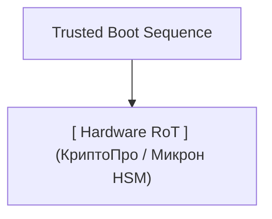

# Стратегия и технический регламент локализации телекоммуникационного и серверного оборудования


### **Стратегический контекст и уровень технологической готовности**

| Выход из РФ ведущих западных вендоров (*Ericsson, Nokia*) и переход китайских Tier-1 производителей (*Huawei, ZTE*) к скрытому взаимодействию через прокси-дистрибьюторов ставят под прямой удар устойчивость критической информационной инфраструктуры ([КИИ](../lib-1/%D0%9A%D0%98%D0%98.md)). Настоящий документ устанавливает **Технический регламент поэтапной миграции** на доверенный стек и проводит сквозной аудит систем на протяжении всей шкалы [TRL (от TRL 1 фундаментальных материалов до TRL 9 серийного внедрения)](../lib-1/%D0%A3%D1%80%D0%BE%D0%B2%D0%B5%D0%BD%D1%8C%20%D1%82%D0%B5%D1%85%D0%BD%D0%BE%D0%BB%D0%BE%D0%B3%D0%B8%D1%87%D0%B5%D1%81%D0%BA%D0%BE%D0%B9%20%D0%B3%D0%BE%D1%82%D0%BE%D0%B2%D0%BD%D0%BE%D1%81%D1%82%D0%B8.md). |
| --- | --- |



---

## 1. Технический регламент миграции на доверенный стек

Переход от проприетарного монолитного оборудования *Huawei/ZTE* к доверенным отечественным платформам требует полного исключения аппаратных и программных «закладок» (Hardware Backdoors / Undocumented Features).

```mermaid
flowchart TD
    A[Фаза 1: Прямой / Серый импорт] -->|Изоляция OAM / Аудит SPI Flash / OpenBMC| B[Фаза 2: SKD + Замена ПО]
    B -->|SMT-монтаж BGA + Внедрение HSM ГОСТ| C[Фаза 3: Глубокая CKD-локализация]
    
    subgraph Фаза 3: Требования ТОРП (Минпромторг)
        C1[Печатные платы 16–24 слоев / HDI]
        C2[Доверенное ПО: Astra/RedOS/ALT + RT-Kernel]
        C3[Аппаратный Root of Trust: ГОСТ Р 34.12-2015]
        C1 --- C2 --- C3
    end

    subgraph Интерфейсы OpenRAN Split 7.2x
        D[vCU - Centralized Unit] <-->|F1 Interface| E[vDU - Distributed Unit]
        E <-->|eCPRI / Low-PHY| F[RU - Radio Unit]
    end
    
    C --> D
```

### Этапы выполнения регламента

#### Этап 1. Изоляция и аппаратный контроль (Срочный)
1. **Аудит сетевых контроллеров и микрокодов:**
### * Полное отключение проприетарных сервисов управления питания и мониторинга «Phone Home» на уровне [BMC](../lib-1/BMC.md) (Baseboard Management Controller, чипы *Aspeed AST2500/AST2600*).

| * Дамп и бинарный аудит прошивок [SPI Flash](../lib-1/SPI%20Flash.md) с контролем целостности по алгоритму [ГОСТ Р 34.11-2012 (Стрибог-256)](../lib-1/%D0%93%D0%9E%D0%A1%D0%A2%20%D0%A0%2034.11-2012.md). |
| --- | --- |

2. **Сегментация трафика управления ([OAM](../lib-1/OAM.md)):**
   * Физическое отключение интерфейсов [NC-SI](../lib-1/NC-SI.md) (Network Controller Sideband Interface), связывающих BMC с основными сетевыми портами. Перевод OAM-трафика на изолированные физические каналы Out-of-Band (OOB).
### 3. **Криптографическая изоляция:**

| * Установка внешних аппаратных криптомодулей ([ГОСТ HSM](../lib-1/%D0%93%D0%9E%D0%A1%D0%A2%20%D0%9A%D0%A0%D0%98%D0%9F%D0%A2%D0%9E%D0%93%D0%A0%D0%90%D0%A4%D0%98%D0%AF.md)) на интерфейсах передачи данных между [eNodeB/gNodeB](../lib-1/eNodeB.md) и ядром сети ([5G Core / EPC](../lib-1/5G%20Core.md)). |
| --- | --- | --- | --- |


#### Этап 2. Программное импортозамещение и SKD-сборка (Промежуточный)
1. **Системное ПО:** Перевод серверов управления и опорной сети с *EulerOS/RedHat Enterprise Linux* на отечественные ОС с мандатным контролем доступа: [Astra Linux Hardened](../lib-1/Astra%20Linux%20Hardened.md), [ПО РедОС](../lib-1/%D0%9F%D0%9E%20%D0%A0%D0%B5%D0%B4%D0%9E%D0%A1.md) или [ALT Linux](../lib-1/ALT%20Linux.md).
2. **Декомпозиция сети по спецификациям [OpenRAN](../lib-1/OpenRAN.md):**
### * Разделение стека на **vCU** (Virtual Centralized Unit), **vDU** (Virtual Distributed Unit) и **RU** (Radio Unit) с использованием архитектуры **Option 7.2x Split**.

| * Исполнение L2/L3 функций в среде контейнеризации ([Kubernetes](../lib-1/Kubernetes.md)) с управлением через отечественные сервисы [MANO/NMS](../lib-1/MANO.md). |
| --- | --- |

3. **Получение статуса [ТОРП](../lib-1/%D0%A2%D0%9E%D0%A0%D0%9F.md):** Выполнение требований Постановления Правительства № 719 (крупноузловая [SKD-сборка](../lib-1/SKD-%D1%81%D0%B1%D0%BE%D1%80%D0%BA%D0%B0.md)), локализация кода [BIOS](../lib-1/BIOS.md)/UEFI на базе *Coreboot* и прошивок OpenBMC.

#### Этап 3. Глубокая локализация CKD и аппаратная адаптация (Целевой)
1. **SMT-монтаж и контроль качества:** Освоение полного цикла поверхностного монтажа (SMT) компонентов, пайки BGA-чипов с шагом $<0.4 \text{ мм}$ и применения систем автоматического оптического ([AOI](../lib-1/AOI.md)) и рентгеновского ([AXI](../lib-1/AXI.md)) контроля.
2. **Замещение FPGA/ASIC:** Замена проприетарных ASIC-процессоров обработки сигнала *HiSilicon Balong/Kirin* на программируемые логические интегральные схемы ([ПЛИС FPGA](../lib-1/%D0%9F%D0%9B%D0%98%D0%A1%20FPGA.md)) с загрузкой отечественных IP-ядер L1-обработки.
3. **Аппаратный Корпусированный Root of Trust (RoT):** Монтаж отечественных микросхем криптозащиты (например, *ПКК Микрон* 5018ВК01 или *КриптоПро* HSM) непосредственно на системную плату для контроля неизменяемости bootloader'а при старте системы (Trusted Boot).

---

## 2. Аппаратный уровень: Физические барьеры, материалы и сборка (TRL 1–6)


### **Сравнительный анализ механики сборки**

| * **[SKD (Semi-Knocked Down)](../lib-1/SKD-%D1%81%D0%B1%D0%BE%D1%80%D0%BA%D0%B0%20*%20**CKD-%D1%81%D0%B1%D0%BE%D1%80%D0%BA%D0%B0.md):** Добавочная стоимость в РФ **5–10%**. Ограничивается сборкой шасси, монтажом готовых плат, установкой радиаторов охлаждения, прошивкой BIOS/BMC и проведением базовых приемо-сдаточных испытаний (ПСИ). CKD (Completely Knocked Down)]]:** Добавочная стоимость в РФ **30–50%**. Включает нанесение паяльной пасты (трафаретная печать), SMT-монтаж пассивных и активных компонентов на голые печатные платы, BGA-пайку в конвекционных печах, селективную пайку выводных разъемов, влагозащитное покрытие и комплексную AXI-диагностику. |
| --- | --- |



> **(Технологический барьер TRL 1-5: Литография, Субстраты, Диэлектрики)**


### Физико-инфраструктурные барьеры локализации CKD

#### 1. Высокоплотные печатные платы ([HDI PCB](../lib-1/HDI%20PCB.md))
* **Физико-химические требования:** Платы базовых станций 5G NR и Blade-серверов требуют применения диэлектриков с ультранизкими потерями ($D_f < 0.004$, $D_k \approx 3.6-3.8$ на частотах до $10\text{ ГГц}$). Необходим жесткий контроль волнового сопротивления (дифференциальные пары PCIe Gen5/Gen6 и eCPRI $25\text{ Gbps}$).
* **Текущее состояние в РФ:** Доступные отечественные производства (*Технотех*, *Резонит*) массово освоили платы до 12–16 слоев 5-го класса точности. Выпуск 18–24 слойных плат с микроотверстиями (microvias, глухие/скрытые переходные отверстия) диаметром $<0.1\text{ мм}$ и аспектным соотношением (Aspect Ratio) $>10:1$ ограничен лабораторными объемами (TRL 4-5).
* **Сырьевой барьер:** Использование высокочастотных ламинатов типа *Panasonic Megtron 6/7* или *Rogers RO4350B* безальтернативно. Отечественные аналоги из стеклоткани и эпоксидных смол пока обладают слишком высоким коэффициентом диэлектрических потерь на гигагерцовых частотах.

#### 2. SMT-оборудование и BGA-монтаж
* Монтаж современной ЭКБ (BGA-корпуса, CSP, Fine-Pitch QFP с шагом выводов $0.3\text{--}0.4\text{ мм}$) требует высокопрецизионных расстановщиков компонентов класса *ASM Siplace* или *Fuji Aimex*.
* **Проблема пайки:** Деформация многослойных HDI-плат при конвекционном нагреве приводит к образованию микротрещин и пустот (voids) под BGA-выводами. Допустимый уровень пустот по стандарту **IPC-A-610G** для класса 3 (телекоммуникации) не должен превышать $15\%$. Для контроля качества требуются 3D-рентгеновские инспекционные установки (AXI), поставка которых контролируется санкционными режимами.

#### 3. Тракты радиочастоты (RF Frontend) и GaN-усилители
* В модулях [Massive MIMO](../lib-1/Massive%20MIMO.md) (32T32R, 64T64R) ключевым элементом являются транзисторы выходных каскадов усилителей мощности (PA) на базе нитрида галлия на кремнии или карбиде кремния (**GaN-on-SiC**).
* **Сравнительные параметры RF-усилителей:**

| Параметр :--- **КПД добавленной мощности (PAE)** **Выходная мощность (Pout)** **Температура перехода ($T_j$)** **Площадь кристалла / Плотность** | Зарубежные аналоги (Qorvo / Sumitomo) :--- $55 - 62\%$ на частоте $3.5\text{ ГГц}$ $80\text{ Вт}$ в блоке До $225^\circ\text{C}$ Высокая (интегрированные MMIC) | Отечественные разработки (АО НПП «Пульсар») :--- $38 - 42\%$ на частоте $3.5\text{ ГГц}$ $40 - 50\text{ Вт}$ в блоке До $175^\circ\text{C}$ Дискретная сборка на подложках | TRL в РФ :--- **TRL 5** **TRL 5** **TRL 6** **TRL 4** |
| --- | --- | --- | --- |


---

## 3. Программный слой, L1-вычисления и реальное время


**Задержки сигнального тракта в L1 (Physical Layer)**
Перенос функций обработки радиосигнала L1 (FFT/IFFT, модуляция/демодуляция, кодирование LDPC, гибридный ARQ) с проприетарных ASIC-ускорителей на процессоры общего назначения архитектуры x86/CISC создает проблему фазового дрожания ([Jitter](../lib-1/Jitter.md)) и задержек. Для TDD-режима 5G NR временной бюджет обработки кадра на физическом уровне составляет $<125\ \mu\text{s}$. Превышение этого лимита влечет срыв синхронизации и обрыв сессии (*Radio Link Failure*).


| Вендорский стек (Huawei) |  |
| --- | --- |
| Proprietary NCE eNodeB / gNodeB Proprietary ASIC | Управление сетью (Orchestration / NMS) Proprietary RTOS (VRP / VxWorks) Hardened L1 PHY Acceleration (HiSilicon Balong) |

                                    │
### ▼  (Архитектурный переход OpenRAN)

| Локализованный стек (РФ) |  |
| --- | --- |
| OpenRAN MANO K8s Container Split 7.2x vDU | Отечественное ПО (Astra Linux Hardened / RedOS) KVM Virtualization + Real-Time Kernel (PREEMPT_RT) DPDK + SR-IOV + PCIe FPGA Acceleration (Inline) |


### Математический и системный апарат ускорения L1

Для соблюдения жестких допусков по времени в виртуализированных средах (vRAN) применяется двухуровневая оптимизация:
1. **Программный уровень:**
   * Сборка ядра Linux с патчем реального времени **PREEMPT_RT**.
   * Применение **DPDK** (Data Plane Development Kit) для поллинга драйвера сетевой карты в обход сетевого стека ядра (Zero-Copy).
   * Настройка **Poll Mode Drivers (PMD)** и изоляция ядер ЦПУ через параметры загрузчика `isolcpus` и `nohz_full`.
2. **Аппаратный уровень (Acceleration Offloading):**
   * **Inline Acceleration:** Полный вынос функций L1 High-PHY (LDPC decoding, Rate Matching) на внешнюю PCIe-плату ускорения (FPGA). Процессор x86 освобождается от тяжелых векторных операций.
   * **Look-aside Acceleration:** Процессор x86 выполняет большинство функций, выгружая на FPGA/ASIC только самую затратную операцию — декодирование каналов с высокой плотностью проверок на четность ([LDPC](../lib-1/LDPC.md)).

### Сквозная [TRL-матрица](../lib-1/TRL-%D0%BC%D0%B0%D1%82%D1%80%D0%B8%D1%86%D0%B0.md) программно-аппаратных подсистем

| Компонент / Подсистема :--- **5G Core (UPF, AMF, SMF)** **vCU / vDU Software** **L1 PHY IP-Cores (LDPC/FFT)** **ОС общего / реального назначения** **Трансиверы RFIC (Direct RF)** **Центральный процессор vDU** | Прототип / Исходник :--- Huawei UNC / Ericsson UDM Proprietary Vendor Code Intel FlexRAN / Qualcomm RedHat Enterprise Linux Analog Devices AD9371 Intel Xeon Scalable / Ice Lake | Отечественная альтернатива :--- [НТЦ ПРОТЕЙ](../lib-1/%D0%9D%D0%A2%D0%A6%20%D0%9F%D0%A0%D0%9E%D0%A2%D0%95%D0%99.md), [ИнфотеКС](../lib-1/%D0%98%D0%BD%D1%84%D0%BE%D1%82%D0%B5%D0%9A%D0%A1.md) [YADRO](../lib-1/YADRO.md), [КНС Групп](../lib-1/%D0%9A%D0%9D%D0%A1%20%D0%93%D1%80%D1%83%D0%BF%D0%BF.md), [ПО БУЛАТ](../lib-1/%D0%9F%D0%9E%20%D0%91%D0%A3%D0%9B%D0%90%D0%A2.md) Разработки Сколтех / FPGA IP [Astra Linux Hardened](../lib-1/Astra%20Linux%20Hardened.md) (RT) Опытные кристаллы (НИИЭТ/Микрон) YADRO VEGMAN / Baikal-S | TRL (РФ) :--- **TRL 8** **TRL 7** **TRL 5** **TRL 9** **TRL 3** **TRL 6** | Ключевой технологический блокер :--- Деградация пропускной способности UPF при трафике $>100\text{ Gbps}$ на узел Полнота поддержки спецификаций 3GPP Rel. 16/17 (URLLC, eMTC) Энергопотребление FPGA в 3-5 раз выше специализированных ASIC Отсутствие оптимизированных драйверов под специфические сетевые чипы Отсутствие динамического диапазона $>100\text{ dB}$ и полосы $>200\text{ MHz}$ Ограниченный доступ к зарубежным фабам (TSMC) для производства процессоров |
| --- | --- | --- | --- | --- |


---

## 4. Цепочка поставок, литографические ограничения и ЭКБ

Разработка и производство полупроводников для телекома опирается на иерархию топологических нормативов:

$$\text{Микроэлектронная топология} \implies \begin{cases} 
\ge 90\text{--}65\text{ нм:} & \text{PMIC (Управление питанием), Простые контроллеры} \\
28\text{--}22\text{ нм:} & \text{Коммутаторы (Switch Fabric), DSP-процессоры} \\
16\text{--}12\text{ нм:} & \text{Высокопроизводительные ПЛИС (FPGA L1 Acceleration)} \\
7\text{--}4\text{ нм:} & \text{Центральные процессоры vRAN, Высокоплотные ASIC}
\end{cases}$$


**Анализ критических уязвимостей цепочки поставок (Supply Chain)**
1. **Литографический тупик:** Фабрика *АО «Микрон»* (техпроцесс 90–65 нм) физически не способна производить современные цифровые сигнальные процессоры (DSP) и FPGA высокой плотности. Зависимость от зарубежных фабов (TSMC, SMIC) остается абсолютной.
2. **Химические расходные материалы:** Процесс photolithography требует сверхчистых фоторезистов (ArF/KrF), специального оптического стекла, травящих газов высокого качества ($\text{WF}_6$, $\text{CF}_4$, высокочистый неон $\text{Ne}$) и полировальных суспензий (CMP slurries). Срок хранения химикатов ограничен 3–6 месяцами, транспортировка требует температурного контроля (от $-20^\circ\text{C}$ до $+5^\circ\text{C}$). Серый импорт логистически затруднен.
3. **Проблема контрафакта ЭКБ:** Закупка FPGA-массивов (*Xilinx UltraScale+, Intel Stratix 10*) через независимых брокеров в Юго-Восточной Азии сопровождается ростом доли брака и перемаркировки до **15–20%**. Необходим $100\%$ входной контроль (X-Ray, разрушающий аудит кристаллов).


---

## 5. Сравнительный анализ: "Made in China 2025" vs Модель РФ

Стратегические возможности РФ по локализации глубоко отличаются от китайского сценария 2010–2020 гг.

| Параметр сравнения :--- **Масштаб емкости рынка** | Стратегия [Made in China 2025](../Made%20in%20China%202025.md) :--- Огромный ($>30\%$ мирового) — окупает R&D полного цикла | Текущая модель РФ (2024–2030) :--- Ограниченный ($\sim 1.5\%$ мирового) — не окупает самостоятельный кремниевый фаб |  |
| --- | --- | --- | --- |
| **Трансфер технологий** | Принудительный через создание совместных предприятий (Joint Ventures) | Полный отказ западных/китайских вендоров от передачи IP; необходимость [реверс-инжиниринга](../lib-1/%D0%A0%D0%B5%D0%B2%D0%B5%D1%80%D1%81-%D0%B8%D0%BD%D0%B6%D0%B8%D0%BD%D0%B8%D1%80%D0%B8%D0%BD%D0%B3.md) |
| **Доступ к EDA-ПО** **Собственный патентный портфель** **Инфраструктура производства** | Многолетний доступ к пакетам *Cadence, Synopsys, Mentor Graphics* Лидерство по стандартизации 3GPP (Huawei — №1 по числу [SEPs](../lib-1/SEPs.md)) Полная цепочка внутри страны (SMIC, YMTC, CXMT, Huawei HiSilicon) | Блокировка лицензий EDA. Переход на открытые или нелицензионные САПР Минимальное присутствие в стандартизации 3GPP; полная зависимость от внешних патентов Зависимость от импорта ЭКБ ниже $65\text{ нм}$; ориентация на сборку и софт |  |



**Риск использования прокси-платформ и Binary BLOBs**
При попытке ускоренной локализации через сборку OEM-дизайнов китайских вендоров 2-го и 3-го эшелонов (например, *MIND, Baicells*) российские разработчики получают прошивки в виде скомпилированных бинарных объектов ([Binary BLOB](../lib-1/Binary%20BLOB.md)). Это **полностью исключает возможность аудита безопасности**, блокирует адаптацию алгоритмов L1 под ГОСТ-шифрование и сохраняет скрытую зависимость от зарубежного разработчика.


---

## 6. Интерактивный практический блок и инженерные кейсы

### Кейс 1: Диагностика и устранение фазового дрожания (Jitter) в vRAN
**Исходные данные:** Инженерная группа разворачивает стек vDU 5G NR на сервере с процессором x86 и [Astra Linux Hardened](../lib-1/Astra%20Linux%20Hardened.md). При подаче синтетической нагрузки $10\text{ Gbps}$ возникает систематический сброс сессий связи. Анализ логов показывает: время обработки L1-кадра периодически превышает $250\ \mu\text{s}$ (при норме $\le 125\ \mu\text{s}$).

**Пошаговое решение:**

```bash
# 1. Изоляция ядер процессора под DPDK и L1-потоки в GRUB
GRUB_CMDLINE_LINUX_DEFAULT="quiet splash isolcpus=2-15 nohz_full=2-15 rcu_nocbs=2-15 intel_idle.max_cstate=0 processor.max_cstate=0"

# 2. Включение преемптивности в ядре и настройка приоритета SCHED_FIFO
chrt -f 99 ./l1_phy_processing_engine --dpdk-cores=2-7 --inline-fpga-dev=0000:03:00.0

# 3. Настройка выгрузки LDPC на PCIe-ускоритель (Inline Accelerator)
# Иключение программного декодирования AVX-512, приводящего к сбросу частоты CPU (Thermal Throttling)
```


**Технический разбор кейса 1**
**Первопричина:** Стандартный планировщик Linux переводил ядра процессора в энергосберегающие состояния (C-states/P-states) и переключал контекст при обработке аппаратных прерываний, а выполнение инструкций AVX-512 вызвало просадку тактовой частоты процессора.
**Решение:**
1. Полный запрет C-states в BIOS и параметрах ядра (`processor.max_cstate=0`).
2. Закрепление потоков (CPU Affinity) за изолированными ядрами.
3. Использование аппаратного выноса LDPC-декодирования на PCIe FPGA-ускоритель, исключая загрузку AVX-512 блоков ЦПУ.


---

### Кейс 2: Устранение некомплаентности BMC и реализация доверенной загрузки
**Исходные данные:** В ходе комплексного аудита планарного сервера 2U обнаружен микроконтроллер *Aspeed AST2500*, использующий закрытую прошивку AMI MegaRAC. Сервер при подключении к сети OAM генерирует посторонний трафик на неизвестный IP-адрес через интерфейс NC-SI.

**Задание:** Разработайте план технического перевода системы на доверенную платформу [OpenBMC](../lib-1/OpenBMC.md) с внедрением аппаратного Root of Trust.

| № | Структура / Компонент |
| --- | --- |
| 1 | Trusted Boot Sequence |
| 2 | [ Hardware RoT ] (КриптоПро / Микрон HSM) |



### │         │                                                              │

> **▼ Проверка подписи ГОСТ Р 34.12-2015 [ OpenBMC Firmware SPI ]**

### │         │                                                              │

> **▼ Проверка образа BIOS / UEFI [ Main Host System OS (Astra Linux Hardened) ]**



**Технический разбор кейса 2**
**Решение:**
1. **Физический уровень:** Отпайка проприетарной микросхемы SPI Flash BMC. Выпайка или программное отключение линий NC-SI, идущих от сетевого контроллера к BMC.
2. **Программный уровень:** Сборка дистрибутива **OpenBMC** из исходного кода с отключением всех неиспользуемых служб (например, IPMI over LAN, замена на TLS-encrypted Redfish API).
3. **Аппаратный Root of Trust:** Установка отечественного криптоконтроллера, извлекающего публичный ключ из защищенной энергонезависимой памяти и проверяющего ЭП образа OpenBMC перед снятием сигнала `RESET` с контроллера управления.
4. **Запись прошивки:** Прошивка подписанного бинарного образа OpenBMC в новую микросхему Flash-памяти и монтаж её на плату.


---

## 7. Дорожная карта локализации (2024–2030)

[2024-2025] TRL 6-7 ──► SKD/CKD сборка на импортной ЭКБ + Перевод на OpenBMC/Astra Linux + vRAN L2/L3 ПО
[2026-2027] TRL 7-8 ──► Опытно-промышленная эксплуатация БС 4G/5G с FPGA Inline-ускорителями и ГОСТ HSM
[2028-2030] TRL 8-9 ──► Попытки перехода на отечественные ASIC L1/DSP (Фабы КНР/РФ 28нм) + 18+ слойные HDI PCB


### **Заключение**

| Создание независимой телеком-инфраструктуры в РФ в краткосрочной перспективе невозможно за счет глубокой аппаратной локализации кремния (TRL 1-4). Единственно реалистичным вектором является **программно-центричная суверенизация**: переход на стандарты [OpenRAN](../lib-1/OpenRAN.md), использование универсальных x86/ARM/RISC-V платформ с глубокой программной оптимизацией (Real-Time Linux, DPDK), изоляция аппаратных контроллеров через [OpenBMC](../lib-1/OpenBMC.md) и защита транзитного трафика аппаратными модулями шифрования по стандартам [ГОСТ](../lib-1/%D0%93%D0%9E%D0%A1%D0%A2%20%D0%9A%D0%A0%D0%98%D0%9F%D0%A2%D0%9E%D0%93%D0%A0%D0%90%D0%A4%D0%98%D0%AF.md). |
| --- | --- |



---
**Смотри также:**
### * [Технический Регламент Локализации ТОРП](../lib-1/%D0%A2%D0%B5%D1%85%D0%BD%D0%B8%D1%87%D0%B5%D1%81%D0%BA%D0%B8%D0%B9%20%D0%A0%D0%B5%D0%B3%D0%BB%D0%B0%D0%BC%D0%B5%D0%BD%D1%82%20%D0%9B%D0%BE%D0%BA%D0%B0%D0%BB%D0%B8%D0%B7%D0%B0%D1%86%D0%B8%D0%B8%20%D0%A2%D0%9E%D0%A0%D0%9F.md)

| * [Шкала TRL в телекоммуникационной отрасли](../lib-1/%D0%A3%D1%80%D0%BE%D0%B2%D0%B5%D0%BD%D1%8C%20%D1%82%D0%B5%D1%85%D0%BD%D0%BE%D0%BB%D0%BE%D0%B3%D0%B8%D1%87%D0%B5%D1%81%D0%BA%D0%BE%D0%B9%20%D0%B3%D0%BE%D1%82%D0%BE%D0%B2%D0%BD%D0%BE%D1%81%D1%82%D0%B8.md) |
| --- | --- |

* [Архитектура OpenRAN и интеграция ГОСТ](../lib-1/%D0%90%D1%80%D1%85%D0%B8%D1%82%D0%B5%D0%BA%D1%82%D1%83%D1%80%D0%B0%20OpenRAN%20%D0%B8%20%D0%B8%D0%BD%D1%82%D0%B5%D0%B3%D1%80%D0%B0%D1%86%D0%B8%D1%8F%20%D0%93%D0%9E%D0%A1%D0%A2.md)
* [Спецификация печатных плат высоких классов HDI](../lib-1/%D0%A1%D0%BF%D0%B5%D1%86%D0%B8%D1%84%D0%B8%D0%BA%D0%B0%D1%86%D0%B8%D1%8F%20%D0%BF%D0%B5%D1%87%D0%B0%D1%82%D0%BD%D1%8B%D1%85%20%D0%BF%D0%BB%D0%B0%D1%82%20%D0%B2%D1%8B%D1%81%D0%BE%D0%BA%D0%B8%D1%85%20%D0%BA%D0%BB%D0%B0%D1%81%D1%81%D0%BE%D0%B2%20HDI.md)
* [Аппаратные модули безопасности HSM и ГОСТ](../lib-1/%D0%90%D0%BF%D0%BF%D0%B0%D1%80%D0%B0%D1%82%D0%BD%D1%8B%D0%B5%20%D0%BC%D0%BE%D0%B4%D1%83%D0%BB%D0%B8%20%D0%B1%D0%B5%D0%B7%D0%BE%D0%BF%D0%B0%D1%81%D0%BD%D0%BE%D1%81%D1%82%D0%B8%20HSM%20%D0%B8%20%D0%93%D0%9E%D0%A1%D0%A2.md)