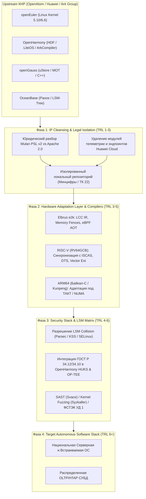


**Стратегическое резюме**
Настоящий документ представляет собой углубленное архитектурно-техническое исследование и **Дорожную карту (Roadmap)** по трансферу, декуплингу, глубокому форкингу, системной адаптации и сертификации китайских базовых Open-Source технологий (**openEuler**, **OpenHarmony**, **openGauss**, **OceanBase**) для критической информационной инфраструктуры (КИИ) РФ. 

Основной фокус направлен на преодоление базовых научно-технологических барьеров (**TRL 1–6**): разрешение аппаратных аномалий архитектуры **Эльбрус e2k** (VLIW), портирование JIT/AOT-компиляторов, устранение коллизий в **Linux Security Modules**, адаптацию криптографических стеков TEE/HUKS под стандарты ГОСТ и переработку низкоуровневых механизмов консенсуса СУБД под гетерогенные кластеры.


---

### Архитектурный граф интеграции и суверенизации



---

### ФАЗА 1: Юридический анализ, IP-очистка и запуск форка (TRL 1–3)


**Критический риск: Юридическая зависимость от юрисдикции КНР (Mulan PSL v2)**
Лицензия **Mulan Permissive Software License v2 (Mulan PSL v2)**, под которой распространяются **openEuler** и **openGauss**, содержит ключевые риски:
1. **Статья 3 (Patent Grant):** Автоматический отзыв патентных прав при инициировании судебных разбирательств против участников OpenAtom.
2. **Подсудность:** Разрешение споров строго в арбитражных судах КНР (Пекин/Шэньчжэнь).
3. **Вторичные санкции:** Экспортный контроль Министерство торговли КНР (MOFCOM) может ограничить передачу обновлений при изменениях в законодательстве КНР (*Cybersecurity Law of the PRC*).


```
┌────────────────────────────────────────────────────────────────────────┐
│                        Mulan PSL v2 Cleansing                          │
├───────────────────────────────┬────────────────────────────────────────┤
│ Исходное состояние (Upstream) │ Целевое состояние (Национальный форк)   │
├───────────────────────────────┼────────────────────────────────────────┤
│ • Юрисдикция: КНР (Mulan PSL)  │ • Изолированный репозиторий (ТК 22)   │
│ • Зависимость от Huawei Cloud │ • Замена на локальные сервисы PKI      │
│ • Проприетарный iSula / Telemetry│• Модульная сборка на базе Apache 2.0   │
└───────────────────────────────┴────────────────────────────────────────┘
```

#### Низкоуровневые шаги IP-декуплинга:
1. **Удаление вендорских вызовов (Vendor Lock-in Stripping):**
   * Удаление бинарных блобов и жестко прописанных (hardcoded) URL-адресов эндпоинтов `huaweicloud.com`, `gitee.com`, `obs.cn-north-4.myhuaweicloud.com` из менеджера пакетов `dnf` / `dnf-plugins-core` и контейнерного движка `iSula`.
   * Извлечение патчей ядра Linux, специфичных для процессоров **Kunpeng 920** (`hisilicon` SoC drivers), и их изолирование в подсистему поддержки плагинов architecture-specific.
2. **Лицензионная трансформаторная сборка:**
   * Создание юридической прослойки: переработка заголовков исходного кода и обвязки сборки (`CMakeLists.txt`, `BUILD.gn`, `spec`-файлы) под лицензии **Apache 2.0** или **BSD 3-Clause** для создаваемых поверхностных компонентов.
   * Формирование полностью независимого реестра зависимостей (Dependency Tree Isolation), гарантирующего сборку без обращения к внешним зеркалам КНР.

---

### ФАЗА 2: Аппаратно-архитектурное портирование и низкоуровневый инжиниринг (TRL 3–6)

```
                            [Спектр аппаратных платформ]
                                         │
     ┌───────────────────────────────────┼───────────────────────────────────┐
     ▼                                   ▼                                   ▼
**ARM64 (Baikal-C / Kunpeng)**    **RISC-V (RV64GCB / Syntacore)**    **Elbrus VLIW (e2k v5/v6)**
  • TRL: 5 -> 6                     • TRL: 3 -> 5                       • TRL: 2 -> 4
  • Задача: NUMA-балансировка,      • Задача: Интеграция RVV 1.0,       • Задача: Адаптация memory ordering,
    GICv3/v4 ITS, CCI-500.            Zba/Zbb/Zbc/Zbs, DTS SoC YADRO.      LCC IR generator, eBPF AOT.
```

#### 2.1. Глубокий инжиниринг под архитектуру **Эльбрус e2k** (VLIW)

Архитектура **Эльбрус e2k** с явным параллелизмом команд (VLIW) кардинально отличается от Out-of-Order систем (x86/ARM). Прямое компилирование кода, рассчитанного на Strong/Weak Memory Ordering, приводит к системным сбоям и фатальной потере производительности.

```
[Исходный C++ код (openGauss / openEuler Kernel)]
                       │
                       ▼
       [Проблема: Неявная модель памяти (TSO)]
                       │
     ┌─────────────────┴─────────────────┐
     ▼                                   ▼
[e2k Weak Memory Model]         [VLIW Instruction Scheduling]
  • Race Conditions в Lock-Free     • Нарушение спекулятивного
    структурах данных.                выполнения (Speculative Loads).
     │                                   │
     └─────────────────┬─────────────────┘
                       ▼
    [Решение: Инъекция Компиляторных и Аппаратных Барьеров]
  • Использование __builtin_e2k_mas() и explicit memory fences.
  • Переработка Lock-Free списков в uStore и kernel eBPF.
```

##### А. Синхронизация памяти (Memory Fencing & Order Barriers)
* **Проблема:** В ядре **openEuler** и СУБД **openGauss** активно используются Lock-Free структуры на базе атомиков C++11 / GCC built-ins (`__atomic_load_n`, `__atomic_compare_exchange_n`). На **Эльбрус e2k** слабый порядок памяти (Weak Memory Ordering) приводит к переупорядочиванию чтения/записи компилятором `LCC` и процессором.
* **Техническое решение:** 
  * Замена всех неявных атомиков в критических секциях (например, `s_lock` в openGauss и `lockless ring-buffer` в ядре) на явные VLIW-инструкции синхронизации шины:
    ```c
    // Адаптация атомарного обмена для e2k в подсистеме памяти openGauss
    #if defined(__e2k__)
        #define E2K_MEM_FENCE() __builtin_e2k_mas(0x8000) // Flush store buffer
        inline bool atomic_cas_e2k(volatile uint64_t* ptr, uint64_t* old_val, uint64_t new_val) {
            bool result;
            E2K_MEM_FENCE();
            result = __atomic_compare_exchange_n(ptr, old_val, new_val, false, 
                                                 __ATOMIC_SEQ_CST, __ATOMIC_SEQ_CST);
            E2K_MEM_FENCE();
            return result;
        }
    #endif
    ```

##### Б. Переработка **ArkCompiler** (OpenHarmony) и eBPF JIT under VLIW
* **Проблема eBPF JIT:** Ядро **openEuler** полагается на eBPF JIT для фильтрации пакетов и мониторинга (`pcap`, `systemd-journald`, `cgroups v2`). JIT-генераторы динамически создают машинный код x86/ARM64. Под e2k динамическая генерация VLIW-широких команд (Wide Instruction Words) в рантайме крайне затруднена из-за необходимости работы тяжеловесного планировщика инструкций компилятора.
* **Техническое решение:** 
  1. Реализация **AOT (Ahead-Of-Time) транслятора bytecode-to-C** для eBPF: BPF-байткод извлекается в пользовательском пространстве, транслируется в C-код, компилируется с помощью `LCC` с максимальным уровнем оптимизации (`-O4 -m32_e2k`) и загружается в ядро как динамический модуль.
  2. Переработка `ArkCompiler` (JS/TS Engine в **OpenHarmony**): Отключение фазы JIT-компиляции (`ark_js_runtime`) и перевод выполнения скриптов исключительно в режим **AOT Compilation + Interpreter PGO Profile**. Внедрение генератора C++ IR-представления на базе оптимизатора `LCC`.

```
[eBPF Bytecode] ──> [AOT C-Translator] ──> [LCC Compiler (-O4)] ──> [Kernel Dynamic Module (.ko)]
```

#### 2.2. Портирование на **RISC-V** (RV64GCB / RV64GCH)

* **Синхронизация с upstream ISCAS (PLCT Lab):** Использование наработок китайской Академии наук по адаптации `openEuler` под `RV64GC`.
* **Доработка под отечественные СнК (**Syntacore** SCR7, **YADRO** C300/C500):**
  * Внедрение поддержки расширений векторной обработки **RVV 1.0** (*Vector Extension*) в алгоритмы криптографии ядра и СУБД.
  * Добавление поддержки расширений манипуляции битами **Zba/Zbb/Zbc/Zbs** в инструкционную обвязку компилятора GCC/Clang для ускорения хеширования в **openGauss**.
  * Написание специфичных файлов описания аппаратных средств **DTS (Device Tree Source)** для межпроцессорного взаимодействия (PLIC/CLINT) и контроллеров когерентности кэша (CCU).

---

### ФАЗА 3: Системная безопасность, LSM и криптография ГОСТ (TRL 4–6)

#### 3.1. Разрешение коллизий в **Linux Security Modules**


**Архитектурный конфликт LSM Hooks**
Попытка совместить штатный модуль безопасности openEuler (**Euler Security Module / SELinux**) с отечественными **КСЗ** (Комплексы Средств Защиты: **Astra Linux Parsec**, **Secret Net**, **Kaspersky Security System**) приводит к взаимоисключающим блокировкам системных вызовов (`EPERM`), разрушению контекстов безопасности Inode (`xattr`) и неизбежному `Kernel Panic`.


```
               [ System Call (e.g., sys_openat) ]
                               │
                               ▼
            [ Linux Security Module (LSM) Infrastructure ]
                               │
       ┌───────────────────────┴───────────────────────┐
       ▼                                               ▼
[SELinux / Euler Security]                  [Российский КСЗ (Parsec/KSS)]
  • Namespace: security.selinux               • Namespace: security.parsec
  • Mandatory Access Control (MAC)            • Субъект-объектные мандатные метки
       │                                               │
       └───────────────────────┬───────────────────────┘
                               ▼
               [ КОЛЛИЗИЯ ХОКОВ И АТРИБУТОВ INODE ]
          • Конфликт при выполнении inode_permission()
          • Ошибка интерпретации xattr
          • Result: Kernel Panic / System Deadlock
```

##### Архитектура решения задачи LSM Stacking:
В ядре Linux 5.10/6.6 **openEuler** реализуется строго изолированный порядок вызова хоков безопасности с переопределением структуры `security_hook_heads`:

```c
// Переработка инициализации LSM в security/security.c под требования ФСТЭК
static __init int national_lsm_init(void) {
    // 1. Отключение штатных модулей SELinux/EulerSecurity для предотвращения коллизий xattr
    #if defined(CONFIG_SECURITY_EULER)
        clear_bit(EULER_SEC_ENABLED, &euler_sec_flags);
    #endif

    // 2. Явная регистрация национального модуля безопасности (например, Parsec/KSS)
    pr_info("National Security Module: Initializing Security Hook Matrix...\n");
    security_add_hooks(national_ksz_hooks, ARRAY_SIZE(national_ksz_hooks), "national_ksz");
    
    return 0;
}
```

1. **Разделение пространств xattr:** Изоляция расширенных атрибутов файлов. Удаление вызовов `security.selinux` из утилит `systemd`, `coreutils` и перевод базовой системы на нейтральное пространство атрибутов `security.national_mac`.
2. **Матрица хоков безопасности:** Приведение порядка вызова хоков к каноническому виду: `Capability` -> `Yama` -> `National_KSZ` (Parsec/KSS) -> `Landlock`.

#### 3.2. Интеграция криптографии ГОСТ в **OpenHarmony** (HUKS & TEE)

Стек безопасности **OpenHarmony** опирается на подсистему **HUKS (Harmony Universal KeyStore)** и доверенную среду **TEE (Trusted Execution Environment)**, использующие по умолчанию алгоритмы AES, RSA, ECC, SHA-256.

```
                          [ HW Hardware Root of Trust ]
                                       │
                                       ▼
                   [ TEE (OP-TEE / GlobalPlatform API) ]
                                       │
     ┌─────────────────────────────────┴─────────────────────────────────┐
     ▼                                                                   ▼
[mbedTLS / BoringSSL Engine]                             [ГОСТ Криптографический Провайдер]
  • (Удалено: AES, RSA, SHA-256)                          • ГОСТ Р 34.12-2015 ("Кузнечик" / "Магма")
                                                         • ГОСТ Р 34.10-2012 (Цифровая подпись)
                                                         • ГОСТ Р 34.11-2012 ("Стрибог")
                                                                         │
                                                                         ▼
                                                       [HUKS Service Abstraction Layer]
```

##### Технические мероприятия по интеграции ГОСТ:
1. **Замена криптографического ядра HUKS:**
   * Замена базового провайдера `mbedTLS` на подсистему с поддержкой **ГОСТ Р 34.12-2015** ("Кузнечик", "Магма"), **ГОСТ Р 34.10-2012** (цифровая подпись) и **ГОСТ Р 34.11-2012** ("Стрибог").
   * Переработка абстракции `huks_core_cipher.c`: перенаправление вызовов генерации ключей и шифрования на ГОСТ-сопроцессоры или программный модуль **КриптоПро** / **OpenSSL Engine GOST**.
2. **Портирование TEE (Trusted Execution Environment):**
   * Полная замена закрытой ОС доверенной среды Huawei `iTrustee` на открытую архитектуру **OP-TEE (Open Portable TEE)**.
   * Написание ГОСТ Доверенных Приложений (Trusted Applications - TA) для выполнения операций строгой аутентификации и хранения ключей шифрования в изолированной памяти (Secure World ARM TrustZone / RISC-V ePMP).

#### 3.3. Сертификационный конвейер ФСТЭК (Уровень Доверия 1 - УД 1)

```
[Кодовая база Upstream] ──> [Svace SAST Scanning] ──> [Syzkaller DAST Fuzzing] ──> [Удаление кода КНР] ──> [Сертификат УД 1]
```

* **Автоматизированный статический анализ (SAST):**
  * Внедрение отечественного сканера `Svace` в CI/CD конвейер. Настройка правил выявления потенциально опасных конструкций (CWE-119 Buffer Errors, CWE-416 Use After Free) в кодовой базе `openEuler` (30+ млн строк) и `openGauss` (3+ млн строк).
  * Автоматический фикс патчей (Backporting Security Fixes) без нарушения ABI ядра.
* **Динамический анализ и фаззинг (DAST):**
  * Покрытие системных вызовов ядра ОС непрерывным фаззинг-тестированием с помощью `Syzkaller` с аппаратной виртуализацией на процессорах **Эльбрус-16С** и **Байкал-С**.
  * Проведение фаззинга сетевого стека СУБД **openGauss** и **OceanBase** с помощью `AFL++` / `libFuzzer` на предмет устойчивости к Denial of Service (DoS) атакам.
* **Аудит кода на соответствие регуляторике КНР:**
  * Реверс-инжиниринг и полное удаление подсистем, реализующих специфические функции перехвата трафика и логирования, требуемые нормами *State Encryption Administration (SAC)* и *Cybersecurity Law of the PRC*.

---

### ФАЗА 4: СУБД Инжиниринг — openGauss vs OceanBase (TRL 4–6)

Сравнение двух ведущих китайских СУБД Enterprise-уровня с точки зрения глубинного портирования и суверенизации:

```
                                  [Сравнительный выбор СУБД]
                                               │
                     ┌─────────────────────────┴─────────────────────────┐
                     ▼                                                   ▼
            **openGauss (Fork)**                                **OceanBase**
  • Архитектура: Монолит/Shared-Nothing             • Архитектура: Distributed NewSQL (Paxos)
  • Кодовая база: C++ (Форк PostgreSQL)              • Кодовая база: C++ (Собственный LSM-engine)
  • TRL в РФ: 5                                      • TRL в РФ: 3
  • Главный риск: NUMA-привязка Kunpeng 920          • Главный риск: Закрытый Paxos в Enterprise
```

#### 4.1. Глубокая адаптация **openGauss**
**openGauss** оптимизирована под архитектуру процессоров Huawei Kunpeng 920 (архитектура NUMA с 64+ ядрами на сокет). Она использует алгоритмы сжатия и блокировок, завязаные на специфичные ARM64 инструкции (`LDADD`, `CAS`).

* **Устранение жесткой NUMA-привязки:**
  * Переработка подсистемы управления памятью `numa_policy.cpp` и движка таблиц в памяти **MOT (Memory-Optimized Tables)**.
  * Адаптация алгоритмов планирования потоков (Thread Pooling) под процессоры **Эльбрус-16С** (учитывая топологию межпроцессорного соединения "Канал" и объединение ядер в кластеры).
* **Модификация подсистемы журналов (uStore / WAL):**
  * Переработка движка `uStore` (Undo-based storage engine): устранение гонок пресечения при заполнении Undo-страниц на weak-memory системах.
  * Интеграция асинхронной записи WAL-журналов с использованием отечественных NVMe-накопителей с аппаратным ГОСТ-шифрованием.

#### 4.2. Реинжиниринг движка консенсуса **OceanBase**
**OceanBase** использует архитектуру LSM-Tree и распределенный Paxos-консенсус.

* **Проблема:** Сообщество развивает лишь Community Edition (CE), в которой отсутствуют критические модули управления гео-распределенной конфигурацией и оптимизатора сложных OLAP-запросов.
* **Техническое решение (TRL 3 -> 5):**
  1. Выделение модуля консенсуса `clog` (Commit Log) и переработка Paxos-протокола для поддержки работы в условиях нестабильных каналов связи КИИ.
  2. Замена проприетарных алгоритмов сжатия данных (`Snappy`/`LZO` версии Ant Group) на стандартизированные алгоритмы (`Zstd`/`LZ4`), а также внедрение ГОСТ-криптографии для межузлового шифрования (TLS/ГОСТ).

---

### ФАЗА 5: Автоматизированный CI/CD pipeline и HIL-стенды (TRL 6+)

Для предотвращения отставания форка от мирового Open-Source сообщества (*Hard-Fork Dead-End*) создается инфраструктура непрерывного сопровождения.

```
┌────────────────────────────────────────────────────────────────────────────────────────┐
│                        Национальный CI/CD Конвейер (ТК 22)                             │
├───────────────────────────────┬───────────────────────────────┬────────────────────────┤
│ 1. Upstream Monitor           │ 2. Smart Patching Engine      │ 3. HIL Hardware Matrix │
├───────────────────────────────┼───────────────────────────────┼────────────────────────┤
│ • Мониторинг Git Commits      │ • Авто-разрешение конфликтов  │ • Стенды Эльбрус-16С   │
│   в OpenAtom / Gitee repos.   │   в Merge Commits.            │ • Стенды Байкал-С      │
│ • Извлечение CVE и Security   │ • Инъекция patches в локальный│ • Стенды RISC-V        │
│   Advisories.                 │   декуплированный форк.       │   (YADRO / Syntacore)  │
└───────────────────────────────┴───────────────────────────────┴────────────────────────┘
```

#### Архитектура Hardware-in-the-Loop (HIL) тестирования:
1. **Вычислительный кластер сборки:** Мощность не менее **15-20 Пфлопс** на базе доступных ускорителей для выполнения регулярной полной пересборки OS-образев (более 10 000 пакетов `openEuler`).
2. **Тестовые фермы (Hardware Matrix):**
   * Физические стенды под управлением контроллеров удаленного управления (IPMI/BMC), укомплектованные платами на базе **Эльбрус-8С/16С**, **Байкал-М/С**, **Syntacore** RISC-V FPGA/SoC.
   * Автоматический развертыватель образцов (Bare-Metal Provisioning) через PXE/iPXE с запуском нагрузочных тестов (LTP — Linux Test Project, Phoronix Test Suite, sysbench, TPC-C/TPC-H для openGauss).

---

### Сравнительная матрица компонентов стека

| Платформа | Роль в экосистеме | TRL (Текущий в РФ) | TRL (Целевой за 24 мес) | Главный барьер | Стратегия устранения |
| :--- | :--- | :---: | :---: | :--- | :--- |
| ****openEuler**** | Базовая Серверная / Cloud ОС | **TRL 5** | **TRL 8** | Конфликты LSM, барьеры памяти e2k | Глубокий форк, LSM-stacking под КСЗ, AOT для eBPF |
| ****OpenHarmony**** | Мобильная / Edge / IoT ОС | **TRL 4** | **TRL 7** | Графический стек GPU, HDF, HUKS | Замена HUKS на ГОСТ, интеграция OP-TEE, RISC-V MCU |
| ****openGauss**** | Enterprise OLTP СУБД | **TRL 5** | **TRL 8** | NUMA-зависимость Kunpeng, uStore lock-free | Адаптация MOT под Эльбрус-16С, ГОСТ-TLS репликация |
| ****OceanBase**** | Распределённая NewSQL СУБД | **TRL 3** | **TRL 6** | Закрытый Enterprise Paxos engine | Форк CE-версии, создание открытого модуля консенсуса |

---

### Практический кейс: Архитектурный тренажер


**Практическая ситуация для системного архитектора**
Крупный транспортно-логистический оператор КИИ производит замену инфраструктуры управления высокоскоростным движением. 

**Требования:**
1. Обработка телеметрии в реальном времени (IoT-датчики, до 100 000 транзакций в сек).
2. Полное соответствие требованиям **ФСТЭК УД 1** и **ФСБ КС3**.
3. Аппаратный стек: Серверный кластер на базе ****Байкал-С**** (ARM64) и периферийные контроллеры на базе ****Syntacore** SCR5** (RISC-V).

**Задание:** Сформулируйте архитектурный стек (ОС, СУБД, Безопасность) и опишите план разрешения узких мест.


<details>
<summary><b>Посмотреть эталонное архитектурное решение</b></summary>

#### 1. Целевой архитектурный стек:
* **Центральный серверный кластер (ARM64 / Байкал-С):**
  * **ОС:** Форк **openEuler** (Linux Kernel 6.6, сборка ARM64).
  * **СУБД:** Форк **openGauss** (Кластер Shared-Nothing с синхронной репликацией).
  * **Безопасность:** Встроенный национальный модуль КСЗ (LSM-Hook stacking), криптографическая подсистема с поддержкой ГОСТ Р 34.12-2015.
* **Периферийные контроллеры (RISC-V / Syntacore SCR5):**
  * **ОС:** Форк **OpenHarmony** (LiteOS kernel / RTOS profile).
  * **Безопасность:** HUKS с ГОСТ-провайдером, OP-TEE поверх RISC-V PMP.

#### 2. Разрешение узких мест (Bottleneck Mitigation):
* **Проблема 1 (Высокая нагрузка IoT):** Штатная СУБД openGauss может упираться в блокировки дискового I/O.
  * *Решение:* Активация движка **MOT (Memory-Optimized Tables)** для таблиц приема телеметрии с асинхронным сбросом на NVMe накопители.
* **Проблема 2 (Безопасность сетевого обмена):** Отсутствие поддержки ГОСТ в протоколе репликации openGauss.
  * *Решение:* Внедрение OpenSSL GOST Engine в сетевой слой `libpq` и настройка взаимной TLS-аутентификации (mTLS) с использованием сертификатов ГОСТ Р 34.10-2012.
* **Проблема 3 (Ограничения ресурсов RISC-V):** Полный профиль OpenHarmony (Standard System) слишком тяжел для микроконтроллеров SCR5.
  * *Решение:* Использование профиля **Small System / Mini System** с компиляцией под набор инструкций `RV32IMAC` / `RV64GC` без GUI-модулей (Graphic Subsystem) и с прямым HDF-драйвером для шин CAN/SPI.

</details>

---

### Связанные заметки (Obsidian Graph Network)
* **openEuler: Архитектура, сборка и методы портирования**
* **OpenHarmony: Стек HDF, ArkCompiler и замена HUKS**
* **openGauss: Движки uStore, MOT и оптимизация NUMA**
* **OceanBase: Paxos Консенсус и LSM-Tree Архитектура**
* **Архитектура Эльбрус VLIW: Память, Компиляция LCC и eBPF**
* **RISC-V в РФ: Перспективы экосистемы YADRO и Syntacore**
* **Linux Security Modules: LSM Stacking и разрешение коллизий**
* **Требования ФСТЭК по Уровням Доверия (УД 1-4)**
* **Mulan PSL v2: Юридический анализ и патентный декуплинг**